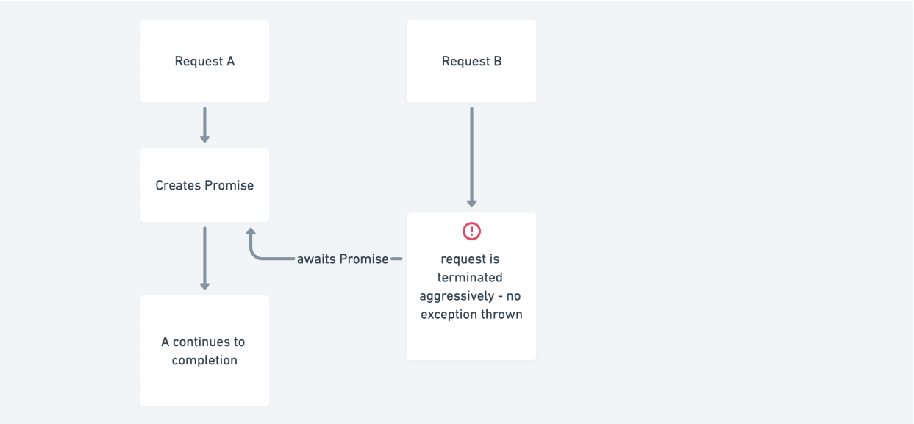

## The problem

CloudFlare is one of our hosting partners at Zuplo and we recently encountered a
very tricky error that occurred intermittently and was not throwing an exception
catchable by our logging framework. Our code wouldn’t even execute the
finally blocks when we countered this. The only clue was deep in the CloudFlare
Workers streaming logs - that looked something like this...

```json
"outcome": "exception",
 "scriptName": null,
 "exceptions": [
   {
     "name": "Error",
     "message": "The script will never generate a response.",
     "timestamp": 1643142701479
   }
 ]
//...
```

We were confident there was no code path in our runtime that wouldn’t return a
response, even if an exception is thrown. It didn’t seem like we were running
out of memory or some other critical exception - so what was going on?

## A request-aware event-loop

With a little help from the CloudFlare team, we learned that CloudFlare workers
do some slightly unusual things with the
[JavaScript event loop](https://developer.mozilla.org/en-US/docs/Web/JavaScript/EventLoop).

Specifically, they track which requests contributed each chunk of work to the
event loop. This allows them to do some magic - like allocate each console.log
to the correct request, even in a single-threaded isolate that is handling many
requests at once.

However, if you use global, module-level, or static variables you can confuse
how Workers track things — leading to some weird results.



In this case, let us imagine you have two requests A and B being handled by the
same worker instance. If A creates a Promise and stores this in an area of state
accessible by request B you’ll hit this issue if request B awaits (blocks on)
that while it is still pending. Note - it won’t fail if the Promise is already
fulfilled.

## A simple repro

You can recreate the bug with the following code.

```ts
addEventListener("fetch", (event) => {
  event.respondWith(handleRequest(event.request));
});

// we're going to store the promise here and use it across requests
let blocker;

async function handleRequest(request) {
  if (!blocker) {
    // block for 20s
    blocker = sleep(20000);
  }
  await blocker;
  blocker = undefined;
  return new Response("ok");
}

function sleep(delay) {
  const p = new Promise((res, rej) => {
    setTimeout(res, delay);
  });
  return p;
}
```

If you deploy this and hit CloudFlare hard enough to get two requests on the
same instance while streaming logs you’ll see the error happen. You can do this
pretty easily with apache benchmark:

```bash
ab -n 10 -c 10 https://your.worker.dev/
```

Beware hidden examples Of course, the challenge with bugs like these is they
often only show up intermittently on a busy server. We actually encountered this
inside one of the libraries we use at Zuplo: Jose - specifically
[this code](https://github.com/panva/jose/blob/bd7bf3789c146d765bbee2db0c93ba035020b24c/src/jwks/remote.ts#L91-L109)
(hopefully fixed by the time you’re reading this):

```ts
async reload() {
  if (!this._pendingFetch) {
    this._pendingFetch = fetchJwks(
      this._url,
      this._timeoutDuration,
      this._options
    )
      .then((json) => {
        if (!isJWKSLike(json)) {
          throw new JWKSInvalid("JSON Web Key Set malformed");
        }

        this._jwks = { keys: json.keys };
        this._cooldownStarted = Date.now();
        this._pendingFetch = undefined;
      })
      .catch((err: Error) => {
        this._pendingFetch = undefined;
        throw err;
      });
  }
}

await this._pendingFetch();
```

It’s easy to see now, how this could trigger the aggressive termination of the
event loop of a request that attempts to await that \_pendingFetch at the end.

We hope this helps! Thanks to
[Erwin van der Koogh](https://twitter.com/evanderkoogh) at CloudFlare for his
help getting to the bottom of this.
