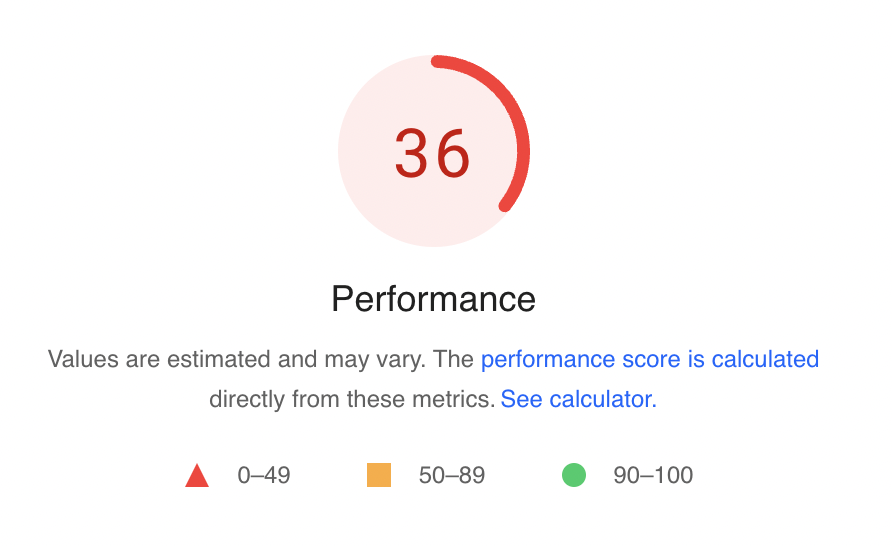

A few weeks back we launched a new website on Webflow. Admittedly, not my first
choice, but its easy for the designers we work with and like any startup we
prioritize where we spend our time. The website was contracted out so we could
build the product. However, one thing I do care a lot about is performance.
Everything we build at Zuplo is FAST. Webflow is not exactly fast.

Our home page scored horrible with raw hosting on webflow. After some digging I
found there were some obvious issues.
