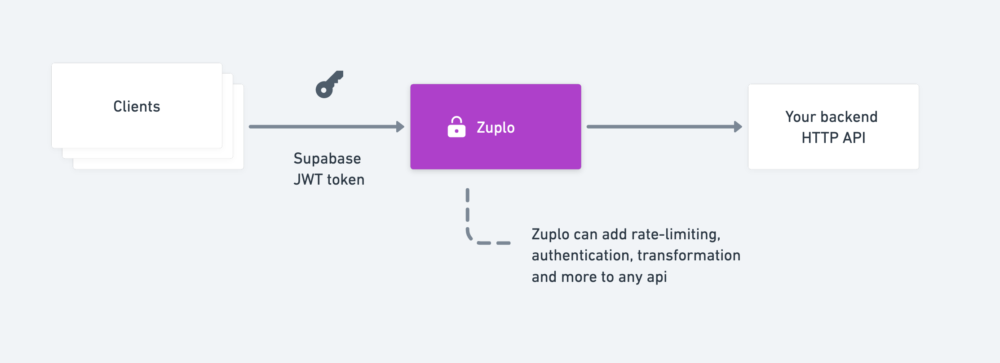
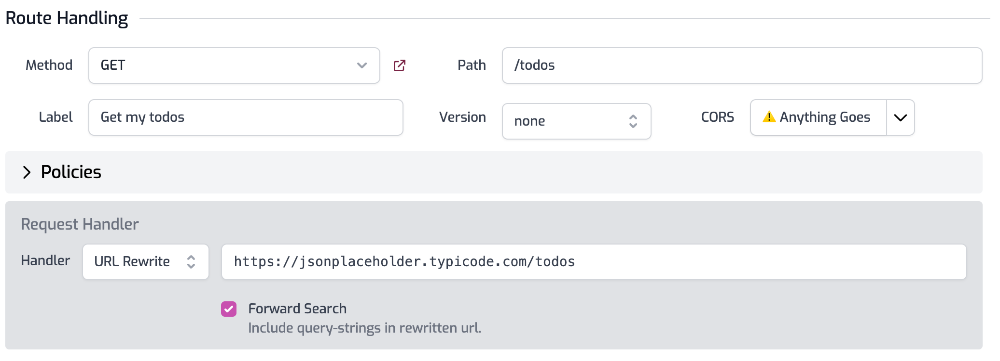
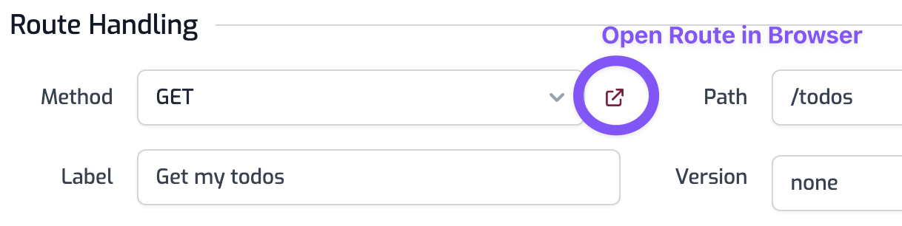
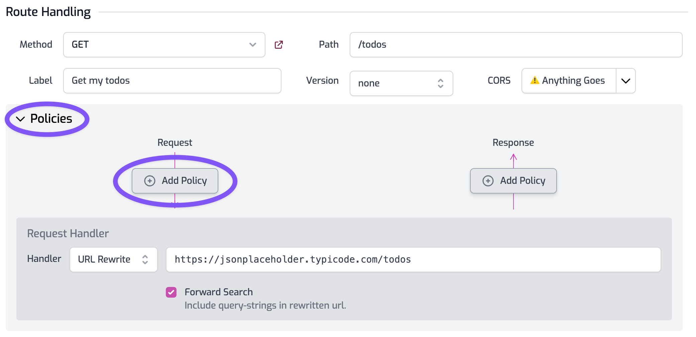

This guide shows you how you can use a Zuplo API gateway to add Supabase JWT Authentication and Authorization to any API, running on any cloud.

There is an accompanying video talk for this blog post: [https://youtu.be/UEeSZkV7o_Y](https://youtu.be/UEeSZkV7o_Y)



Zuplo is an edge-based programmable API gateway that can augment any existing backend HTTP API to add JWT authentication, dynamic rate-limiting, custom transformations and projections of JSON data.

Zuplo is a fully managed service, sign-up at [zuplo.com](http://zuplo.com) to try it out.

In this example, we’re going to add [Supabase](https://supabase.com/) JWT authentication and authorization to a demo API and turn on rate-limiting. We’ll use the JSONPlaceholder todo API available at [https://jsonplaceholder.typicode.com/todos](https://jsonplaceholder.typicode.com/todos). For ease of demonstration, this is a public API, but Zuplo has a number of options for secure connectivity to a backend API.

## Step 1: Proxy your API using Zuplo

Sign-in at [portal.zuplo.com](http://portal.zuplo.com) and create a new project. Click on the **Routes** item in the file list. You will see that you have no routes.

Click **Add Route** and configure the route as follows:

- Method: `GET`
- Path: `/todos`
- Summary: `Get my todos`
- Version: `none`
- CORS: `Anything Goes` (you can configure [custom CORS policies](https://zuplo.com/docs/guides/custom-cors-policy) later).

In the Request Handler section, set the **URL Rewrite** path to [`https://jsonplaceholder.typicode.com/todos`](https://jsonplaceholder.typicode.com/todos)



Click the save icon next to the **Routes** link (or press CMD+S/CTRL+S) to save your changes.

Your gateway is now ready to proxy requests to the todo API! To try it, click the Open Route link (shown below)



## Step 2: Add JWT Authentication

Next, expand the **Policies** section of your route and click **Add Policy** to the **Request** pipeline.



Find the **[Supabase JWT Auth** policy](https://zuplo.com/docs/policies/supabase-jwt-auth-inbound) and select it. Edit the **Configuration** to remove the `requiredClaims` property (we’ll set those up later) and click OK.


Finally, go to the **Settings** tab, choose **Environment Variables,** and add a new variable called `SUPABASE_JWT_SECRET`.


The value of the secret can be obtained from your Supabase **Settings** in the **API** section.

Save your changes by navigating back to the file tab and clicking the Save icon next to **Routes**. Congratulations, you have now secured your todos API with a Supabase JWT token!

You can try calling this using a JWT token from a client (web, mobile, postman, curl etc) and sending the JWT token as the `Authorization` header, with a value `"Bearer JWT_TOKEN_HERE"`.

Reminder, you can get the URL of your API using the Open In Browser button we used above or, on the **Getting Started** page, you’ll see the root API.

## Step 3 - Enforce required claims

You can add custom claims to your user(s) in Supabase by adding them to the `auth.users` tables `raw_app_metadata` column (there’s a good article on this [here](https://dev.to/supabase/supabase-custom-claims-34l2)).

These custom claims are encoded into the JWT token and we can use them to restrict access to our API. For this example, we updated the `raw_app_metadata` to have a custom claim of `user_type`. Note that we left the other claims in place.

```sql
UPDATE auth.users SET raw_app_meta_data =
'{"provider":"email", "providers":["email"], "user_type": "supa_user"}'
WHERE id = 'user_id_here';
```

Now we can require that anybody calling our API has a specific claim. To do this we update the `requiredClaims` property on our policy configuration. Go back to the **Route Designer** and find your **Supabase JWT policy**. Click the edit button and change the **Configuration** as follows:

```json
{
  "export": "SupabaseJwtInboundPolicy",
  "module": "$import(@zuplo/runtime)",
  "options": {
    "secret": "$env(SUPABASE_JWT_SECRET)",
    "allowUnauthenticatedRequests": false,
    "requiredClaims": {
      "user_type": ["supa_users"]
    }
  }
}
```

This means anybody calling this particularly route must have a `user_type` claim of `supa_user` to successfully invoke this API.

Get started with Zuplo for free today: [Sign Up Free](https://zuplo.link/sb-blog-signup)

See also:

[Shipping a public API backed by Supabase](https://zuplo.com/blog/2022/11/18/shipping-a-public-api-backed-by-supabase)

[Supa-dynamic rate-limiting based on data (using supabase)](https://zuplo.com/blog/2022/12/05/supa-dynamic-rate-limiting-based-on-data)

