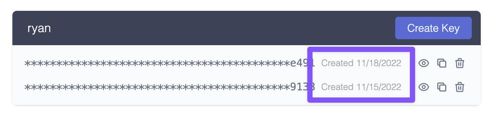

Many public APIs choose to use API keys as their authentication mechanism, and with good reason. In this article, we’ll discuss how to approach API key management for your API, including:

- why you should consider API key security
- design options and tradeoffs
- best practices of API key authentication
- technical details of a sound implementation

This article is language agnostic and doesn't provide a particular solution for PHP, Python, TypeScript, C# etc but every language should afford the capabilities that would allow you to build an appropriate solution.

## Why API Keys? Why not?

I talked about this in more detail in [Wait, you’re not using API Keys?](https://zuplo.com/blog/2022/05/03/you-should-be-using-api-keys/) but in summary, API keys are a great choice because they are plenty secure, easier for developers to use vs JWT tokens, are opaque strings that don’t give away any clues to your claims structure, and are used by some of the best API-first companies in the world like Stripe, Twilio, and SendGrid.

Perhaps the most legitimate complaint against API keys is that they are not standardized, which is true, but — thanks to programs like GitHub’s secret scanning program — some patterns are starting to emerge.

If you’re building a public API, API-key authentication is much easier for a developer to configure and learn. They work great in `curl` and, provided you follow some of the best practices outlined here, are plenty secure.

The main case where I would not advocate for using API keys is for operations that are on behalf of an individual user. For this, OAuth and JWT is a much better fit. Examples of APIs that do and should use OAuth are Twitter and Facebook. However, if you’re Stripe and the callee of your API is an ‘organization’ and not a user, API keys are a great choice. Perhaps the best example of this is the GitHub API, which uses both: API-keys for organization-level interactions and JWT for on-behalf of users.

## Decisions to make

The best practices for API key management are becoming somewhat recognizable now, but there is a dimension where we still see some variability in the implementation of API keys: to make the key **retrievable** or **irretrievable**.

The world of API-key implementations is divided into two groups. The first will show you your API key only once. You'll need to copy it and save it somewhere safe before leaving the console. This is **irretrievable**. Typically the keys are unrecoverable because they are not actually stored in the key database, only a hash of the key is stored in the database. This means, if lost, the keys can genuinely never be recovered. Of course, in the case of a loss you can usually regenerate a new key and view it once.

The other group allows you to go back to your developer portal and retrieve your key at any time. These keys are typically stored encrypted in the database. Meaning if the database is stolen, the thief would also need the encryption codes to access the API keys.

The tradeoffs here are tricky, and there are two schools of thought

1. **Irretrievable** is better because it’s more secure. The keys are stored via a one-way encryption process so they can never be retrieved, or stolen from the database in a worse case scenario.
2. **Retrievable** offers good-enough security with some advantages, and it’s easier to use. The keys are stored encrypted via reversible encryption. One potential security advantage is that users are less likely to feel pressured to quickly store the key somewhere to avoid losing it. A person that follows best practices will use a vault or service like 1password. However, some users will take the convenient path and paste it into a .txt file for a few minutes thinking, “I’ll delete that later.”

So what are some examples of APIs that support recoverable vs. unrecoverable today??

**Irretrievable:** Stripe, Amazon AWS

**Retrievable:** Twilio, AirTable, RapidAPI

There is some correlation between services that protect sensitive information and services seem more likely to use **irretrievable**, while services that are less sensitive choose **retrievable** for ease of use and good-enough security.

The choice is yours. Personally, I lean a little toward **retrievable** because I know that I personally have made the mistake of quickly pasting a newly generated **irretrievable** key into notepad and forgetting about it. You may come to a different conclusion for your own API key management.

## Best Practices of API Key Authentication

The bit of API key management advice you’ve been waiting for… the best practices of API key auth based on the patterns observed in the API world and our experience building our own [API key authentication service for Zuplo](https://zuplo.com/docs/quickstarts/add-api-key-auth).

**1/ Secure storage for the keys**

Depending on your choice of **retrievable** vs. **irretrievable,** you’ll need to take a different path. For **irretrievable** keys, it’s best to store them as a hash, ideally using a secure approach like `bcrypt`. There’s an excellent article on this by Auth0, who use `bcrypt` to store user passwords (so it must be good) — [Hashing in action: Understanding bcrypt](https://auth0.com/blog/hashing-in-action-understanding-bcrypt/).

For **retrievable**, you’ll need to use encryption so that the values can be read from the database to show to the user at a later date. You have a few choices here, like storing the keys in a secure vault, or using encryption programmatically to store in a standard database and manage the keys yourself.

**2/ Support a rolling transition period**

It’s critical that you allow your users to roll their API keys in case they accidentally expose it, or just have a practice of periodically changing them out. It’s important that this ‘roll’ function either allows for multiple keys to exist at the same time or allows the setting of an expiry period on the previous key, otherwise rolling the key will cause downtime for any consumers that didn’t get the chance to plug-in the new key before the last one expired. Here’s Stripe’s roll dialog:

In Zuplo, we allow folks to have multiple keys so they can temporarily add another key and delete the old one as soon as they’re done with the transition.

**3/ Show the key creation date**

It’s important to show developers when the key was created so they can compare the date to any potential incidents. This is especially important if you support multiple keys so that users can differentiate between old and new.

**4/ Checksum validation**

Since checking the API key will be on the critical path of every API call, you want to minimize latency. This is one of the reasons that you’ll want to add a checksum to your API key. Here’s an example API key from Zuplo:

`zpka_a5c5e56x54c4437fbd6ce7dee9185e_631238`

The last section `_631238` is a checksum that we can use to verify in the request pipeline whether this even looks like a valid key. If not, we can simply reject the request and avoid putting load on the API key store.

**5/ Support secret scanning**

One of the reason we have the unusual beginning of the key `"zpka_`" is so that we could participate in programs like [GitHub’s secret scanning](https://docs.github.com/en/code-security/secret-scanning/about-secret-scanning). This allows us to create a regular expression that allows GitHub to inform us if an API key is accidentally checked into a repo. Then we can automatically revoke the key and inform its owner of the event. We also use the checksum to double-check that it’s one of our keys before locating the service and owner.

At Zuplo, we participate in the GitHub secret scanning program so that we can offer these services to any customer using our API-key policy.

(Aside: _Yes, the example key above triggered our secret scanning when I checked this article into GitHub and we got notified about a token leak_ 👏😆)

**6/ Minimize latency and load on your API Key storage**

To reduce the latency on every API request, you might consider using an in-memory cache to store keys (and any metadata read from the API Key Store). If you have a globally distributed system, you’ll want multiple caches, one in each location. Since Zuplo runs at the edge, we use a high-performance cache in every data center. To increase security it's important to consider only caching the one-way hashed version of the API-key (taking care to avoid hash-collisions by doing a pre-hash collision check at the point of key-creation, using the same hash algorithm).

You’ll need to choose an appropriate TTL (time-to-live) for your cache entries which has some tradeoffs. The longer the cache, the faster your average response time will be and less load will be placed on your API Key store - however, it will also take longer for any revocations or changes to key metadata to work.

We recommend just a couple of minutes maximum; that’s usually plenty to keep your latency low, a manageable load on your API Key Store, and be able to revoke keys quickly.

If this is important to you, you might want to design a way to actively flush a key from your cache.

**7/ Hide keys until needed**

Today, everybody has a high-quality camera in their pocket. Don’t show an API key on-screen unless explicitly requested. Avoid the need to show keys at all by providing a copy button. Here’s the supabase console, which almost gets full marks, but would be even better if it provided a copy option **without** needing me to reveal the key visually.

**8/ Attention to detail — keys need to be copied and pasted**

Sometimes it’s the little things in life; for example, try double-clicking on **key-1** below to select it. Then try **key-2**.

key-1: `zpka-83fff45-1639-4e8d-be-122621fcd4d1`

key-2: `zpka_a5c5e56x54c4437fbd6ce7dee9185e_631238`

Note how much easier it is to select the API key in `snake_case`?

**9/ Consider labeling your keys**

A number of services are increasingly doing this to help their customers, but mostly to help their support teams. For example, in Stripe they have a convention as follows:

- `sk_live_` - Secret Key, Live version
- `pk_test_` - Publishable Key, Test version

This not only supports GitHub secret key scanning above, but it can also be invaluable to your support team when they can easily check if the customer is using the right key in the right place. Your SDK can even enforce this to prevent confusion.

The downside to key labeling is that if the key is found without context by a malicious user - they can discover which services to attack. This is one advantage of using a managed API key service that dissociates the key from any specific API. GitHub have a great article - [Behind GitHub’s new authentication token formats](https://github.blog/2021-04-05-behind-githubs-new-authentication-token-formats/).

## A canonical flow through an API key check

Stacking all of that together, here’s a flow chart showing the canonical implementation of the API key check using all these practices above.

## API Key Management - Great DX, but requires some effort

API keys are a great approach if you want to maximize the developer experience of those using your API, but there are quite a few things to think about when it comes to API key management. An alternative to building this yourself is to use an API Management product with a gateway that does all the work for you and includes a self-serve developer portal. Examples include Apigee, Kong, and — of course — Zuplo.

## The Author

_Before founding Zuplo, Josh led Product for Stripe’s Payment Methods team (responsible for the majority of Stripes payment APIs) and worked at Facebook and Microsoft, where he founded a number of services, including Azure API Management._
