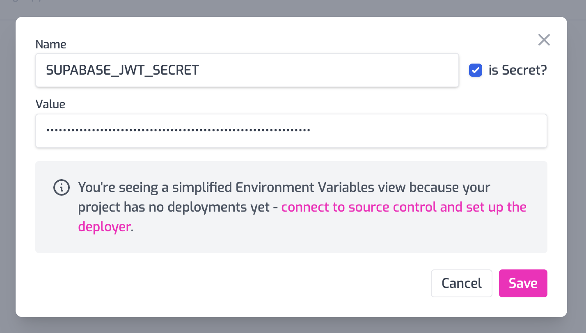

Your supabase backend is often exposed to the public, anybody can sign in create an account and work with data. This can be a problem, if you get a malicious or clumsy user that is hitting your service too hard. That's where you need rate-limits, a way of making sure a single user doesn't starve others of resources (or cost you too much $).

With Zuplo, you can add user-based rate-limiting to a supabase backend in a couple of minutes. There is a video tutorial version of this guide here: [YouTube: Per-user rate limit your supabase backend](https://www.youtube.com/watch?v=HklIu9LLZ54).

Best of all, the only code you'll need to change in your client is the URL of the supabase service (because traffic will now go via Zuplo).

Here are the steps

1/ Create a new project in Zuplo (get a free account at [portal.zuplo.com](https://portal.zuplo.com)).

2/ Add a route to your new project. Set the following properties

- path: `/(.*)` - this is wildcard route that will match all paths
- methods: `all` - select all methods in the dropdown
- CORS: `anything goes` - this is easiest, but [you can set stricter policies](https://zuplo.com/docs/guides/custom-cors-policy)
- URL Rewrite: `<https://your-supabase-domain>${pathname}` - make sure to add your supabase URL, e.g. `https://rxodffgalrhwpvjugcio.supabase.co${pathname}`

3/ Add a policy to the request pipeline - choose the `supabase-jwt-auth` policy. Remove the required claims from the JSON template.

```json
{
  "export": "SupabaseJwtInboundPolicy",
  "module": "$import(@zuplo/runtime)",
  "options": {
    "secret": "$env(SUPABASE_JWT_SECRET)",
    "allowUnauthenticatedRequests": false
  }
}
```

4/ Create an environment variable called `SUPABASE_JWT_SECRET` (this is in Settings > Environment Variables). Paste in the JWT Secret from supabase (available in Settings > API).



5/ Add a rate-limiting policy at the end of the request pipeline. Configure it to be a `user` mode rate limit, suggest 2 requests per minute for demo purposes.


```json
{
  "export": "BasicRateLimitInboundPolicy",
  "module": "$import(@zuplo/runtime)",
  "options": {
    "rateLimitBy": "user",
    "requestsAllowed": 2,
    "timeWindowMinutes": 1
  }
}
```

6/ Get the URL for your gateway by going to Getting Started tab and copying the gateway URL. Replace the Supabase URL in your client and boom 💥!


You now have a rate-limit protected supabase backend. Stay tuned for a subsequent tutorial where we'll show how to ensure folks have to come via Zuplo to call your Supabase backend.

Got questions or feedback, [join us on Discord](https://discord.gg/8QbEjr2MgZ).

<YouTubeVideo url="https://www.youtube-nocookie.com/embed/HklIu9LLZ54" />
