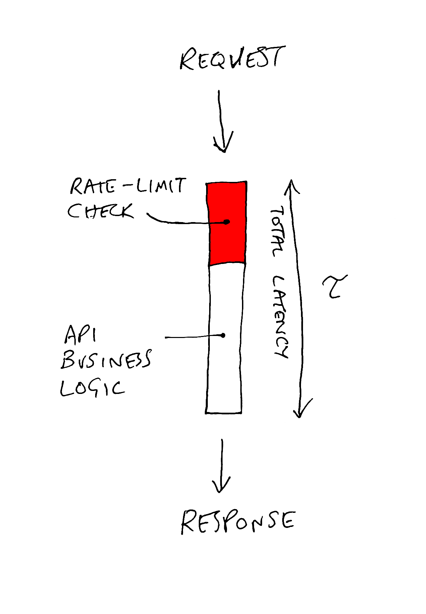

In
'[The three pillars of an API program](https://zuplo.com/blog/2022/05/11/the-three-pillars-of-an-API-program/)'
we outline that one of the critical pillars of launching an API is protection -
or, more specifically, rate limiting.

API rate limiting is a technique used to control the number of requests that can
be made to an API within a specified time frame. This helps maintain the
stability and performance of the API by preventing server overload, protecting
against DDoS attacks, and ensuring fair usage among consumers. Additionally,
many businesses use rate limits as a product feature (e.g. premium customers get
higher rate limits than free, for example - see
[Twitter](https://developer.twitter.com/en/docs/twitter-api/getting-started/about-twitter-api)).

There are infinite articles about different rate limiting algorithms - token
bucket vs sliding window, yada yada. Mostly these articles are more interesting
academically than they are practical; there are more pressing concerns that must
be closed before thinking about the nuances of different algorithms.

That’s why we’ve put this guide together for you, based on our experiences
working with many customers on rate-limiting challenges at zuplo, including
building a high-performance distributed rate-limiting capability. How
distributed? Try 1000s of instances per customer running in 250+ data centers
around the world.

This article is also available in [video](https://youtu.be/gO5e9GdvuT0)

We’ll cover

- a canonical rate-limiting implementation for an HTTP API
- secret limits or public?
- how should rate limiting be applied? globally, by IP, user, or custom
  functions?
- rate-limiting in distributed systems
- the latency/accuracy tradeoff
- observability - what do I need?
- how do I configure my rate limits in the first place?

This article explores these items from the viewpoint of the API owner and how to
offer the best experience for your API consumers.

### A canonical approach to rate-limiting for an HTTP API

This part is relatively simple but is often done incorrectly. We recommend
returning a 429 status code which is described on MDN as “indicates the user has
sent too many requests in a given amount of time (’rate limiting’)” - so
perfect.

We recommend using the
[Problem Details format](https://zuplo.com/blog/2023/04/11/the-power-of-problem-details)
as the body of your response. For example:

```json
{
  "type": "https://httpproblems.com/http-status/429",
  "title": "Too Many Requests",
  "detail": "You made too many requests to the endpoint, try again later",
  "instance": "/account/12345/msgs/abc",
  "trace": {
    "requestId": "4d54e4ee-c003-4d75-aba9-e09a6d707b08"
  }
}
```

Depending on the decision you make in the next section, you might choose to
include a Retry-After header with the number of seconds the user should wait
before trying again.

`Retry-After: 3600`

### Do you keep limit thresholds and timings a secret?

Some rate-limiting implementations return information to the user that tells
them how long they should wait until trying their request again. This can be
very useful but also presents some risk. If a malicious user is effectively
trying to maximize the amount of resources they can consume without hitting the
rate limit, they can use this information to infer your rate-limiting policy.
For this reason, many businesses choose not to disclose this and keep rate-limit
thresholds and timings private. This is common for public, anonymous APIs but
also for APIs that require authentication, but it’s easy to get an access key.
For example, a free tier of a service where I can use an e-mail address to get
access to the API. The gate to entry isn’t effortless, but it isn’t hard either.

However, if you have a more formal arrangement with your API consumer; maybe
they are a paying customer, then it is often better to share details of the rate
limits you’re imposing on them. So we find most B2B APIs that require a contract
are liberal in disclosing their rate-limits, while free APIs keep their cards
closer to their chest. Based on this, you may choose not to share a
`Retry-After` header (and we made this an easy option in the
[Zuplo rate limiting policy](https://zuplo.com/docs/articles/step-3-add-rate-limiting)).

You may even choose to have a variable policy - where your free customers don’t
get a header, but your paying customers do.

### How to apply rate limiting (AKA why IP or global rate limiting is a bad idea)

So you’ve been convinced that you need to think about rate-limiting protection
👏 - the next step is to think about how to apply that rate limit.

The most obvious approach might be to apply a global rate limit to all incoming
requests. That will help make sure your backend doesn’t go down. But remember
your goals, you want to protect your resources _and_ ensure a great customer
experience by not allowing one customer to impact others (by taking you down or
abusing their API access).

It may still be valuable to have a global rate limit, but you will need
something more fine-grained to prevent any noisy neighbor issues. At this point,
folks might reach for IP-based rate-limiting. However, in some scenarios, this
can actually _increase_ the chance that one customer negatively impacts the
experience of another.


If you have two API consumers hosting at a major cloud provider, it’s possible
their outbound calls share an IP address. For individual users calling your API
from their device, they might be co-working in a WeWork and sharing WiFi, and
most likely an IP address. In these cases, rate-limiting by IP can actually
_create_ a noisy neighbor problem, as one customer causes the other to be
blocked when they hit your rate limit. This is surprisingly common.

The best approach is to rate limit by the user, typically leveraging an
authentication mechanism like a JWT or API Key. This is the fairest approach. In
Zuplo, when we do user rate-limiting, we unpack the JWT (or API key) and extract
the `sub` or ‘subject’. So even if the same user has two JWTs, they’ll both
count toward the same rate limit total.

The most advanced approach allows you to segment users into different buckets.
For example, maybe free users get 10 RPS (requests per second), while premium
users get 1M RPS. A good example of somebody who does this is
[GitHub - they even allow unauthenticated access to their API, but it is tightly throttled](https://docs.github.com/en/apps/creating-github-apps/setting-up-a-github-app/rate-limits-for-github-apps).

This is user-specific rate-limiting (we call it
[dynamic rate-limiting](https://zuplo.com/docs/articles/per-user-rate-limits-using-db)
in Zuplo).

### Rate-limiting in distributed systems

Implementing a rate-limit algorithm or using an open-source package is
relatively trivial if you have a simple setup with a single server (or process)
handling the rate-limit counting. You can probably just keep the count of
requests in memory for maximum performance and the lowest latency. However, the
minute you scale up your system (for high availability or higher load), you have
a whole new set of problems.


You cannot use an in-process counter because your load balancer might send the
next request for a given user to a different machine, allowing them to exceed
the rate-limit many-fold (by as many machines/processes as you have). One way
around this is to have a sticky session, so all traffic from a given identity
goes to the same server. Building stateful services like this is generally a
terrible idea, and rate-limiting is no longer your most pressing concern. Go fix
that, then come back.

So most folks will need to think about an independent service to synchronize
counts. Many folks use Redis for this. The problem now is that you are adding
latency - often a meaningful amount - to your API.



This becomes a particular problem if your service is highly distributed (or
edge-based, like Zuplo) and in many data centers around the world. Do you have a
single Redis instance in one location? That will add huge latency for folks
calling servers far away from that location. The correct answer is to have
multiple services around the world with some form of synchronization. This is
non-trivial to setup, deploy and manage — but it is the world we live in today
as developers.

At Zuplo we’ve spent a lot of time optimizing that latency with layers of caches
and advanced replication. We call this `strict` mode, and when configured, we
will not call the backend (API) until we know for sure this user is not
rate-limited. However, we also have an `async` mode if you would prefer a
different tradeoff…

### The latency/accuracy tradeoff

In the design above, we are trading away performance (latency) in favor of
accuracy. For many businesses, this might not be the right decision. Every call
to your API will have added latency even though your API consumer has done
nothing wrong. Instead, you may choose a design that gives the user the benefit
of the doubt and allows the request to run in parallel with the rate limit
check.

In Zuplo, we call this `async` mode.

We implement a local cache (a datacenter-level cache, in-memory cache, or
combination thereof). Now the latency added to each request is minimal. If the
rate-limit check comes back negative the user will still get a
`429 Too Many Requests` (and we will update the local cache with an appropriate
timeout to match the `Retry-After`).


The downside to this approach is your backend may receive a little more traffic
than was strictly defined. In most cases, this is probably the right call to
offer the best experience for your API overall.

### Observability - what’s the minimum you need

So far, we’ve only looked at how you might design and implement rate-limiting.
We have not considered some of the important non-functional requirements like
observability and analytics. Even better, how do you know where to set your rate
limits?

A minimum bar for reporting on your rate-limiting includes

- See a count of rate-limited responses
- Being able to break this down by user (or IP, etc)

With these, you can identify users that are getting rate limited, how often, and
reach out to them if necessary to discuss remediation (or punishment 😄).

To go further, it’s also good to be able to see the overall RPS (request per
second) of your system and users as this will help with the next, and final
section:

### How do I configure my rate limits in the first place?

Setting rate limits is hard? How do you know when your system will break? Most
businesses don’t get to stress test their system to the actual breaking point to
set these limits, so the following approaches and heuristics can be helpful:

1. **Test-To-Failure Data** - if you have had the benefit of a formal
   Test-To-Failure, then you should have some data on your max capacity and can
   use this to inform your rate limiting decisions. Maybe you didn’t proactively
   set this up but were unexpectedly tested in a real-world scenario. This data
   can be valuable to understand your breaking point. You might divide your
   overall capacity by your number of customers, plus some margin
2. **Observation before enforcement** - before you enforce rate limiting, you
   can have a period of observation and look at the max RPS of your different
   customer profiles. You might then typically set the rate limits at some
   reasonable margin higher than that max, assuming that any meaningful spike
   beyond this is probably not intentional. Zuplo’s Rate Limiting and RPS
   reports can be useful for this.
3. **Business / Pricing** - rate-limiting might be part of your overall business
   strategy, and you may charge customers for higher rate limits. In this case,
   conversations with your customers and prospects (combined with
   observation-before-enforcement) are usually a great source of input for how
   to set these rate limits.

Hopefully, you found this useful. As always, if you don’t want to build or
manage any of this yourself, you can always turn to solutions like Zuplo that
offer a fully managed, distributed, and programmable rate-limiting capability -
try it for free at portal.zuplo.com.

<YouTubeVideo url="https://www.youtube-nocookie.com/embed/gO5e9GdvuT0" />
