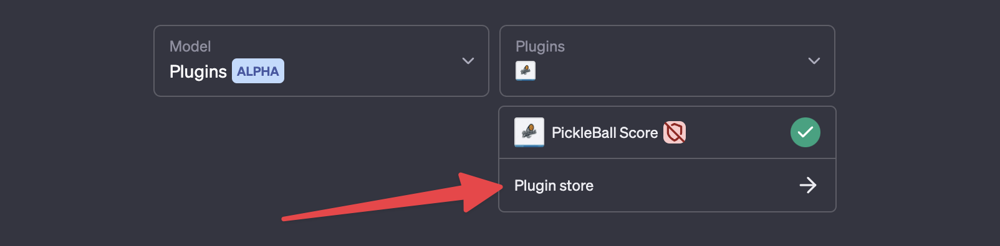
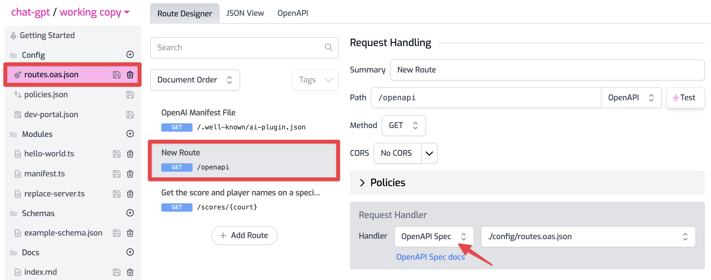
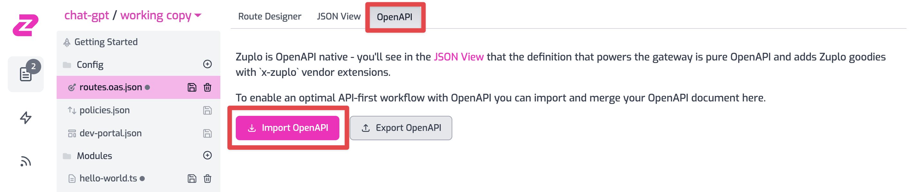
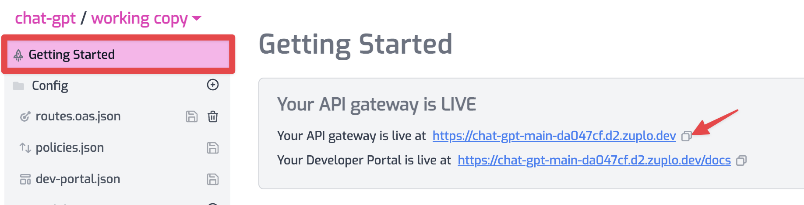
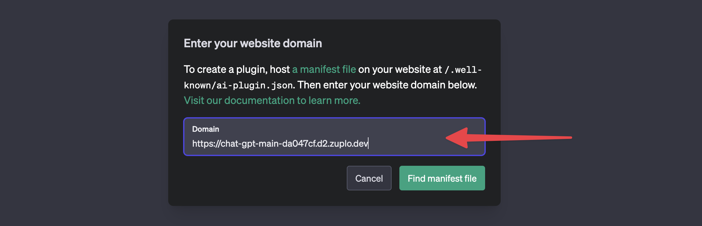

Over the past few years, the field of natural language processing has seen rapid
advancements, with GPT-based models like Chat-GPT leading the charge. It's an
exciting time with massive productivity gains ahead, especially for software
engineers.

One area of software development that is going to grow exponentially important
in a world boosted by AI productivity is APIs. APIs are how AI will actually get
things done and interact with real-world services.

Proof of this came recently with the announcement of Chat-GPT plugins. This is a
way for OpenAI to connect with real-world services via APIs. And, amazingly, all
OpenAI need to understand how your API works in an OpenAPI document. Wow, we
knew OpenAPI (so confusing, the similarity in names) was going to be important
but...

As a company that is all about APIs all the time, we couldn't be more excited.
We're the only gateway natively powered by OpenAPI which makes us the **fastest
way to deploy a Chat-GPT plugin**. In this post, I'll show you how (also
available in [video](https://youtu.be/hr0pBhgklB0))

For the purposes of this demo, we'll use a simple example API

## 1/ Installing a plugin to Chat-GPT

First, you need access to the Chat-GPT plugin which is currently in alpha. I
found it hard to learn how to do this so I'll share in detail here - but you
will need access.

Login to Chat-GPT at [chat.openai.com](https://chat.openai.com) and make sure
you have the Plugins option selected


Then, to add your own plugin, go to the plugin store



In the plugin store, choose `Develop your own plugin` at the bottom


This will open a prompt, asking for your domain - where OpenAI will find your
[manifest file](https://platform.openai.com/docs/plugins/getting-started/plugin-manifest).


The manifest file is a document that tells OpenAI more about your API and where
it will find your OpenAPI document. It has to be at the same location on your
domain `https://example.com/.well-known/ai-plugin.json`. With Zuplo, we can
easily create and host a manifest - let's switch over to Zuplo and get
everything ready, including our manifest and OpenAPI document.

## 2/ Creating the manifest file

Create a free account on Zuplo at [portal.zuplo.com](https://portal.zuplo.com)
and create a new project. In your project - we'll need to add our first route
for the manifest.

Click on `routes.oas.json` to select your routes file (this is actually an
OpenAPI file under the hood) and click **Add route**.

Set the following properties on your new route

- Summary: `OpenAI Manifest File`
- Path: `/.well-known/ai-plugin.json`

And press CMD+S to save your changes. Next, we'll need to make the handler for
this route a custom function. In the **Request Handler** section, choose
**Function** and use the ellipsis `...` to create a new Module called
`manifest`.


This will open your new `manifest.ts` file in the editor. Paste the following
code, replacing the original template:

```ts
import { ZuploContext, ZuploRequest } from "@zuplo/runtime";

const manifest = {
  schema_version: "v1",
  name_for_human: "Pro Club Tennis",
  name_for_model: "pro_club_tennis_score",
  description_for_human:
    "Plugin getting the current players and score for Tennis on our 6 courts",
  description_for_model:
    "Plugin getting the current players and score for Tennis on our 6 courts",
  auth: {
    type: "none",
  },
  api: {
    type: "openapi",
    url: "/openapi",
    is_user_authenticated: false,
  },
  logo_url:
    "https://thumbs.dreamstime.com/z/pickleball-logo-combination-lettering-moving-261404902.jpg",
  contact_email: "support@example.com",
  legal_info_url: "https://example.com/legal",
};

export default async function (request: ZuploRequest, context: ZuploContext) {
  // Zuplo will automatically serialize to JSON and add the content-type header
  // if you return an object like this in a function.
  return manifest;
}
```

A few things to note about this manifest, we are not using any auth for our
API - it's public (you can add auth protection with zuplo if you like). Also,
note the relative link to our OpenAPI file at `/openapi`. That's the next route
we'll add. Save your changes - your manifest file is now ready.

## 3/ Serving the OpenAPI file

Since our `routes.oas.json` file IS an OpenAPI file we just have to tell Zuplo
that we'd like to serve it, and on what path.

Add a new Route and set the path to `/openapi`. Choose **OpenAP Spec** for your
route handler, it should look like this:



This will now serve a sanitized (`x-zuplo` stuff and `x-internal` operations
removed) from the path `/openapi`. Neat! The very routing table powering your
gateway and documentation is now available as an endpoint (and visible to
OpenAI).

## 4/ The actual API part

If you have an OpenAPI file for your API already, you can just import to Zuplo
and most likely you are off to the races. To do this, go to the OpenAPI tab and
hit **Import OpenAPI**.



Your routes should have been imported and you should be good to go.

If you don't have an API with OpenAPI handy, you can easily use Zuplo to create
one. Watch this video to see how I created the demo API using Zuplo + ChatGPT in
under 5 minutes.

- [Generating a Demo API in Zuplo + ChatGPT in under 5 minutes](https://youtu.be/8zAuE2OUQLE).

## 5/ Setup the ChatGPT plugin

Now it's time to go back to chat GPT to setup the plugin, but before we do go
the **Getting Started** page to get your gateways URL.



Use the copy button next to your gateway's URL ("Your API gateway is live at").

Now head back to ChatGPT and paste the URL into that dialog asking for your
domain



And click **Find manifest file**.

With a bit of luck, you'll see the next 'Found Plugin' screen with no errors.
Otherwise errors in your manifest are typically well explained and easy to
correct.


If so, click **Install for me** and keep going through the many dialogs until
you see your plugin in the chat gpt main screen. Then ask, 'What are the scores
on court 3?'

Et voila! A working plugin


Checkout the video version of this content:

<YouTubeVideo url="https://www.youtube-nocookie.com/embed/hr0pBhgklB0" />
