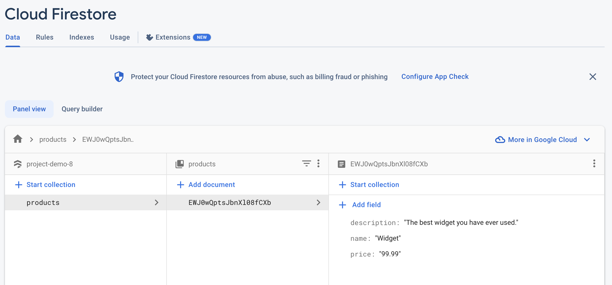
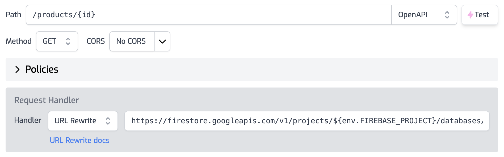
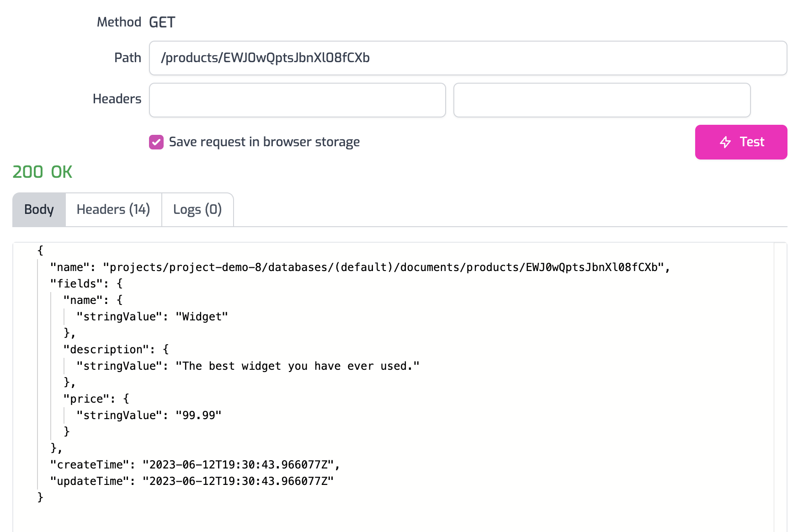

Recently, we shipped two new policies that make it easy to use Zuplo to utilize
Firebase services. The first policy
[Upstream Firebase Admin Auth](https://zuplo.com/docs/policies/upstream-firebase-admin-auth-inbound)
authorizes requests using a Firebase Admin Token that can be used to call any
Firebase API. The second policy,
[Upstream Firebase User Auth](https://zuplo.com/docs/policies/upstream-firebase-user-auth-inbound)
authorizes requests as a specific user which allows securing Firebase resources
using [security rules](https://firebase.google.com/docs/rules/rules-and-auth).

It's common for multi-tenant systems to share the same database with many users.
With Firestore, there are several ways to do this - one is create security rules
that grant users access to certain collections, documents, etc., the other is to
put another system in front of Firestore to gate access to data. In this
walkthrough you will learn how to use Zuplo to expose data stored in Firebase
securely without utilizing Firebase's security rules. This can be useful if you
don't want to tie your system to Firebase rules or maybe you just need
additional flexibility.

### 1/ Firestore Collection

For this walkthrough, we'll assume your Firebase database has a collection
called `products` with at least one document.



### 2/ Create a Zuplo Route

In the [Zuplo Portal](https://portal.zuplo.com), create a route in Zuplo that
uses a [URL Rewrite](https://zuplo.com/docs/handlers/url-rewrite) handler to map
the incoming request to Firestore's REST API. In this case set the Route's url
to `/products/{id}` and the rewrite value to the value below. Replace
`YOUR_PROJECT_ID` with your Firebase project ID.

`https://firestore.googleapis.com/v1/projects/YOUR_PROJECT_ID/databases/(default)/documents/products/${params.id}`



### 3/ Firebase Authentication Policy

Next, to give the request access to call the Firestore REST API, add the
**Upstream Firebase Admin Auth** policy. Notice the environment variable named
`SERVICE_ACCOUNT_JSON`.

<Video id="3f11d90de09f5f6e3891ce8164d85d87" />

### 4/ Environment Variable

Next, set the `SERVICE_ACCOUNT_JSON` environment variable as a secret. To get
the value of the private key, navigate to Firebase **Project Settings**, select
the **Service Accounts** tab and then generate and download a private key.

**CAUTION**: The value of the private key is a JSON file. **Before you save the
file to Zuplo's environment variables**, you must remove all line breaks and all
instances of the `\n` escape character. The JSON file should be a single line.

<Video id="f8840dfe93c3f17f064449a1fb028d9e" />

### 5/ Test the Route

Next, return the file explorer in Zuplo and select the route you created
earlier. Click the **Test** button. Set the ID pramaeter in the path
`/products/{id}` to an ID in your Firebase collection. Click **Test** and you
should see the data from the product returned.



### 6/ Modify the Body

The response returned from Firestore isn't in the nicest format. Add a new
custom policy to the route by selecting **Add Policy** and searching for
**custom code outbound**. Set the configuration of the policy to the code below
and click **Save**.

```json
{
  "export": "default",
  "module": "$import(./modules/rewrite-body)"
}
```

Next create a new outbound module called `rewrite-body.ts` and set it to the
following code. This will take the JSON sent by Firestore and convert it into a
more readable format.

```ts
export default async function (response: Response) {
  // Read the outgoing body
  const body = await response.json();

  // Create a new body with additional properties
  const outbound = {
    name: body.fields.name.stringValue,
    description: body.fields.description.stringValue,
    price: body.fields.price.stringValue,
  };

  // Return a new request with the modified body
  return new Response(JSON.stringify(outbound), response);
}
```

<Video id="8dead98359628f56ea7a85767bbaaf8e" autoplay={false} loop={false} />

### 7/ Test the Body Rewrite

Go back to the route tester and fetch the document again. This time you will get
a response with a nicely formatted JSON document like the below example.

```json
{
  "name": "Widget",
  "description": "The best widget you have ever used.",
  "price": "99.99"
}
```

Now you have a document that is stored in Firebase Firestore that can be served
to users through a nice REST API. I addition to what was shown in this
walkthrough, its easy to add even more functionality like
[authentication with API Keys](https://zuplo.com/docs/articles/api-key-management),
[rate limiting](https://zuplo.com/docs/policies/rate-limit-inbound), and more
using Zuplo.
