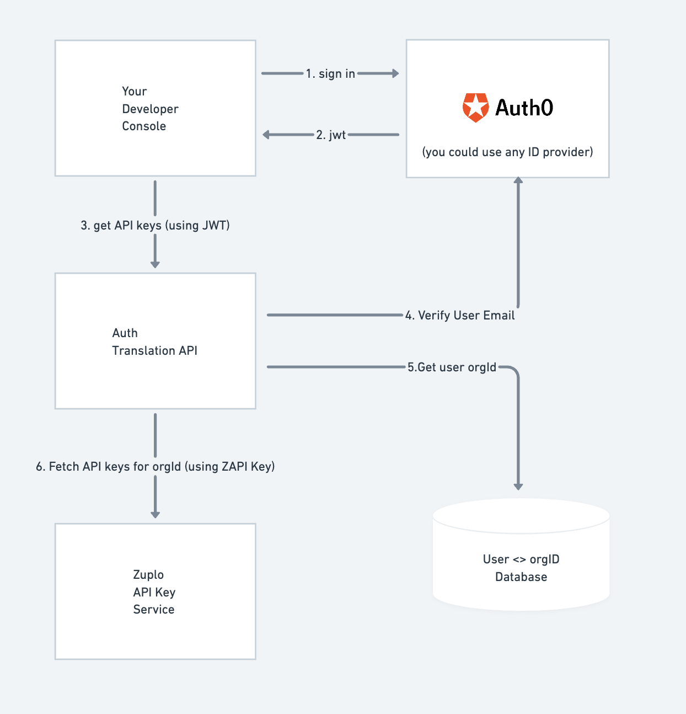

> _Zuplo helps you ship great APIs from day one. Startups and big enterprises
> ship API authentication, rate limiting, and developer documentation with
> amazing DX, using our serverless API Gateway deployed at the edge. You can
> start free at [zuplo.com](http://zuplo.com) and ship an API in minutes._

Day 2 of API Key Week at Zuplo comes with our first open-source release. At
Zuplo, we use and sponsor and lot of open-source and we are glad to announce our
first open-source project, an NPM package for adding an API Key manager to your
React projects.

## Why an API Key manager React component?

Zuplo offers in it’s own
[developer portal](https://zuplo.com/docs/articles/developer-portal) an
integrated API Key management that your users can use to self-serve API keys to
authenticate against your API. Although this is enough for most, some of
customers prefer to integrate their API experiences into their own Dev Console.

Our newest open-source component will help you shape your own API experience
while leveraging all of the other Zuplo features for your APIs. The component
(which is pluggable with a provider model to work with any API Key solution
provider) can be installed via npm `npm install @zuplo/react-api-key-manager`.
You can also checkout the code [here](https://github.com/zuplo/api-key-manager).

If you're curious how this work, we have a tutorial in this blogpost that will
help you set it up. But first... why should you care about API Key Management?

## What is Zuplo’s API Key Management?

Building your own API Key Management solution so you can offer your customers a
way to create, roll, delete API Keys that they will use to authenticate against
your APIs can take months, specially if you want to do it _The Right Way_:tm:.

Zuplo includes a fully managed API Key Management service that includes advanced
features such as

- User based
  [Rate Limiting](https://zuplo.com/docs/articles/step-3-add-rate-limiting)
- Customization of API behavior per-user using Typescript code
- [Github secret scanning](https://github.blog/changelog/2022-07-13-zuplo-is-now-a-github-secret-scanning-partner/)
- Key metadata
- Multiple keys per consumer and built in key rolling

API Key management on Zuplo allows you to easily secure your API using API keys
[with best practices](../2022-12-01-api-key-authentication/index.md).

## Tutorial: Setup a Web App with the newly release component

In this demo we will have users sign in into a web app labelled “Your Developer
Console” in the diagram below. Their e-mail address will be associated with an
`orgId` (e.g. “sales-east”) and have permissions to manage any keys in your API
key bucket tagged with that `orgId`.

The interaction of the different components of this demo are displayed in the
following screenshot and described below:



### Your Developer Console

The sample web app (NextJS) will support login using Auth0 (note: you could use
any auth provider). Once your user has acquired a JWT token from Auth0, the
token can be used to call the “Auth Translation API”, which protects your API
key store by restricting access only to keys the user has permissions to manage.

### Zuplo API Key Service

Our API Key service makes it easy to automate the management of your API keys
via our API. This sample shows you how you can help your users to help
themselves by self-serving certain capabilities like

- key labelling
- key rolling
- key deletion

The API Key services API is documented
[here](https://dev.zuplo.com/docs/routes#api-keys---consumers). When calling
this service you use your Zuplo API (ZAPI) API Key. This key has the power to
create, read, update and delete all API keys in your system and therefore should
be treated securely. For this reason **you should never give this key to a
customer or use it in a website directly.**

Instead, you need an intermediary Auth Translation API to enforce your
particular security policies around your API keys. In a cool twist of fate,
Zuplo is an excellent intermediary well suited to this task, and we’ll use it in
this demo.

### Auth Translation API

Zuplo is a very effective tool for auth translation. With native support for JWT
auth (including an Auth0 specific policy) and being able to easily modify
requests and change the auth to a secured secret like your ZAPI key, it’s an
ideal way to implement your API key auth translation capability. It is not
required however, and you could implement this in another backend if you so
choose. If you do use Zuplo for your API, we would recommend creating a separate
project for the Auth Translation Service.

This service will get the e-mail of the current user by calling Auth0 and then
call a database to get the `orgId` this user has permissions to manage.

The Auth Translation API — so called because it translates from JWT to Zuplo API
API Key, adding constraints — will then call the Zuplo API Key service and load
consumers that belong to the specified `orgId` using tags associated with the
consumer.

:::info What is a **consumer**?

In Zuplo’s API Key service, a **consumer** is an identity that has associated
metadata. Typically a consumer has a single key (which is similar to a password)
that is used to identify the consumer when calling your API. A consumer can have
multiple keys at any one time - all identifying the same ‘user’.

:::

## Let’s build the sample (about time)!

### 1- Clone the Auth Translation API

This API is configured to be deployed to Zuplo. You can find the git repo
[here](https://github.com/zuplo/sample-auth-translation-api), but all you have
to do is click on the deploy button below and Zuplo will automatically create a
copy of the project and deploy it for you 😎

[](https://portal.zuplo.com/zup-it?sourceRepoUrl=https://github.com/zuplo/sample-auth-translation-api.git)

You should see the below screen. Enter a custom name for your project or accept
the default suggestion. Click **Zup It!** to complete the deployment.


:::info Auth0 Demo Tenant

To make it easier to get started with this demo we have provided you with a demo
Auth0 tenant. You can easily create and configure your own Auth0 tenant by
modifying the environment variables in the auth translation service and your
developer console projects.

:::

Go to **_Settings > Environment Variables_** and create the following
Environment Variables:

1. `AUTH0_AUDIENCE`: This is the value of your configured API Audience in Auth0.
   For simplicity you can use the value below from our sample Auth0 tenant to
   test.

   ```
   https://api.example.com/
   ```

1. `AUTH0_DOMAIN`: This is the value of your Auth0 domain. For simplicity, you
   can use the value below from our sample Auth0 tenant to test.

   ```
   zuplo-samples.us.auth0.com
   ```

1. `BUCKET_URL`: Get the value for this from **_Settings > Project
   Information_** tab. The value is labelled ‘_API Key Bucket URL_’.
1. `ZAPI_KEY`: (_Secret_) Get your ZAPI (Zuplo API) Key from the **_Settings >
   Zuplo API Keys_** section.

All done! Your auth translation service is all ready to go 👏.

:::caution E-mail verification

To keep the demo simple, we do not check if the user's
[e-mail is verified](https://auth0.com/docs/manage-users/user-accounts/verify-emails).
You should do this in any real implementation.

:::

### 2- Add some users to the "database" so you can manage some keys

To keep the demo simple, we created a mock database API project. Go the Zuplo
portal again and open the **file explorer**. Open the `modules/data.ts` file and
add yourself as a member of the `sales-east` organization with me
(abdallah@zuplo.com). Don’t forget to save your changes (CMD+S).

:::note

Make sure this is the e-mail that you’ll use to sign in to Auth0 within the
developer console.

:::

```sh title=modules/data.ts {6}
const DATA = {
  orgs: [
    {
      id: "sales-east",
      name: "Contoso",
      members: ["abdallah@zuplo.com", "YOUR_EMAIL_HERE"],
    },
  ],
};
```

### 3- Build the Developer Console

This is a sample NextJS project that will be using the open-source API Key
manager component. Clone the project by running the following command. You will
be asked to name your project.

```sh
npx create-next-app --example \
  https://github.com/zuplo/api-key-manager/tree/main/examples/nextjs
```

> You can also download the example as a
> [zip file here](https://github.com/zuplo/api-key-manager/releases/latest/download/nextjs-example.zip)

We'll now need to get the Auth Translation API url from the previous steps to
start the Developer Console.

1.  Copy the Auth Translation API url

    In Zuplo, Go to the **_Settings > Project Information_** tab in Zuplo and
    grab the Current Env URL value (it will look something like
    `https://sample-auth-translation-api-main-a494b6a.d2.zuplo.dev`)

2.  Set the Environment Variable

    In your web app, open the `.env.local` file and set the
    `NEXT_PUBLIC_API_URL` variable using the URL from the previous step:

    ```txt title=.env.local {1}
    NEXT_PUBLIC_API_URL=https://you-url-here.d2.zuplo.dev
    NEXT_PUBLIC_AUTH0_DOMAIN=zuplo-samples.us.auth0.com
    NEXT_PUBLIC_AUTH0_CLIENT_ID=OFNbP5hhtsCHkBsXHEtWO72kKQvJtgI3
    NEXT_PUBLIC_AUTH0_AUDIENCE=https://api.example.com/
    ```

    :::info Auth0 Demo Tenant

    If you are using your own Auth0 account, set the other variables
    accordingly, otherwise just leave our sample values.

    :::

3.  Start the project

    ```
    npm run dev
    ```

### 4- Try out your own API Key Manager

Sign in the e-mail you specified and, all being well, you should be able to
create your first API key and try the following

1. editing the description of the key
2. rolling the key
3. deleting an expiring key
4. delete a whole consumer/key

Copy an API Key to use it with the API in the next step.

### 5- Test the API Key

Copy the gateway URL from **_Files > Getting Started_**


Now, try the API Key against a `/who-am-i` endpoint deployed with the Auth
Translation API.

```bash
curl https://YOUR_GATEWAY_URL/who-am-i \
--header 'Authorization: Bearer YOUR_API_KEY'
```

Have fun!

## This is only Day 2 of API Key week

Come back to check out new content and announcements each day!

Tomorrow, we'll have a new announcement that will show our commitment to our
newest open-source project.
