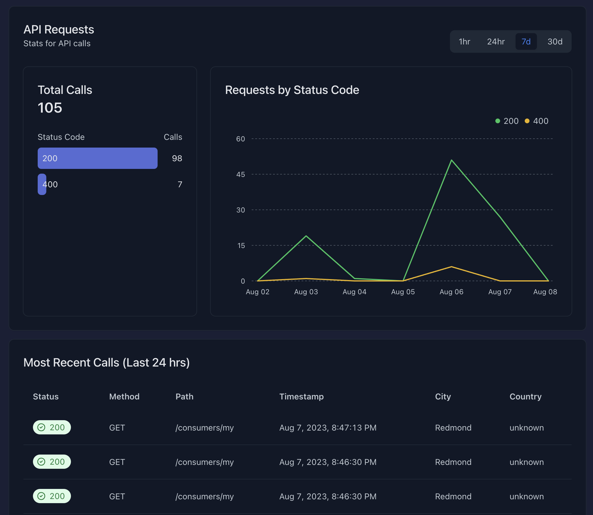

Today — Day 3 of API Key Week — we're excited to announce a new feature in our
Zuplo Developer Portal. In addition to built-in, fully automated self-serve API
Key management, developers using your API can now access their own view of their
activity on your API with our new Developer Portal Analytics feature.

The bar for offering a high-quality API experience is constantly being raised,
you need at least

- clear, beautiful API reference documentation
- easy and appropriate authentication options (like API Keys, 
[used by the best API companies in the world](../2022-05-03-you-should-be-using-api-keys/index.md))
- self-serve API Key management
- clear error messages that follow a standard (ideally an open one like
  [Problem Details](../2023-04-11-the-power-of-problem-details/index.md))

And, in addition to this, we're increasingly seeing the best APIs offer
developer facing analytics to help them debug and understand their own usage of
their API. Especially useful when they might be hitting rate limits or unsure if
their code is even making it to your backend.

<YouTubeVideo url="https://www.youtube-nocookie.com/embed/vyOzlztHpnM" />

This feature is now effortlessly available to Zuplo customers on our Business
tier (any tier can try it for free in their working-copy -
[pricing](https://zuplo.com/pricing)).

Try it out today and let us know what you think. Stay tuned for another cool
API week update tomorrow!
