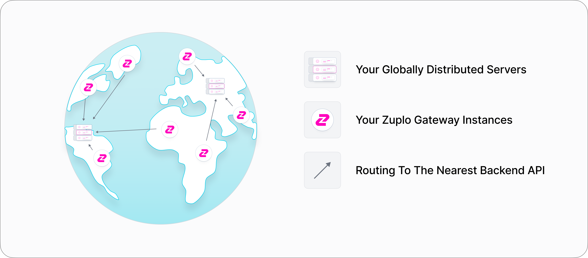

The Zuplo API Gateway is a fully-managed, lightweight API management platform
designed for developers. It offers fast deployment, GitOps-friendly workflows,
and unlimited environments. Whether you're an individual developer or part of an
engineering team, Zuplo makes it easy to:

- [Add authentication and access control](../articles/step-3-add-api-key-auth.mdx)
- [Implement rate limiting](../articles/step-2-add-rate-limiting.mdx)
- Write custom logic to run at the gateway layer
- Build a [rich developer portal](../dev-portal/introduction.mdx) with
  self-serve tools for auth and monetization

Zuplo delivers the core benefits of API management without the overhead of
legacy platforms. That means no expensive licensing, training requirements, or
complex setup.

Everything in Zuplo is defined through code and stored in source control.
Deployments are handled through Git-based workflows and go live globally in
under 20 seconds.

Explore more by [booking a demo](https://zuplo.com/meeting?utm_source=docs) or
[signing up](https://portal.zuplo.com/signup?utm_source=docs) for free.

## Zuplo in your stack

Zuplo is a serverless gateway that runs at the edge in over 300 data centers
worldwide. This edge-first architecture provides:

- Built-in redundancy and high availability
- Low-latency performance—typically within 50ms of most users

Zuplo is cloud-agnostic. It integrates with backends running on AWS, Azure, GCP,
or private infrastructure. Multiple
[secure connectivity options](../articles/securing-your-backend.mdx) are
available.

In most setups, Zuplo sits between clients and your backend API—whether those
clients are servers, browsers, mobile apps, or IoT devices. Traffic is routed
through Zuplo, where you can enforce policies like rate limiting and
authentication, validate requests, and apply transformations before requests
reach your backend.

Zuplo also supports global traffic management. Customers with distributed
backends use Zuplo to route requests to the nearest data center, optimizing for
speed and reliability.

## Protocols

Zuplo can proxy any HTTP traffic. It supports REST, GraphQL, WebSockets, and
other HTTP-based protocols (including legacy systems proxying SOAP over HTTP!).
HTTP/2 is fully supported.

## Languages

Zuplo is configured via JSON and extended using TypeScript or JavaScript. Your
backend can be written in any language that speaks HTTP, such as Go, Node.js,
.NET, Java, C, and more.

## Integrations

Zuplo integrates with platforms like Datadog, New Relic and GCP Cloud Logging
for monitoring and observability. We continuously add new integrations based on
customer needs, so [reach out](../articles/support.mdx) if you need support for
a specific tool.

## Runtime

The Zuplo runtime is based on Web Worker technology, supporting JavaScript and
WebAssembly. It's the same foundational tech used by platforms like Deno Deploy,
Fastly, Vercel Edge Functions and Cloudflare Workers.

This architecture offers key benefits:

- Near-zero cold start time
- High throughput
- Strong developer ergonomics—built on familiar browser APIs like
  [Response Web API](https://developer.mozilla.org/en-US/docs/Web/API/Response)

## Performance and latency

Zuplo processes billions of requests monthly and has been tested to handle over
10,000 requests per second, even with policies like API key validation and rate
limiting enabled.

Typical added latency is in the low milliseconds. Policies are highly optimized
and can be tuned to meet specific performance goals.

## Multi-cloud

Zuplo is designed to work seamlessly with services across cloud providers
including AWS, Azure, GCP, and on-premise environments.

Our distributed architecture and
[connectivity options](../articles/securing-your-backend.mdx) ensure secure,
performant connections to your backend, wherever it runs.

## Security and Compliance

Zuplo is built with a security-first architecture and offers robust tools for
securing APIs in production environments:

- Support for API key auth, OAuth2, mTLS, IP allowlisting, and custom
  authentication logic
- Fine-grained access control and rate limiting applied at the edge
- Token validation and request enforcement before hitting your backend

Zuplo is SOC 2 Type II compliant and operates in a multi-tenant, zero-trust
model. All data in transit is encrypted using TLS 1.2+, and backend secrets are
managed securely.

Deployments are Git-based and fully auditable. All gateway configurations are
defined as code, making it easy to enforce policy-as-code and maintain
traceability.

For teams with strict compliance or data residency requirements Zuplo offers
customizable deployment options, including managed dedicated instances and
tailored configurations.
[Book a demo](https://calendly.com/zuplo-api/api-discussion) to discuss your
needs.
