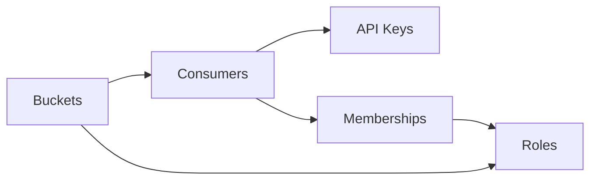

# Zuplo API Key Service

Zuplo runs a globally distributed API Key management service that scales to handle millions of daily key validation requests while maintaining low latency from any region around the world.

The Zuplo API Key service is the backend that handles management of API keys and related data as well as key validation when using the API Key Authentication policy in your Zuplo API Gateway. This service can be managed through the Zuplo Portal (coming soon) or directly using the API.

# Service Reference

## Models

The service consists of several objects:

### Buckets

Buckets are the top level group for this service. A bucket could be used with a single Zuplo environment or shared among multiple environments or projects. By default a Zuplo API Gateway project will be created with several buckets that map to production, preview, and working copy environments.

Enterprise plan customers run complex configurations where buckets are shared across gateway projects or even accounts. This can allow your end-users to authenticate to all your APIs with a single API key with unified permissions.

### Consumers

Consumers are the core of the API Key service. The consumer is the "identity" of any API Keys that are created. Consumers have a `name` which must be unique in the bucket. This `name` is used as the default `user.sub` property in the API Key Authentication policy.

### API Keys

A Consumer can have any number of API keys associated with it. Each API Key shares the same identity (i.e. Consumer) when authenticating with this service. Keys can have their own `description` to note the use of the key and can have an expiration date. Expired keys will not be permitted to authenticate after their expiration.

### Roles

This service supports a simple role-based access model. This RBAC is not intended to be a full featured authorization system, but can be useful for certain common and relatively simple uses. Roles are given a name and Consumers can be assigned to any number of roles.

This system does not complex features like role inheritance or groups. For these purposes, a purpose-build RBAC solution should be used.

### Memberships

Consumers are added to roles by creating a "Membership". Consumers can be added to a role with or without an "object" scope. When validating API Keys, the request can optionally check for role membership and scope.

## Relationships

The below diagram show the relationships between the API objects. Notice that the most important object is the consumer - this is the identity of the API Key and the object that contains the `metadata`. Additionally, this is the object that is added as a member to roles. API Keys are used to authenticate as a Consumer.



## Usage

Each bucket is created with a default API Key that is assigned the role of bucket owner. The bucket owner role has permissions to perform any tasks on a bucket such as creating consumers, api keys, etc. Additional bucket owner tokens may be created through the Zuplo Portal (coming soon).

To start set two environment variables.

```bash
export API_KEY=YOUR_KEY
export BUCKET_NAME=the-bucket
```

Next, create a consumer and an API Key.

```bash
curl \
  -H "Content-type: application/json" \
  -H "Authorization: Bearer $API_KEY" \
  -d '{ "metadata": { "testId": "1234" }, "name": "my-consumer" }' \
  https://apikey.zuplo.com/v1/buckets/$BUCKET_NAME/consumers
```

The response should look like this:

```json
{
  "id": "csmr_sikZcE754kJu17X8yahPFO8J",
  "name": "my-consumer",
  "createdOn": "2023-02-03T21:33:17.067Z",
  "updatedOn": "2023-02-03T21:33:17.067Z",
  "description": null,
  "tags": {},
  "metadata": { "testId": "1234" }
}
```

Next, create an API Key for this consumer.

```bash
curl \
 -H "Content-type: application/json" \
 -H "Authorization: Bearer $API_KEY" \
 -d '{ "description": "My first API Key" }' \
 https://apikey.zuplo.com/v1/buckets/$BUCKET_NAME/consumers/my-consumer/keys
```

The response should look like this:

```json
{
  "id": "key_Lcu5VVvuJWpgLS86oVo5mfDJ",
  "description": null,
  "createdOn": "2023-02-03T21:35:22.047Z",
  "updatedOn": "2023-02-03T21:35:22.047Z",
  "expiresOn": null,
  "key": "zpka_d67b7e241bb948758f415b79aa8ec822_2efb7009"
}
```

You can use this API Key to call your Zuplo API Gateway that is protected by the [API Key Authentication](/docs/policies/api-key-inbound) policy.

## Reference

The full API Reference for the API Service is hosted using a Zuplo developer portal at [https://apikey.zuplo.com/docs/](https://apikey.zuplo.com/docs/).
