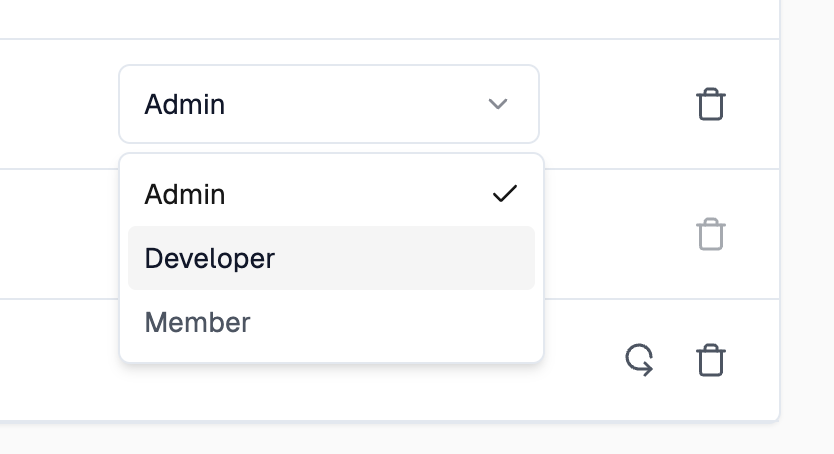

Accounts can be shared with many users. This document explains how to add and
manage users in your account.

To start, navigate to the account settings page by clicking on your user icon in
the top right corner of the screen and selecting "Settings" from the dropdown
menu.

The view will display the users that are currently members of the account and
their roles.

On the top of the page, you can enter an email address of the user you want to
invite. For accounts with the enterprise role feature, users are added to the
account with the role of "Member", for all other accounts users are added with
the role of "Admin".

After inviting a user, you will see the invited user in the list with the
members.

Once a user has accepted the invitation, you can change their role by selecting
the role from the drop down.

:::info Paid Add-on

Roles are available as a paid add-on as part of enterprise plans. For plans
without this feature, users are always set to the "Admin" role. For more
information contact [sales@zuplo.com](mailto:sales@zuplo.com).

:::

## Removing a Member

To remove a user from the account, click on the remove icon next to the user.

