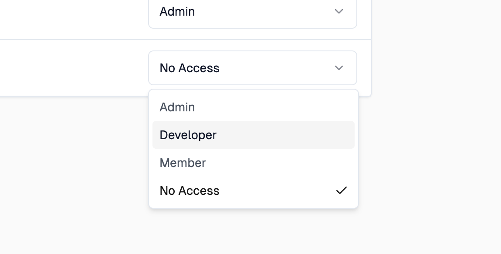

Projects can have multiple members with different roles. Some account level
roles allow access to project resources as well. Users can also be assigned
project level roles in order to grant them access to specific project resources.

## Add Project Member

To manage project members, navigate to the project settings page and click the
**Members** tab, which shows a list of all members in the project and their
roles.

This list will display all account members - even those who have no access to
the project.

## Change Member Role

<EnterpriseFeature name="Role Based Access Control" />

Account admins will always have access to all projects. If you try to change the
role of an account admin, you will see a warning message that this user is an
account admin and can't be changed.

For users who aren't account admins, you can change their role by selecting the
desired role from the dropdown.

## Remove Project Member

Removing a project member can be done by selecting "No Access" from the role
drop down.
