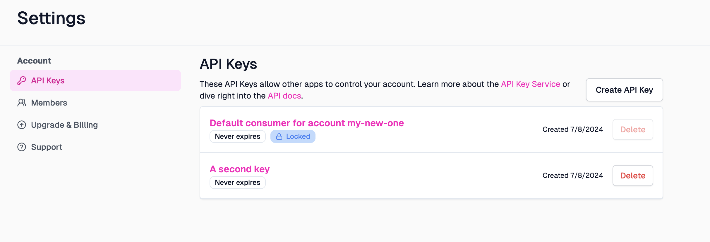
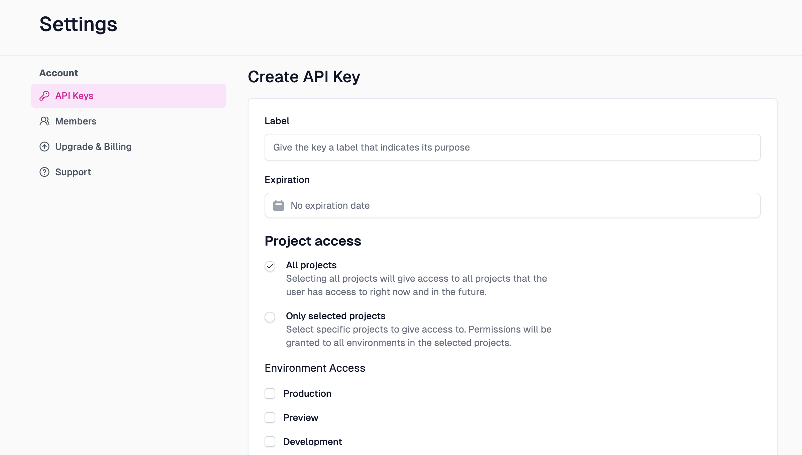
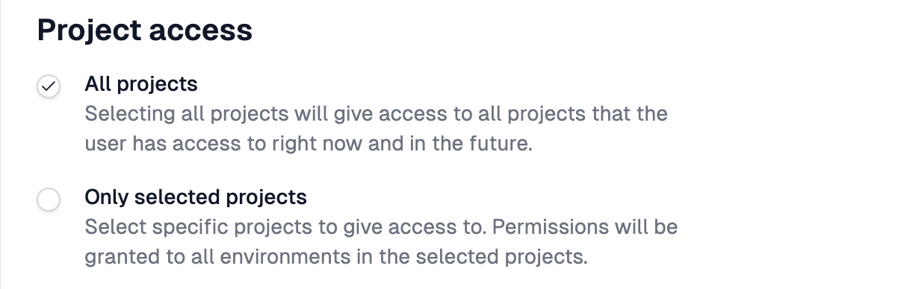
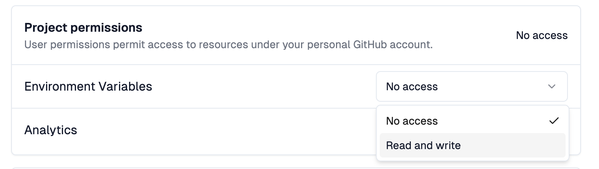

The [Zuplo Developer API](https://dev.zuplo.com) allows you to programmatically
interact with Zuplo. To access the API, you need to create an API key.

API keys are used to authenticate requests to the Zuplo API. They're unique to
your account and should be kept secret. Don't share your API key in publicly
accessible areas such as GitHub repositories.

## Creating an API Key

To start, navigate to the account settings page by clicking your user icon in
the top right corner of the screen and selecting "Settings" from the dropdown
menu. Click the **API Keys** tab to view the API keys in your account that you
have access to.

:::note{title="Required Role"}

Account admins can view and manage all API keys in the account. Developers can
only view their own API keys. Members don't have access to API keys.

:::

Select the "Create API Key" button to create a new API key. You can enter a
label, expiration, and select the permissions for your new API key.

<EnterpriseFeature name="Fine-grained API Key Management" />

## Editing an API Key

API Keys are immutable once created. If you need to change the permissions you
will need to create a new API key.

## Deleting an API Key

API Keys can be deleted by selecting the delete button on the list page or by
opening the details page for the key and clicking the **Delete** button at the
bottom of the page.

## API Key Permissions

<EnterpriseFeature name="Fine-grained API Key Management" />

The following table outlines the permissions available to each API key.

### Project Access

API Keys can be scoped to all projects or specific projects in the account.
Selecting All Projects will also grant all project level permissions to that
key. If you want to customize the project level permissions, scope the key to
one or more projects.

### Environment Access

API Keys can be scoped to all environments or specific environments within the
projects they have access to. You can select one or more environments. For
example, if you want to restrict a key to only have access to only access
preview and development environments, you can select only those two
environments.

### Project permissions

When API Keys are scoped to specific projects, you can select the permissions
the key has in that project. For each permission select the level of access
desired from the drop down.

### Account permissions

API Keys can be granted account level permissions. These permissions are for
account level resources like custom domains, tunnels, etc. For each permission
select the level of access desired from the drop down.

When selecting permissions for API Key Buckets or Monetization Buckets, the
environment type scope is also applied. For example, if your key has access to
preview environments and has Read and Write access to API Key buckets, that key
can only read and write to API Key buckets in the preview environments - it
can't modify buckets used in production environments.
