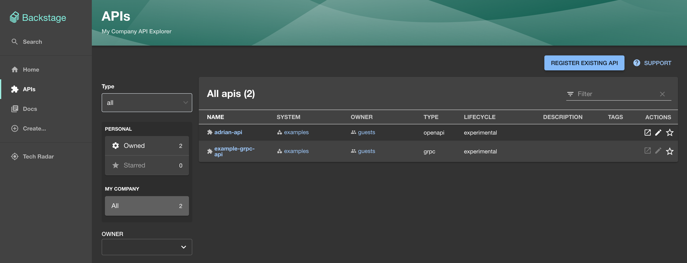

In this guide, we'll walk you through the steps to add a your Zuplo API to
[Backstage](https://backstage.io/).

## 1/ Add the OpenAPI Spec Handler

Backstage allows you to document
[API entities](https://backstage.io/docs/features/software-catalog/descriptor-format/#kind-api)
using an OpenAPI file. Although Zuplo is OpenAPI based, you can't directly use
your `routes.oas.json` file, as it's missing details about your API. Instead,
you will need to use the public-ready version of your spec, by adding an
[OpenAPI Spec Handler](../handlers/openapi.mdx).

Add a new route with the path `/openapi`, and select the `OpenAPI Spec Handler`
from the Request Handler selector. Save your changes and commit them to your
production branch. If you haven't already connected your Zuplo API to a GitHub
repository, you can follow
[these instructions](./step-4-deploying-to-the-edge.mdx) to do so. Once your
Zuplo API is redeployed, you should now be able to retrieve your public-ready
OpenAPI file by hitting `https://<your-prod-zuplo-api-domain>/openapi`.


## 2/ Add Zuplo to your `reading.allowed` list

Navigate to the `app-config.yaml` file in your backstage repository. You will
need to allow backstage to call Zuplo's domain to fetch the OpenAPI file. Add
the following code:

```yaml
backend:
  reading:
    allow:
      - host: "*.zuplo.dev"
      - host: "*.zuplo.app"
```

If you are using a [custom domain](./custom-domains.mdx) on your Zuplo API - you
will need to add that domain in the list above.

## 3/ Add your Zuplo API to your Backstage Catalog

The most direct way to add your Zuplo API to backstage is by adding an entry to
your backstage service's `entities.yaml` file.

```yaml
apiVersion: backstage.io/v1alpha1
kind: API
metadata:
  name: backstage-sample-api # Your API name
  annotations:
    # Your github project slug Ex. org/repo-name
    github.com/project-slug: zuplo-samples/backstage-sample-api
spec:
  type: openapi
  lifecycle: experimental # Change to match your backstage project
  owner: guests # Change to match your backstage project
  system: examples # Change to match your backstage project
  definition:
    # Change to match your Zuplo API
    $text: https://backstage-sample-api-main-821019a.zuplo.app/openapi
```

Once you've added the API component, you must link it to an existing component.
For example, if your website provides APIs, you would add the following

```yaml
---
apiVersion: backstage.io/v1alpha1
kind: Component
metadata:
  name: example-website
spec:
  type: website
  lifecycle: experimental
  owner: guests
  system: examples
  providesApis: [backstage-sample-api] # This must match the metadata.name of the entity
---
```

You should now be able to see your API under the APIs tab in Backstage. If you
navigate to your API and click the **DEFINITION** tab - you can even preview
your OpenAPI spec.


Congratulations! You've successfully added your Zuplo API to Backstage. You can
repeat the steps above for all of your OpenAPI files.

## Optional: Reusing your API across Backstage catalogs

If you don't wish to directly add your Zuplo API to your backstage
`entities.yaml`, you can instead add the entity definition to your Zuplo
repository directly, and sync it with backstage using their GitHub integration.
You will still need to follow steps 1 & 2 from the guide above.

### 1/ Add `catalog-info.yaml` to your Zuplo Repository

In your Zuplo repository, add a file named `catalog-info.yaml` and fill it with
the following

```yaml
apiVersion: backstage.io/v1alpha1
kind: API
metadata:
  name: backstage-sample-api # Your API name
  annotations:
    # Your github project slug Ex. org/repo-name
    github.com/project-slug: zuplo-samples/backstage-sample-api
spec:
  type: openapi
  lifecycle: experimental # Change to match your backstage project
  owner: guests # Change to match your backstage project
  system: examples # Change to match your backstage project
  definition:
    # Change to match your Zuplo API
    $text: https://backstage-sample-api-main-821019a.zuplo.app/openapi
```

Save and commit this file.

### 2/ Add your API Component to Backstage

You can register existing APIs in your catalog directly from Backstage. Navigate
to the APIs tab, and click **REGISTER EXISTING API**.



When prompted for the component URL, enter the GitHub URL of your
`catalog-info.yaml` file (ex.
https://github.com/AdrianMachado/adrian-api/blob/main/catalog-info.yaml).


Complete registration of your API. If you run into issues connecting your
repository, see the [troubleshooting guide](#troubleshooting).

### 3/ Link the API to a component

You should now be able to see your API under the APIs tab in Backstage. If your
API is associated with a another entity, you will need to link to that entity as
follows:

```yaml
apiVersion: backstage.io/v1alpha1
kind: System
metadata:
  name: examples
spec:
  owner: guests
---
apiVersion: backstage.io/v1alpha1
kind: Component
metadata:
  name: example-website
spec:
  type: website
  lifecycle: experimental
  owner: guests
  system: examples
  providesApis: [<YOUR_API_NAME>] # This must match the metadata.name from step 1
```

## Troubleshooting

### Can't connect to GitHub

If your repository isn't public and you haven't already configured GitHub
authentication -
[follow the GitHub auth guide](https://backstage.io/docs/getting-started/config/authentication).
You will likely want to add sign-in support as a part of your Backstage setup,
to authenticate your users. In your `app-config.yaml` add:

```yaml
auth:
  allowGuestAccess: true
  environment: development
  providers:
    github:
      development:
        clientId: ${GITHUB_CLIENT_ID}
        clientSecret: ${GITHUB_CLIENT_SECRET}
        signIn:
          resolvers:
            - resolver: emailMatchingUserEntityProfileEmail
            - resolver: usernameMatchingUserEntityName
```

Additionally, in your `index.ts` file, add the following line before calling
`backend.start()`

```typescript
backend.add(import("@backstage/plugin-auth-backend-module-github-provider"));
```

This isn't well documented by Backstage - any issues should be directed
[to them](https://github.com/backstage/backstage/issues).

### Backstage hosted on Roadie.io

If you are using a managed version of Backstage from services like Roadie.io -
you will need to follow their
[official docs](https://roadie.io/docs/details/openapi-specs/) for OpenAPI. We
don't guarantee support for these platforms.
