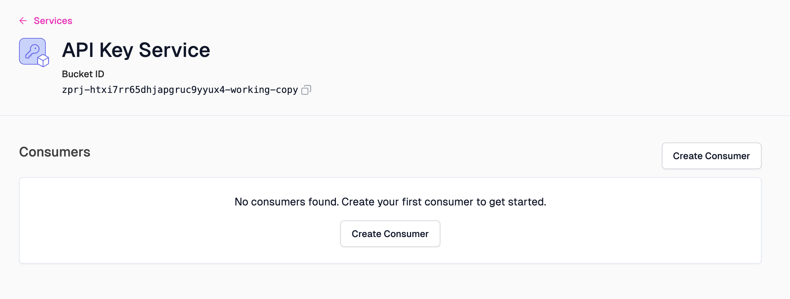
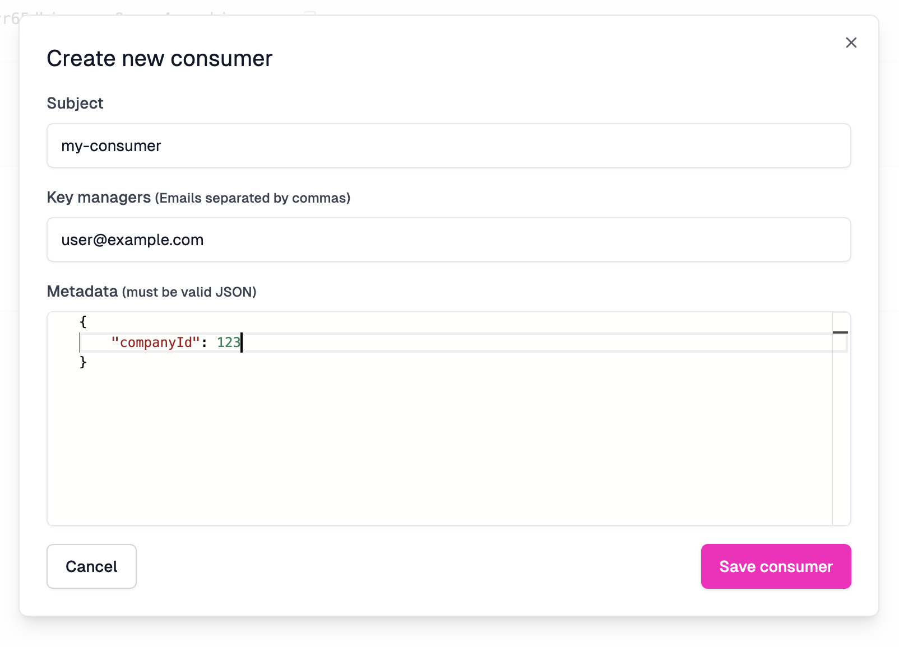
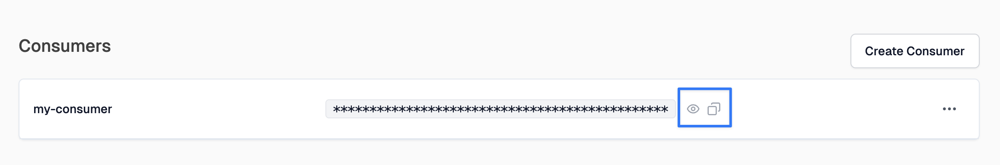

API Key Consumers can be managed in the Zuplo Portal's **Services** section.
Each project is created with three API Key Buckets - one for production, one
shared by preview environments, and one for development (working copy)
environments.

You can view the buckets for each environment or for all environments using the
drop down.

To open the API Key Bucket for an environment, click the **Configure** button.

When you first open the API Key Bucket, you won't have any API Keys created.

To add a new API Key Consumer click the **Create Consumer** button and complete
the form.

Once a consumer is created, you can view or copy the API Key by clicking the
icons shown.

If you're using the Zuplo [Developer Portal](../dev-portal/introduction.md),
we've an integration with the API Key API that allows developers to access their
API keys, create new ones and delete them. To enable this, you must assign one
or more managers, via e-mail, to be a manager for your API Key Consumer. This is
optional if you aren't using the
[Developer Portal](../dev-portal/introduction.md).

You can assign managers in the Zuplo Portal (portal.zuplo.com) or via the API.

If you want to automatically create an API Key for a customer automatically when
they sign into your developer portal using Auth0,
[follow this tutorial](../dev-portal/dev-portal-create-consumer-on-auth.md).
