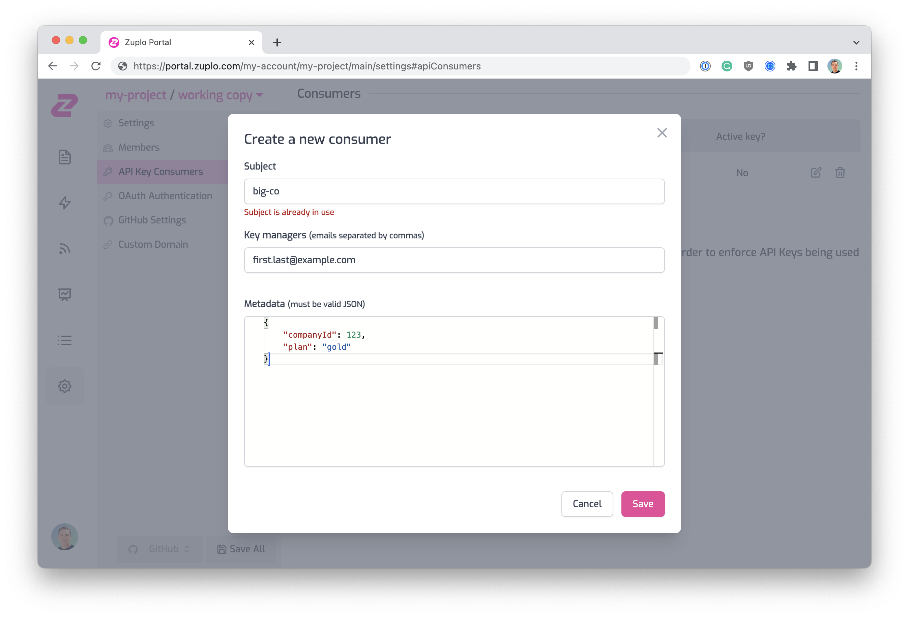

## Managing Consumers in the Zuplo Portal

API Key Consumers can be managed in the Zuplo Portal's **API Key Consumers**
section under the <SettingsTabIcon /> **Settings** tab.

To add a new API Key Consumer click the **Add new consumer** button and complete
the form.

If you're using the Zuplo [Developer Portal](./developer-portal.md), we have an
integration with the API Key API that allows developers to access their API
keys, create new ones and delete them. To enable this, you must assign one or
more managers, via e-mail, to be a manager for your API Key Consumer. This is
optional if you are not using the [Developer Portal](./developer-portal.md).

You can assign managers in the Zuplo Portal (portal.zuplo.com) or via the API.

If you want to automatically create an API Key for a customer automatically when
they sign into your developer portal using Auth0,
[follow this tutorial](./dev-portal-create-consumer-on-auth.md).
