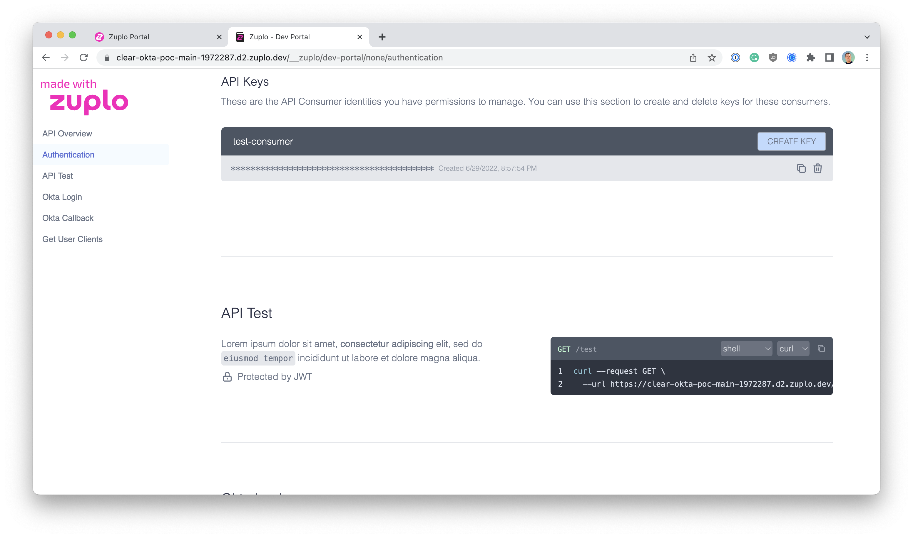

For any API Key to be useful it needs to be shared with the right end-user.
Zuplo provides several options depending on the level of customization required.

## Dev & Testing

For development and testing, the easiest way to obtain an API key is right in
the [Zuplo Management Portal](https://portal.zuplo.com). From inside the **API
Key Consumers** section in the **Settings** tab you can create and manage
consumers and their keys.

For quick access the newest, non-expired API key is shown in this section.

## Zuplo Developer Portal

If you are using Zuplo's integrated developer portal to share your API with your
end-users, you can easily enable API Key management to authenticated users of
the portal.

When API Key Managers log into the Developer Portal they can copy, manage, or
create new API Keys.

## Zuplo Developer API

If you want complete control over the experience - for example, building an "API
Keys" section directly into your product's settings page - you can use the
[Zuplo Developer API](https://dev.zuplo.com/docs/) to manage the full lifecycle
of consumers and keys from your own backend.

This approach works with any tech stack. Your backend authenticates users with
your own auth system, then proxies requests to the Zuplo Developer API to
create, list, rotate, and delete keys on their behalf. You control the UI, the
access rules, and the onboarding flow.

For a complete implementation walkthrough including architecture, code examples,
and security guidance, see
[Build Self-Serve API Key Management in Your Product](./api-key-self-serve-integration.mdx).
For the raw API operations, see
[Programmatic API Key Management](./api-key-api.mdx) and the
[Zuplo Developer API documentation](https://dev.zuplo.com/docs/).
