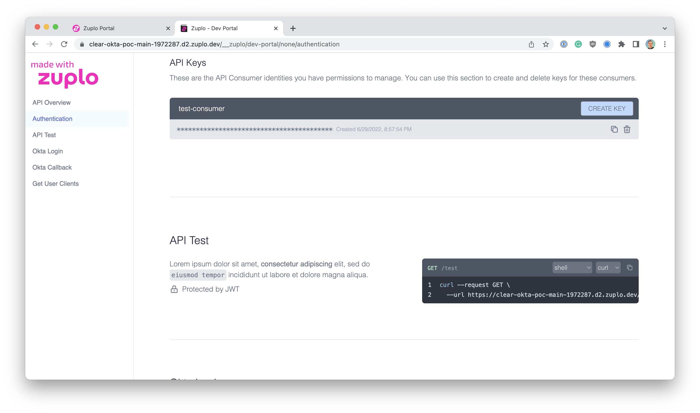

For any API Key to be useful it needs to be shared with the right end-user.
Zuplo provides several options depending on the level of customization required.

## Dev & Testing

For development and testing, the easiest way to obtain an API key is right in
the [Zuplo Management Portal](https://portal.zuplo.com). From inside the **API
Key Consumers** section in the **Settings** tab you can create and manage
consumers and their keys.

For quick access the newest, non-expired API key is shown in this section.

## Zuplo Developer Portal

If you are using Zuplo's integrated developer portal to share your API with your
end-users, you can easily enable API Key management to authenticated users of
the portal.

When API Key Managers log into the Developer Portal they can copy, manage, or
create new API Keys.

## React Component and API

If you would prefer to integrate API Key management inside of your own portal
and you are building with React, Zuplo offers an
[open source API Key Manager component](https://github.com/zuplo/api-key-manager)
that makes it easy to allow your users self serve access to their keys.

Additionally, you can use the
[Auth Translation API](https://github.com/zuplo/sample-auth-translation-api)
sample as a starting point for building your management API using Zuplo.

You can find a demo of this component at https://api-key-manager.com.

## Zuplo Developer API

Finally, if you want complete control over the entire experience, you can
utilize Zuplo's Developer API to manage the full lifecycle of API Consumers and
Keys.

For more infomation on using the API to manage consumers and keys see
[Programmatic API Key Management](./api-key-api.mdx) and the
