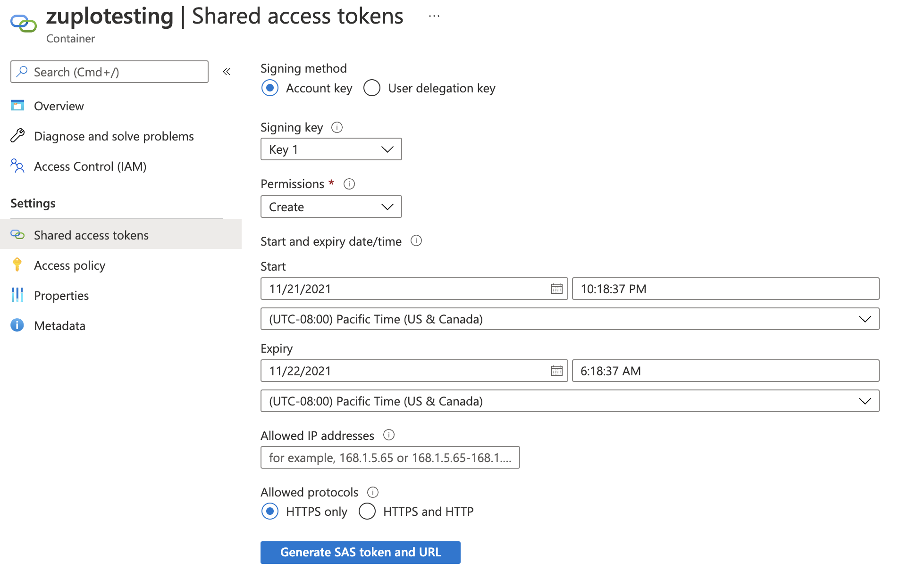

> Note - this sample uses Policies, read [this guide](../policies) first.

In this sample, we'll show how you can archive the text body of incoming
requests to Azure Blob Storage. We also have a post on
[Archiving to AWS S3 Storage](https://zuplo.com/blog/2022/03/22/custom-policies-in-code-archiving-requests-to-s3).

First, let's set up Azure. You'll need a container in Azure storage
([docs](https://learn.microsoft.com/en-us/azure/storage/common/storage-account-create?tabs=azure-portal)).
Once you have your container you'll need the URL - click the **Properties** tab
of your container as shown below.


This URL will be the `blobPath` in our policy options.

Next, we'll need a SAS (Shared Access Secret) to authenticate with Azure. You
can generate one of these on the `Shared access tokens` tab.

Note, you should minimize the permissions - and select only the `Create`
permission. Choose a sensible start and expiration time for your token. Note, we
don't recommend restricting IP addresses because Zuplo runs at the edge in over
200 data-centers world-wide.



Then generate your SAS token - copy the token (not the URL) to the clipboard and
enter it into a new environment variable in your API called `BLOB_CREATE_SAS`.
You'll need another environment variable called `BLOB_CONTAINER_PATH`.


> Note - production customers should talk to a Zuplo representative to get help
> managing their secure keys.

We'll write a policy called `request-archive-policy` that can be used on all
routes.

```ts title="file-archive-policy.ts"
import { ZuploRequest, ZuploContext } from "@zuplo/runtime";

export type RequestArchivePolicyOptions = {
  blobContainerPath: string;
  blobCreateSas: string;
};

export default async function (
  request: ZuploRequest,
  context: ZuploContext,
  options: RequestArchivePolicyOptions,
) {
  // because we will read the body, we need to
  // create a clone of this request first, otherwise
  // there may be two attempts to read the body
  // causing a runtime error
  const clone = request.clone();
  const body = await clone.text();

  // let's generate a unique blob name based on the date and requestId
  const blobName = `${Date.now()}-${request.requestId}.req.txt`;

  const url = `${options.blobContainerPath}/${blobName}?${options.blobCreateSas}`;

  const result = await fetch(url, {
    method: "PUT",
    body: body,
    headers: {
      "x-ms-blob-type": "BlockBlob",
    },
  });

  if (result.status > 201) {
    const err = {
      message: `Error archiving file`,
      status: result.status,
      body: await result.text(),
    };
    request.logger.error(err);
  }

  // continue
  return request;
}
```

Finally, you need to configure your policies.json file to include the policy,
example below:

```json
{
  "name": "request-archive-policy",
  "policyType": "code-policy",
  "handler": {
    "export": "default",
    "module": "$import(./modules/archive-request-policy)",
    "options": {
      "blobCreateSas": "$env(BLOB_CREATE_SAS)",
      "blobContainerPath": "$env(BLOB_CONTAINER_PATH)"
    }
  }
}
```

Don't forget to reference the `file-archive-policy` in the policies.inbound
property of your routes.

Here's the policy in action:


