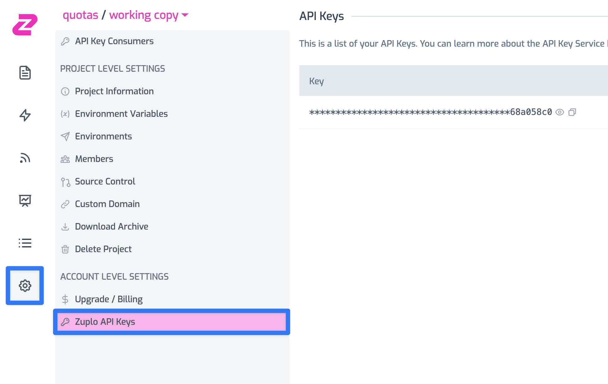

Zuplo provides the Zuplo deployer, a GitHub app that can be used to
automatically deploy your APIs from your GitHub repository to the Zuplo
platform. However, we realized that sometimes you might not be using GitHub as
your version control system. Or, that you might want to exercise more control
over your CI/CD pipeline. For these cases, we provide a CLI that can be used to
deploy your APIs to the Zuplo platform.

## Getting Started

:::tip

The API key is scoped to your account. So you can use the same one for all
projects under the same account. If you are a member of multiple accounts, be
sure to select the right one.

:::

The Zuplo CLI, `zup`, which you be using in you custom CI/CD script, uses API
Keys to authenticate. You can find your API Key by following these steps:

1. Navigate to [portal.zuplo.com](https://portal.zuplo.com) and log in.
2. Select the project that you want to work on.
3. Click on the "Settings" tab and navigate to the "Zuplo API Keys" section.



4. Write some tests for your API. We provide a rich set of test helpers and
   utils based on BDD. You can see examples of tests at
   [samples](https://github.com/zuplo/zup-cli-example-project/tree/main/tests).

:::tip

Your test files need to be under the `tests` folder and end with `.test.ts` to
be picked up by the Zuplo CLI.

:::

## Setting up a custom workflow with GitHub Actions

The full example is available at
https://github.com/zuplo/zup-cli-example-project/blob/main/.github/workflows/ci.yml

1. Create a workflow file. You can use the following to help you get started:

```yaml title=".github/workflows/ci.yaml"
name: Zuplo CI

on:
  push:
    branches:
      - main
  pull_request:

jobs:
  run-zup-test:
    runs-on: ubuntu-latest
    env:
      ZUPLO_API_KEY: ${{ secrets.ZUPLO_API_KEY }}

    steps:
      - uses: actions/checkout@v3

      # This explicitly tells action to use the latest version of Zuplo from the public NPM registry
      - uses: actions/setup-node@v3
        with:
          node-version: "18.x"
          registry-url: "https://registry.npmjs.com"
          scope: "@zuplo"

      - name: Checkout the actual branch for the pull request
        if: ${{ github.event_name == 'pull_request' }}
        run: |
          git checkout -b ${{ github.head_ref }}

      - name: NPM Install
        run: npm install

      # shell: bash is required so that pipefail is set.
      # See https://docs.github.com/en/actions/using-workflows/workflow-syntax-for-github-actions#exit-codes-and-error-action-preference
      # This way if the deploy fails, we fail before piping to tee.
      # Note that you are not required to use tee. We are using it in this example so that the output is available to the terminal and written to the file.
      - name: Zup Deploy
        shell: bash
        run: |
          npx @zuplo/cli deploy --apiKey "$ZUPLO_API_KEY" | tee ./DEPLOYMENT_STDOUT

      - name: Zup Test
        shell: bash
        run: |
          npx @zuplo/cli test --endpoint $(cat ./DEPLOYMENT_STDOUT |  sed -E 's/Deployed to (.*)/\1/')

      - name: Zup Delete
        if: ${{ github.event_name == 'pull_request' }}
        shell: bash
        run: |
          npx @zuplo/cli delete --url $(cat ./DEPLOYMENT_STDOUT |  sed -E 's/Deployed to (.*)/\1/') --apiKey "$ZUPLO_API_KEY" --wait

      # This is not necessary but it showcases how you can list your zups
      - name: Zup List
        shell: bash
        run: |
          npx @zuplo/cli list --apiKey "$ZUPLO_API_KEY"
```

2. Create a secret for your GitHub Action and be sure to set `ZUPLO_API_KEY` to
   the API key you generated in the previous step.

## Setting up a custom workflow with Bitbucket Pipelines

The full example is available at
https://github.com/zuplo/zup-cli-example-project/blob/main/bitbucket-pipelines.yml

1. Create a pipelines file. You can use the following to help you get started:

```yaml title="bitbucket-pipelines.yml"
image: node:18

pipelines:
  branches:
    # If your default branch is not main, change this to match
    main:
      - step:
          name: NPM Install
          script:
            - npm install
      - step:
          name: Zup Deploy
          # set -o pipefail
          # This way if the deploy fails, we fail before piping to tee.
          # Note that you are not required to use tee. We are using it in this example so that the output is available to the terminal and written to the file.
          script:
            - set -o pipefail
            - npx @zuplo/cli deploy --apiKey "$ZUPLO_API_KEY" | tee
              ./DEPLOYMENT_STDOUT
          artifacts:
            - DEPLOYMENT_STDOUT
      - step:
          name: Zup Test
          script:
            - npx @zuplo/cli test --endpoint $(cat ./DEPLOYMENT_STDOUT |  sed -E
              's/Deployed to (.*)/\1/')
  pull-requests:
    "**":
      - step:
          name: NPM Install
          script:
            - npm install
      - step:
          name: Zup Deploy
          # set -o pipefail
          # This way if the deploy fails, we fail before piping to tee.
          # Note that you are not required to use tee. We are using it in this example so that the output is available to the terminal and written to the file.
          script:
            - set -o pipefail
            - npx @zuplo/cli deploy --apiKey "$ZUPLO_API_KEY" | tee
              ./DEPLOYMENT_STDOUT
          artifacts:
            - DEPLOYMENT_STDOUT
      - step:
          name: Zup Test
          script:
            - npx @zuplo/cli test --endpoint $(cat ./DEPLOYMENT_STDOUT |  sed -E
              's/Deployed to (.*)/\1/')
      - step:
          name: Zup Delete (if necessary)
          script:
            - echo $BITBUCKET_PR_ID
            - if [[ -n "$BITBUCKET_PR_ID" ]]; then npx @zuplo/cli delete --url
              $(cat ./DEPLOYMENT_STDOUT |  sed -E 's/Deployed to (.*)/\1/')
              --apiKey "$ZUPLO_API_KEY" --wait; exit; fi
      # This is not necessary but it showcases how you can list your zups
      - step:
          name: Zup List
          script:
            - npx @zuplo/cli list --apiKey "$ZUPLO_API_KEY"
```

2. Create a secret repository variable for your BitBucket Pipelines and be sure
   to set `ZUPLO_API_KEY` to the API key you generated in the previous step.

## Setting up a custom workflow with Azure Pipelines

The full example is available at
https://github.com/zuplo/zup-cli-example-project/blob/main/azure-pipelines.yml

1. Create a pipelines file. You can use the following to help you get started:

```yaml title="azure-pipelines.yml"
trigger:
  - main

pool:
  vmImage: ubuntu-latest

steps:
  - task: NodeTool@0
    inputs:
      versionSpec: "18.x"
    displayName: "Install Node.js"

  - script: |
      npm install
    displayName: "npm install"

  # set -o pipefail
  # This way if the deploy fails, we fail before piping to tee.
  # Note that you are not required to use tee. We are using it in this example so that the output is available to the terminal and written to the file.
  - script: |
      set -o pipefail 
      npx @zuplo/cli deploy --api-key $(ZUPLO_API_KEY) | tee ./DEPLOYMENT_STDOUT
    displayName: "Zup Deploy"

  - script: |
      npx @zuplo/cli test --endpoint $(cat ./DEPLOYMENT_STDOUT |  sed -E 's/Deployed to (.*)/\1/')
    displayName: "Zup Test"

  - script: |
      npx @zuplo/cli delete --url $(cat ./DEPLOYMENT_STDOUT |  sed -E 's/Deployed to (.*)/\1/') --api-key $(ZUPLO_API_KEY) --wait
    displayName: "Zup Delete"
    # Only run this step if the build is a pull request
    condition: eq(variables['Build.Reason'], 'PullRequest')

  # This is not necessary but it showcases how you can list your zups
  - script: |
      npx @zuplo/cli list --api-key $(ZUPLO_API_KEY)
    displayName: "Zup List"
```

2. Create a secret for your Azure Pipelines and be sure to set `ZUPLO_API_KEY`
   to the API key you generated in the previous step.

## Setting up a custom workflow with GitLab Pipelines

The full example is available at
https://github.com/zuplo/zup-cli-example-project/blob/main/.gitlab-ci.yml

1. Create a pipelines file. You can use the following to help you get started:

```yaml title=".gitlab-ci.yml"
image: node:latest
workflow:
  rules:
    - if: $CI_PIPELINE_SOURCE == "merge_request_event"
      when: always
    - if: $CI_MERGE_REQUEST_TARGET_BRANCH_NAME == $CI_DEFAULT_BRANCH
      when: always

npm_install:
  stage: build
  script:
    - npm install

zup_deploy:
  stage: deploy
  script:
    - npx @zuplo/cli deploy --apiKey "$ZUPLO_API_KEY" | tee ./DEPLOYMENT_STDOUT
  artifacts:
    expire_in: 30 minutes
    paths:
      - "./DEPLOYMENT_STDOUT"

zup_test:
  stage: deploy
  needs: [zup_deploy]
  script:
    - npx @zuplo/cli test --endpoint $(cat ./DEPLOYMENT_STDOUT |  sed -E
      's/Deployed to (.*)/\1/')

zup_delete:
  stage: deploy
  needs: [zup_deploy, zup_test]
  only:
    - merge_requests
  script:
    - npx @zuplo/cli delete --url $(cat ./DEPLOYMENT_STDOUT |  sed -E
      's/Deployed to (.*)/\1/') --apiKey "$ZUPLO_API_KEY" --wait

# This is not necessary but it showcases how you can list your zups
zup_list:
  stage: deploy
  needs: [zup_test]
  script:
    - npx @zuplo/cli list --apiKey "$ZUPLO_API_KEY"
```

2. [Create a variable](https://docs.gitlab.com/ee/ci/variables/#for-a-project)
   for `ZUPLO_API_KEY` on your GitLab project. Set it to the API key you
   generated in the previous step. You can choose to
   [mask](https://docs.gitlab.com/ee/ci/variables/#mask-a-cicd-variable) the
   variable so it does not display in job logs.

## Advanced Use Cases

The above samples showcase the most common use case for our customers. However,
you might have more advanced use cases that require more control. The following
sections describe some other parameters that you can control.

### You have multiple sub-folders in your repository

You might end up with this structure because you are using git submodules to
connect multiple repositories together. Or, you might have multiple projects in
the same repository because you are trying to migrate to a monorepo.

If you have multiple sub-folders in your repository, each representing a
different Zuplo project, you can deploy each one separately.

1. Ensure you use the right API key for each project. You can specify the API
   key by passing it with the `--apiKey` flag.
2. Ensure that you have the project name configured in the zuplo.jsonc file in
   the subfolder. This tells the Zuplo CLI which project to deploy to.
3. You might need to use the --no-verify-remote flag to bypass verification. By
   default, the CLI checks that the repository matches what is configured on the
   server. If you have moved or renamed your repository, you must bypass the
   verification.

Here's a complete example.

Assuming you have the following structure and the appropriate zuplo.jsonc
configured for each project. Take a look at
[https://github.com/zuplo/zup-cli-example-project/tree/main/nested-projects](https://github.com/zuplo/zup-cli-example-project/tree/main/nested-projects)

```bash
nested-projects
├── zup-cli-nested-project1
│   ├── README.md
│   ├── config
│   ├── docs
│   ├── local-config
│   ├── modules
│   ├── package.json
│   ├── schemas
│   ├── tests
│   ├── tsconfig.json
│   └── zuplo.jsonc
└── zup-cli-nested-project2
    ├── README.md
    ├── config
    ├── docs
    ├── local-config
    ├── modules
    ├── package.json
    ├── schemas
    ├── tests
    ├── tsconfig.json
    └── zuplo.jsonc
```

And here's how you would deploy it using the CLI

```bash
# Let's deploy the first project
cd zup-cli-nested-project1
npx @zuplo/cli deploy --api-key $YOUR_API_KEY_FOR_THE_ACCOUNT_THAT_CONTAINS_PROJECT1 --no-verify-remote


# Let's deploy the second project
cd ..
cd zup-cli-nested-project2
npx @zuplo/cli deploy --api-key $YOUR_API_KEY_FOR_THE_ACCOUNT_THAT_CONTAINS_PROJECT2 --no-verify-remote
```

The `npx @zuplo/cli deploy` command takes the current Git branch that you are on
into consideration when deploying. If you are on your `main` branch, it will
deploy to your production. If you are on any other branch, it will deploy to a
staging environment with the name of your branch.
