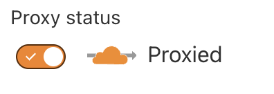

This guide will walk you through the process of setting up a custom domain for
your project's edge deployment environment. You can manage all domain settings
related to a project in the Custom Domains section of the Settings tab of your
project. Custom Domains are available on
[Builder plans and above](https://zuplo.com/pricing).

## Types of Custom Domains

Zuplo supports two types of custom domains that can be configured separately:

1. **API Gateway Custom Domain**: For your API endpoints (for example,
   `api.example.com`). This domain uses the CNAME `cname.zuplo.app`.

2. **Developer Portal Custom Domain**: For your developer documentation site
   (for example, `docs.example.com`). This domain uses the CNAME
   `cname.zuplodocs.com`. Learn more about the Developer Portal in the
   [Developer Portal documentation](/docs/dev-portal/introduction).

Both types of custom domains can be managed from the same Custom Domains section
in your project settings and follow a similar configuration process.

:::note

Custom domains can't be added to development environments. You can tell if an
environment is development if the domain ends with `zuplo.dev`.

:::

## Adding a new custom domain

The following steps will guide you on how to add and configure a custom domain
for your Zuplo project.

### 1. Navigate to your project's Custom Domain Settings

Go to your project in the Zuplo portal and open to the **Settings** tab (1),
then select **Custom Domain** (2) and click the **Add New Custom Domain** button
to open the `New Custom Domain` configuration modal.


### 2. Add your domain

Then, select the type of custom domain (API Gateway or Developer Portal), pick
the environment you want to assign the domain to, and enter your apex domain
(for example `example.com`) or subdomain (for example api.example.com or
docs.example.com).

<ModalScreenshot size="md">
  
</ModalScreenshot>

Once saved, you will be provided with a `CNAME` configuration that you'll use in
the next step. The CNAME value depends on the domain type:

**For API Gateway domains:**

```txt
CNAME   api.example.com                       cname.zuplo.app
```

**For Developer Portal domains:**

```txt
CNAME   docs.example.com                      cname.zuplodocs.com
```

### 3. Configure your DNS

Once you have added your custom domain to your Zuplo project, you will need to
configure the DNS records of your domain with your registrar.

Using the CNAME configuration provided at the end of the previous step, you will
create that record on your DNS registrar. Cloudflare will then query your domain
[periodically](https://developers.cloudflare.com/cloudflare-for-platforms/cloudflare-for-saas/start/hostname-verification-backoff-schedule/)
until it can verify everything. If everything is configured correctly, it should
take a few minutes for your production API to start responding to traffic on
your custom domain. On the other hand, if a misconfiguration (typo) occurs and
you need to make changes, Cloudflare could take up to 4 hours to retry the
verification. Please be patient if this happens.

By default, you can also use the url on `zuploapp.com` although, if you prefer
that to be removed contact support and we can disable it for you.

:::caution

If you use Cloudflare as your DNS provider, you MUST enable Cloudflare Proxy on
your custom domain.



:::

### 4. Redeploy

Some changes, like the domain set in your developer portal, only get picked up
on the deployment. After you set a custom domain it's a good idea to redeploy
your environment to ensure everything is applied correctly.

## Cloudflare Customers

Zuplo uses Cloudflare for routing custom domain traffic to our servers. If you
use Cloudflare on your domain, there are a few limitations to be aware of. In
general, these shouldn't be a problem as we handle all the complexities for you.

For host names managed by Zuplo, you can't control some Cloudflare settings for
your Zuplo subdomain (for example `api.example.com`). Examples include:

- Wildcard DNS
- Spectrum
- Argo
- Page Shield

See
[Cloudflare's documentation](https://developers.cloudflare.com/cloudflare-for-platforms/cloudflare-for-saas/#limitations)
for more details.

Other Cloudflare features that are configured on your Cloudflare Account such as
Firewall or WAF rules will function normally.

At this time, to use a wildcard domain or other complex custom domain for your
environment you will need to contact
[support@zuplo.com](mailto:support@zuplo.com).

## CAA Records

:::info

In most cases this isn't required. You only need to modify CAA records if you
already have them set on your DNS.

:::

If you have a CAA DNS record set on your domain, you must add either Google
Trust Services or Let's Encrypt as an authorized certificate authority.

You don't need to add both of these, just add one. The Google Trust Services
(pki.goog) is the recommended Authority as it has slightly better compatibility
with clients. Zuplo will use Google Trust Services by default unless only the
Let's Encrypt record is set.

```txt
CAA 0 issue "pki.goog"
CAA 0 issue "letsencrypt.org"
```

## Managed SSL Certificates

By default Zuplo will automatically manage SSL certificates for your custom
domain. If you prefer to manage your own SSL certificates, please contact
[support@zuplo.com](mailto:support@zuplo.com).

Certificates are issued by either Google Trust Services or Let's Encrypt. If you
have a preference, please let us know, but we recommend (and default to) Google
Trust Services as it has slightly better compatibility with clients.

Certificates are issued for 90 days and are automatically renewed approximately
30 days before they expire. No action is required on your part.

:::warning{title="Certificate Pinning"}

Certificate pinning isn't recommended for Zuplo APIs as the certificates are
issued for short periods of time and renewed automatically. If you or your end
clients require certificate pinning, it's recommended you use a custom,
long-lived SSL certificate. (Although this is
[not recommended](https://scotthelme.co.uk/why-we-need-to-do-more-to-reduce-certificate-lifetimes/)
for most use cases.)

:::

For alternatives to certificate pinning, consider using
[HSTS headers](https://https.cio.gov/hsts/) or adding CAA records to your DNS.
The CAA records required for Zuplo are shown below (depending on what authority
your domain is configured to use)

```txt
# CAA records added by Let's Encrypt
0 issue "letsencrypt.org"
0 issuewild "letsencrypt.org"

# CAA records added by Google Trust Services
0 issue "pki.goog; cansignhttpexchanges=yes"
0 issuewild "pki.goog; cansignhttpexchanges=yes"
```

## TLS Versions

Zuplo supports issuing certificates with TLS versions 1.0, 1.1, 1.2 and 1.3. By
default certificates are issues with versions 1.2 and 1.3 enabled. If you
require a specific version, please contact
[support@zuplo.com](mailto:support@zuplo.com).

:::note{title="Legacy TLS Versions"}

Early Zuplo customers may have certificates issued with TLS 1.0 and greater
enabled. If you wish to upgrade to a higher TLS version, please contact
[support@zuplo.com](mailto:support@zuplo.com).

:::

## Alias Domains

<EnterpriseFeature name="Alias Domains" />

Sometimes your API Gateway might be running behind another service such as a
CDN, WAF or load balancer. In this case, your API Gateway's domain may not be
the same as the domain your clients use to access your API. In this case, you
can add an alias domain to your Zuplo project. An alias domain will configure
your API and documentation to use the alias domain for any public facing URLs
such as those in your OpenAPI files or developer portal.

To add an alias domain, simply add a new custom domain per the instructions
above, but select **Alias Domain** option when creating the domain.

Do note that domains can't be "converted" from a custom domain to an alias
domain or vice versa. If you need to change a domain from one type to another,
you will need to delete the existing domain and create a new one with the
desired type.

## Validation Error

If you receive a notification or email that your domain has a validation error
the likely causes of the issue listed below. If you are unable to resolve the
issue or have any questions, please contact
[support@zuplo.com](mailto:support@zuplo.com).

### No DNS Record or Invalid Record

Your DNS isn't configured correctly. Ensure that your domain is configured with
a `CNAME` record pointing to the correct target based on your domain type:

**For API Gateway domains:**

```txt
CNAME   api.example.com     cname.zuplo.app
```

**For Developer Portal domains:**

```txt
CNAME   docs.example.com    cname.zuplodocs.com
```

### CAA Record Error

Your DNS has been configured with CAA records that don't authorize Google Trust
Services to issue certificates for your domain. To resolve add the following DNS
records:

```txt
0 issue "pki.goog; cansignhttpexchanges=yes"
0 issuewild "pki.goog; cansignhttpexchanges=yes"
```
