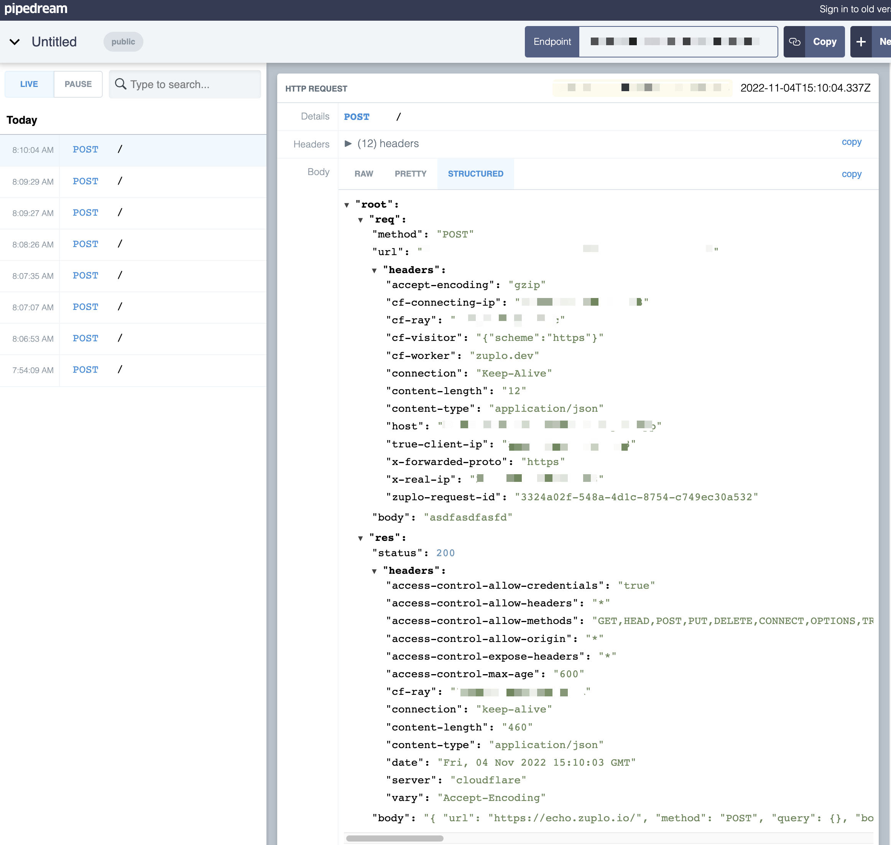

Some of our customers want to build custom logging for their gateway runtime.
This is an example of just how powerful the programmability of Zuplo is.

In this custom inbound policy we show how you could post to a service (in this
case we just use RequestBin.com).

```ts
import { ZuploContext, ZuploRequest, ResponseSentEvent } from "@zuplo/runtime";

type CustomLoggingOptions = {
  endpoint: string;
};

const serializableHeaders = (headers: Headers) => {
  const output = {};
  headers.forEach((value, key) => {
    output[key] = value;
  });
  return output;
};

const serializableRequest = async (request: ZuploRequest) => {
  // if we're going to read the body, we need to clone
  // the request first - otherwise the response pipeline will
  // encounter a drained stream
  const clone = request.clone();
  const body = await clone.text(); // read as text
  const data = {
    method: request.method,
    url: request.url,
    headers: serializableHeaders(request.headers),
    body,
  };

  return data;
};

const serializableResponse = async (response: Response) => {
  // if we're going to read the body, we need to clone
  // the response first - otherwise the response pipeline will
  // encounter a drained stream
  const clone = response.clone();
  const body = await clone.text(); // read as text

  const data = {
    status: response.status,
    headers: serializableHeaders(response.headers),
    body,
  };

  return data;
};

const logReqRes = async (
  endpoint: string,
  req: any,
  response: Response,
  context: ZuploContext,
  start: number,
) => {
  // we don't want any errors thrown that might impact
  // our consumers experience so catch everything and
  // use context.log
  try {
    const data = {
      req,
      res: await serializableResponse(response),
      timeMs: Date.now() - start,
    };

    return fetch(endpoint, {
      method: "POST",
      body: JSON.stringify(data),
    });
  } catch (err) {
    context.log.error(err, "error in custom-logging policy");
  }
};

export default async function (
  request: ZuploRequest,
  context: ZuploContext,
  options: CustomLoggingOptions,
  policyName: string,
) {
  // We need to read the body of the request before it's used by the handler
  // so let's serialize the request now
  const req = await serializableRequest(request);
  const start = Date.now();

  // The 'responseSent' event will fire at the very last stage in the response
  // pipeline, when no more mutations can be made - so you can be confident
  // this was the response sent by Zuplo
  context.addEventListener("responseSent", async (event: ResponseSentEvent) => {
    const promise = logReqRes(
      options.endpoint,
      req,
      event.response,
      context,
      start,
    );

    // We need to ask the runtime now to shut down until this is complete,
    // as this will run asynchronously to our response
    context.waitUntil(promise);
  });
  return request;
}
```

We would then configure the policy as follows

```json
{
  "name": "custom-logging-policy",
  "policyType": "custom-code-inbound",
  "handler": {
    "export": "default",
    "module": "$import(./modules/custom-logging)",
    "options": {
      "endpoint": "https://YOUR_REQUESTBIN_URL_HERE"
    }
  }
}
```

And don't forget to register your new custom policy on your routes! This should
be the very first inbound policy to see the incoming request, unmodified by
other policies (or blocked by auth, rate-limiting etc).

You'll then see live entries with details of the requests and responses for your
test calls:



You can create a free requestbin at [requestbin.com](https://requestbin.com) -
to get started quickly look for the link to create a `public bin`.
