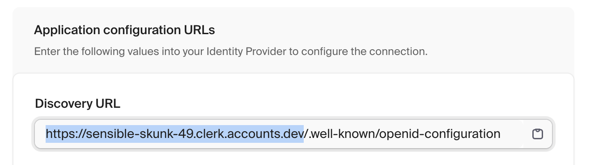

## Clerk Setup

If you don't have an Clerk account, you can sign up for a
[free Clerk account](https://clerk.com/) that will provide you will 10,000
monthly active users.

### 1/ Create OAuth Application

Create a
[new OAuth application](https://clerk.com/docs/advanced-usage/clerk-idp). This
is done in their portal in the **OAuth applications** section.

Create the application with the following settings:

- **Name**: This can be anything you like
- **Scopes**: Select the `openid`, `profile`, and `email` scopes
- **Redirect URI**: This should be the URL of your Zuplo Developer Portal. This
  is the URL that you use to access the Developer Portal. For example,
  `https://your-url.dev.zuplo.com/docs/`. It's IMPORTANT that the URL ends with
  the trailing `/`.
- **Public** - Enable this option so that your Clerk OAuth application supports
  Authorization Code with PKCE (Proof Key for Code Exchange) flow.

After creating the application, you will receive a Client ID. You will also see
a list of Application configuration URLs. You will use these values to create an
environment variable in Zuplo.

Create a new environment variable named `ZUPLO_PUBLIC_CLERK_CLIENT_ID` and set
the value to the **Client ID** value in the portal. Create another variable
named `ZUPLO_PUBLIC_CLERK_ISSUER` and set the value to the Clerk domain. Note,
the issuer isn't explicitly shown in the portal. It's the domain of any of the
values shown in the **Application configuration URLs**. So, if your **Discovery
URL** is
`https://sensible-skunk-49.clerk.accounts.dev/.well-known/openid-configuration`,
then the issuer is `https://sensible-skunk-49.clerk.accounts.dev`.



### 2/ Configure the Developer Portal

Inside of the Zuplo Developer portal navigate to the **Code Editor** tab and
open the `dev-portal.json` file. You can set the values in the form or open the
JSON tab and edit the file to look like the following.

```json
{
  "$schema": "https://cdn.zuplo.com/schemas/dev-portal.json",
  "enabled": true,
  "enableAuthentication": true,
  "requireAuthentication": false,
  "authentication": {
    "provider": "oidc",
    "issuer": "$env(ZUPLO_PUBLIC_CLERK_ISSUER)",
    "clientId": "$env(ZUPLO_PUBLIC_CLERK_CLIENT_ID)"
  }
}
```
