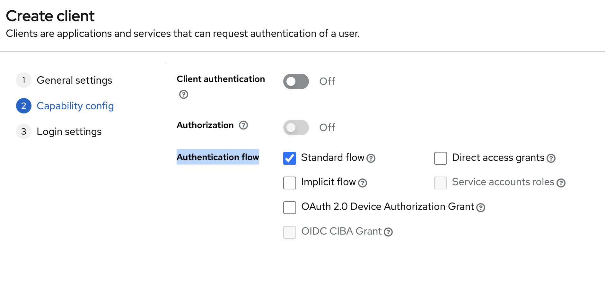
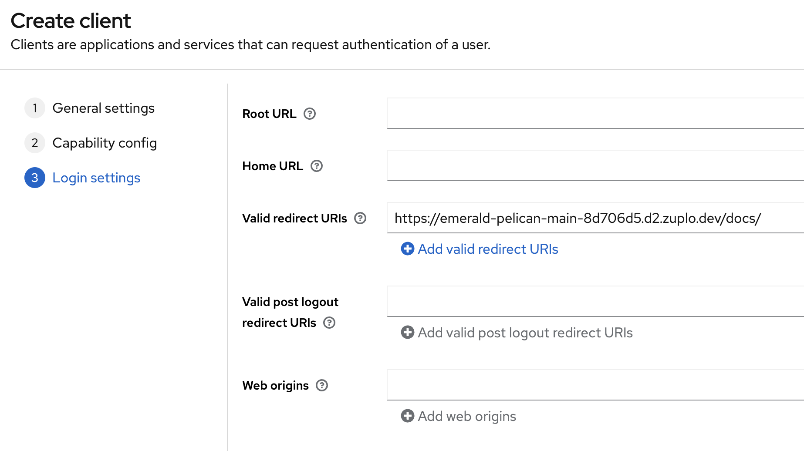
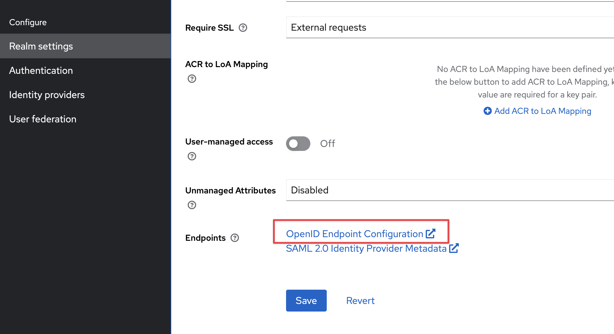

## Keycloak Setup

This guide will walk you through setting up Keycloak as the authentication
provider for your Zuplo hosted developer portal.

### 1/ Create OAuth Application

Navigate to your admin console and create a new client. The Client ID can be
anything you want, but for this example, we will use `zuplo-dev-portal`.
Optionally, fill in the name and description. Once you have entered the data,
click "Next".

### 2/ Set the Client Capabilities

In the Authentication flow section, enable the "Standard flow" and disable
"Direct access grants". Leave "Client authentication" and "Authorization" set to
"off". Click "Next".

### 3/ Set the Login Settings

In the "Valid Redirect URIs" field, enter the URL of your Zuplo Dev Portal with
the base path (this defaults to `/docs/`). Make sure you have the trailing slash
set. Click "Save".

### 4/ Find the Issuer URL

Open the "Realm settings" tab in your Keycloak admin console. And click the link
to "OpenID Endpoint Configuration". This will open a JSON document. Find the
`issuer` key and copy the value. You will use this value to configure the Zuplo
Dev Portal.

### 3/ Configure the Developer Portal

Inside of the Zuplo Developer portal navigate to the **Code Editor** tab and
open the `dev-portal.json` file. Under the "Authentication" section, set the
"Provider" to "OpenID Connect". Set the "Authority" value to the `issuer` value
you copied from the JSON file in the previous step. Set the "Client ID" value to
the value you set in step 1 (in our example this is `zuplo-dev-portal`). Click
"Save".

