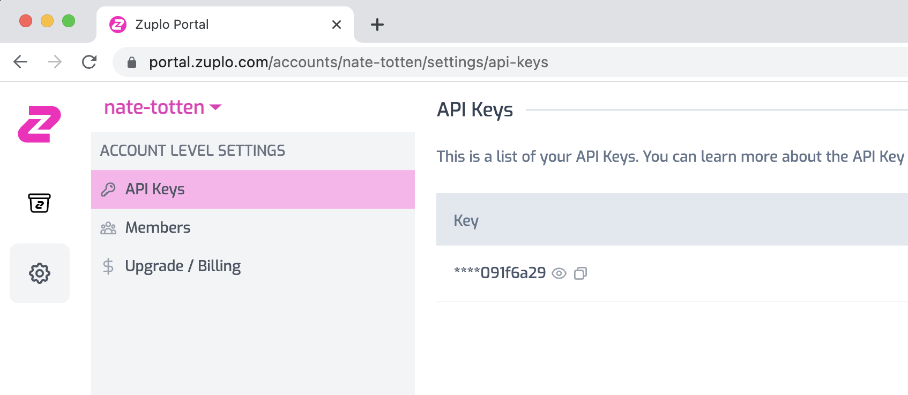

The [Zuplo Developer API](https://dev.zuplo.com/docs) enables developers to
write their own integrations for Zuplo.

## Developer API Authorization

The Zuplo Developer API uses API Keys for authorization. To generate an API Key
for your account go to the [Zuplo Portal](https://portal.zuplo.com/). In the
main account page click the gear icon and the navigate to **API Keys**.



## Calling the API

After you have obtained an API Key for the Developer API, you can call the API
to perform management actions on your account.

A basic request with curl is shown below.

```bash
curl --request GET \
  --url https://dev.zuplo.com/v1/who-am-i \
  --header 'Authorization: Bearer YOUR_KEY_HERE'
```

You can make the same request using `fetch`:

```ts
const response = await fetch("https://dev.zuplo.com/v1/who-am-i", {
  method: "GET",
  headers: { Authorization: "Bearer YOUR_KEY_HERE" },
});

const result = await response.json();

console.log(result);
```
