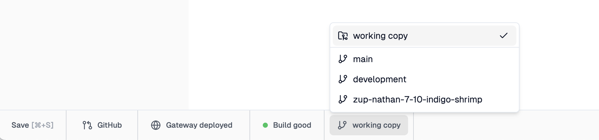

One of the things that makes Zuplo different from most API gateways, and API
management platforms is that you can rapidly deploy many environments. Some of
our customers have hundreds of deployed environments! This facilitates
collaboration, where teams can collaborate on new features with a dedicated
environment, deployed for no additional cost in under 20 seconds.

## Environment Types

There are three types of environments on Zuplo - Production, Preview, and
Development (called Working Copy). Each environment has a unique URL and every
environment is deployed to 300+ edge locations around the world.

### Development (Working Copy)

This is your development environment. You can think of this as your personal
cloud laptop. To deploy to this environment you just need to save a change in
portal.zuplo.com, that will automatically trigger a build and deploy of your
working-copy. A working-copy environment ends in a `.dev` URL. While these
environments are deployed to the edge in 300+ data centers around the world,
they are optimized for development purposes. There are some minor differences
with production and preview environments with caching and other features.

### Preview

These are are environments that are deployed using the
[GitHub integration](/docs/articles/source-control) or building a
[custom CI/CD pipeline](/docs/articles/custom-ci-cd). Preview environments are
deployed from from any branch that isn't set as your default (for example
production branch). Preview environments are deployed to the edge and have the
same behavior as production environments, but are typically used for staging,
testing pull requests, etc.

### Production

These are are environments that are deployed using the
[GitHub integration](/docs/articles/source-control) or building a
[custom CI/CD pipeline](/docs/articles/custom-ci-cd). Each project has only one
Production environment and is deployed from the git branch that's set as your
production branch in your source control settings.

### Preview vs Production Environments (or multiple Production Environments)

Note, there is no _technical_ difference between a **Preview** environment and a
**Production** environment and some customers choose to use a specific (or
multiple) Preview environments as 'Production' deployments of their API. By
default, Preview environments share a set of
[environment variables](/docs/articles/environment-variables) and buckets for
API keys etc, but these can be overridden for specific environments.

## Navigating Environments

On the bottom toolbar of the Zuplo portal you will see a selector for the
current environment. You can switch between environments by clicking on the name
of the current environment and then selecting another environment.



Your development (working copy) environment will be listed at the top in a
separate section. Your git deployed environments will be listed next with the
production environment on top.

For users using [source control integration](/docs/articles/source-control) the
name of the deployment matches the branch name (yes - creating a new environment
is literally as easy as creating a new branch).

You can't edit the code of an production or preview environment in
portal.zuplo.com but you can switch into those environments to perform a number
of functions, such as:

- edit API consumers for this environment
- view analytics for this environment
- view Live Logs for this environment

## Different Backends per Environment

It's common to want a different backend for your production, staging and preview
environments. This can be easily achieved by using
[environment variables](./environment-variables.mdx) to specify the origin of
the backend and then using that in your
[URL Rewrite Handlers](../handlers/url-rewrite.mdx).

For example,

```json
${env.BASE_PATH}${pathname}
```

A url rewrite like this will combine the `BASE_PATH` environment variable, say
`https://example.com` with the incoming path, e.g. `/foo/bar` to create a
re-written URL:

```json
https://example.com/foo/bar
```
