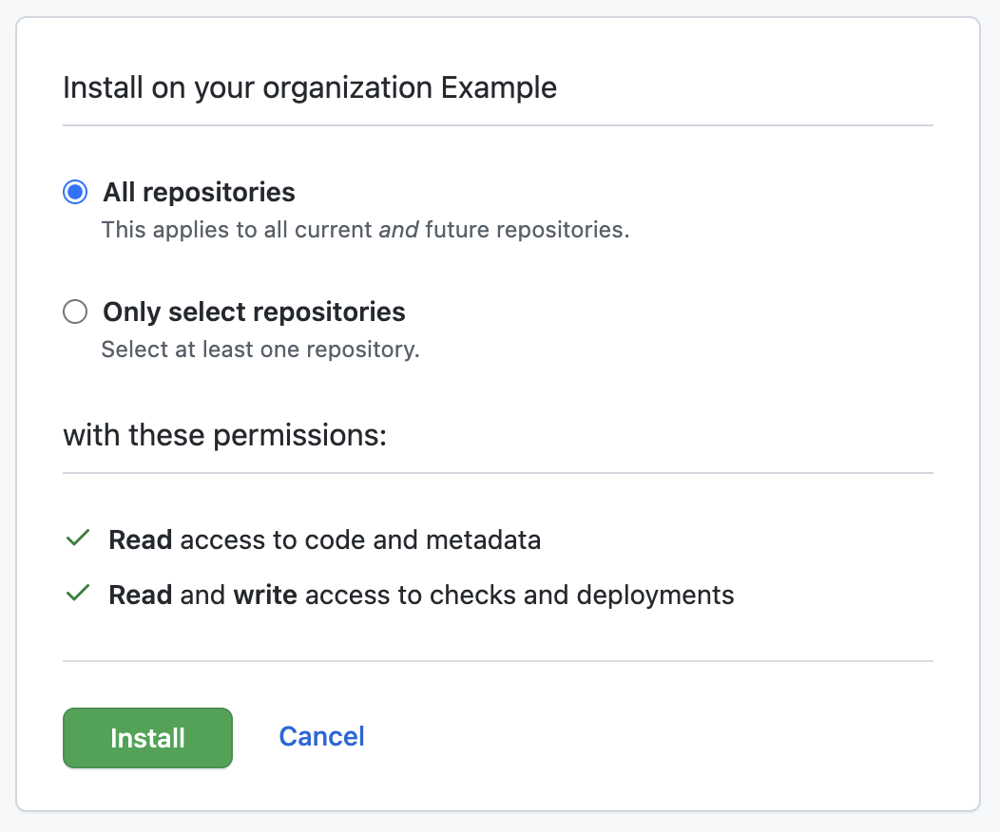
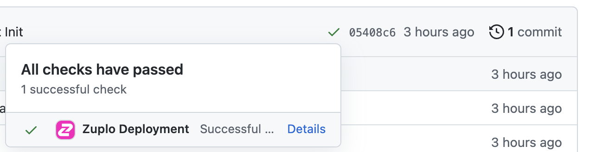

Zuplo can integrate with Source Control providers like GitHub, BitBucket and GitLab. GitHub is our primary option - BitBucket and GitLab (including private instances) are available on an enterprise plan.

In this article we'll talk about GitHub integration - which has numerous benefits, including:

- source control integration in portal.zuplo.com
- ability to deploy an [edge-deployment](../articles/environments.md) just by adding a branch or making a commit.

There's also a recommended [video tutorial](https://youtu.be/a3931OlO2ng) that shows you how to connect GitHub, and deploy your first edge environment.

## Setting it up

To enable the Zuplo integration for GitHub, navigate to <SettingsTabIcon /> **Settings** > <GitHubIcon /> **GitHub Settings**. On the settings page, click the **Connect to GitHub** button. You will be prompted to authorize Zuplo to your GitHub account.

Once you have connected GitHub, you can enter the name of the GitHub repository you would like to create for your project. Enter the name and click **Create repository**. This will take a few seconds.

After the project is connected, all of your code will be committed to the `main` branch.

## GitHub Edge Deployments

For deployments to work you'll need to install the [Zuplo GitHub App](https://github.com/apps/zuplo/installations/new).

Select the organization to install the application and authorize all repositories or specific repositories.

The Zuplo GitHub app requires the following permissions:

- **Read** access to code and metadata
- **Read** and **write** access to checks, deployments and pull requests

After the Zuplo app is installed, Zuplo can deploy your app to an edge deployment. To make this happen for the first time, you'll need to make a commit on your branch (so that the deployer knows to deploy this branch). You can make a simple change (like edit the readme.md in GitHub or add a space to a comment in your code and push).

To view the deployment of a specific commit hover over the small dot next to the commit hash. Click the **Details** link and you will also see the deployment's URL.

Alternatively, all deployments can be viewed by clicking **Environments** on the GitHub project's side menu.

## Limitations

**Renaming or moving projects in GitHub**

The Zuplo GitHub integration does not yet handle moving or renaming repositories. As a workaround, you can first disconnect your project from GitHub and recreate it in another org or with another name. To do so, go to <SettingsTabIcon /> **Settings** > <GitHubIcon /> **GitHub Settings** and then click **Disconnect** to disconnect your project from GitHub. Then follow the above instructions to reconnect your project to GitHub.

**Connecting an Existing Repository**

The Zuplo GitHub integration does not yet support connecting an existing repository. You can only create new repositories at this time.
