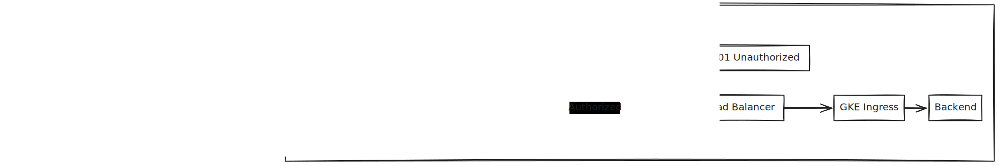
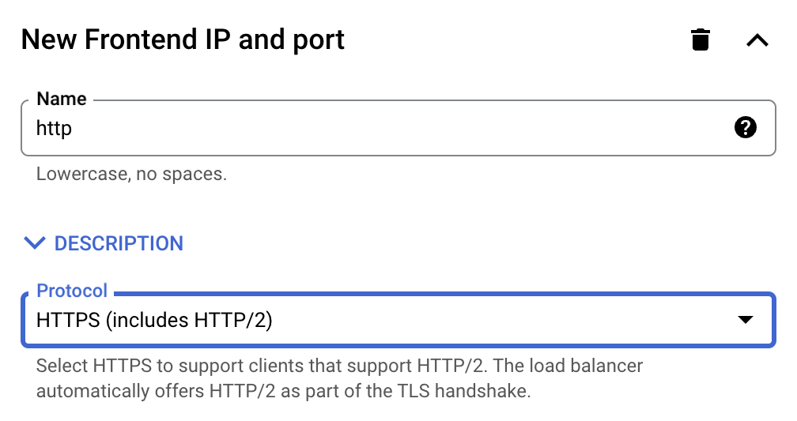
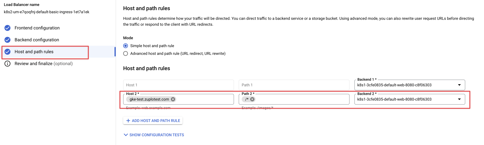

When using any API gateway as your API's entry point, it's critical that only
traffic that originates from the Gateway is allowed to call your backend. There
are [many way to to this](./securing-your-backend.mdx) depending on your
requirements and how your backend is hosted. This article will explain how to
use Google IAM to secure a GKE cluster so that only requests made through your
Zuplo API Gateway will be allowed to call your GKE ingress.

Using GCP IAM to authorize your Zuplo Gateway to make requests to your backend
utilizes Googles core IAM system known as
"[Identity Aware Proxy](https://cloud.google.com/iap)" to secure public IP
address from unauthorized access. When correctly configured, this will ensure
that no unauthorized access makes it to your application.

While it's also possible to enforce authorization within your application
itself - for example using JWT Authentication. The key difference is that by
using your Cloud providers identity and authorization system, you are ensuring
that unauthorized requests are blocked before they even touch your backend. This
provides protection from any potential security vulnerabilities in your core,
web server, or operating system.

:::note

This article uses GKE as the example backend, but any GCP service that can be
setup behind an HTTP Load Balancer can be used.

:::

The diagram below shows how the end-to-end system interacts. The important steps
to this process are:

1. The client makes a request to your Zuplo API Gateway
1. The Zuplo API Gateway enforces any policies (for example authentication,
   authorization, rate limiting)
1. The Zuplo API Gateway proxies the request to the public IP address of your
   GCP Load Balancer. Zuplo adds authorization information to the request that
   identify the request as coming from Zuplo
1. GCP Identity Aware proxy validates that the request comes from an authorized
   Service Account identity. Unauthorized requests are rejected.
1. Authorized requests are forwarded on through your GKE ingress to your
   backend.



## Zuplo Gateway Identity

Requests that are proxied from Zuplo to your GCP Load Balancer use the
[Upstream GCP Service Auth Policy](../policies/upstream-gcp-service-auth-inbound.mdx)
to authenticate the request via a
[GCP Service Account](https://cloud.google.com/iam/docs/service-account-overview).
The policy appends an `authorization` header to the request that the GCP
Identity Aware Proxy uses to determine if the request is authorized or not.

Using this system means that you can uniquely identify requests that come from
Zuplo as a their own identity. This means all request logs can be identified by
their source - for example your Zuplo Gateway, another system also using a GCP
Service account, a developer testing an internal system, etc.

:::tip{title="Multiple Service Account"}

While not normally needed, it's possible to configure multiple Upstream GCP
Service Auth Inbound policies in order to provide fine-grain authorization to
your internal resources by Service Account. For example, if you had two Zuplo
projects - one for external users and one for internal users - each could use
its own identity.

:::

For instructions on how to configure upstream GCP IAM auth, see the
[Upstream GCP Service Auth Policy document](../policies/upstream-gcp-service-auth-inbound.mdx)

## GCP Configuration

Documentation on configuring GCP Identity Aware Proxy can be found on Google's
documentation. Below are a few links on how to configure the proxy with several
common backends.

- [Enabling IAP for Compute Engine](https://cloud.google.com/iap/docs/enabling-compute-howto)
- [Enabling IAP for GKE](https://cloud.google.com/iap/docs/enabling-kubernetes-howto)
- [Enabling IAP for Cloud Run](https://cloud.google.com/iap/docs/enabling-cloud-run)

:::tip{title="Cloud Run"}

Cloud Run doesn't need to use IAP in all cases. It's possible to restrict Cloud
Run to
[require IAM authentication in order to invoke the service](https://cloud.google.com/run/docs/securing/managing-access).

:::

## Example

To see how this works in action, follow the steps in Google's document
_[Set up an external Application Load Balancer with Ingress](https://cloud.google.com/kubernetes-engine/docs/tutorials/http-balancer)_.
This will configure a GKE cluster with a simple "hello world" web application
behind an HTTP Load Balancer. At the end of the tutorial, you should have a
public IP address that serves a simple web application.

You can test the request with a simple curl command.

```shell
curl http://34.111.91.10/
Hello, world!
Version: 1.0.0
Hostname: web-58756b54cc-7hdcw
```

In order to securely proxy traffic from Zuplo to GCP, you'll need to secure your
traffic over an SSL connection. Navigate to the GCP portal to manage your
[load balancer](https://console.cloud.google.com/net-services/loadbalancing/list/loadBalancers)
and select the load balancer that was created previously. Click, **Edit** on the
load balancer.


Next, click **ADD FRONTEND IP AND PORT**. Enter the name and select **HTTPS** as
the protocol.



Then click **Add a Certificate**. Select Google-managed Certificate and enter
your domain name.


Next, select **Host and path rules** and enter the domain and associate it with
the backend.



Click **Done** and then **Update** to update your Load Balancer. It will take a
few minutes to issue the SSL certificate for the domain.

After the Load Balancer updates you should be able to request your site using
the configured domain via HTTPS.

```shell
curl https://api.example.com
Hello, world!
Version: 1.0.0
Hostname: web-58756b54cc-7hdcw
```

:::tip{title="Checkpoint"}

At this point, your backend on GKE is exposed on the public internet via a GCP
HTTP Load Balancer via HTTP and HTTPS. For this demo, we won't go through the
changes, but in production you shouldn't expose an HTTP endpoint on your API.

:::

### Enabling Identity Aware Proxy

To enable Identity Aware Proxy on your Load Balancer, follow googles document
_[Enabling IAP for GKE](https://cloud.google.com/iap/docs/enabling-kubernetes-howto)_

After you have enabled IAP, if you try to open your example API in the browser
you will now be prompted to authenticate using your Google Account. If you do so
you be shown a screen that blocks access to the application.


Your API is now completely inaccessible to unauthorized requests.

In order to allow your Zuplo Gateway access you need to
[grant it's service account permission](https://cloud.google.com/iap/docs/managing-access)
to call the IAP protected API.


### Authorize Zuplo to Call the API

The last thing required is to configure Zuplo with a service account and policy
so that it can securely call your API. Follow the instructions on the
[Upstream GCP Service Auth Policy document](../policies/upstream-gcp-service-auth-inbound.mdx)
to setup the policy.

With the policy setup, create a route in your Zuplo portal that points to your
API. When you make a request you will once again see a successful response.

```shell
curl https://zuplo-gateway.example.com
Hello, world!
Version: 1.0.0
Hostname: web-58756b54cc-7hdcw
```

You can now add additional policies on Zuplo in order to authenticate requests,
add rate limiting, etc.
