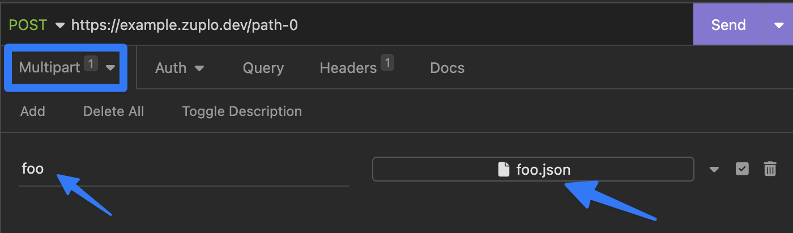

Zuplo supports working with `FormData` including `multipart/form-data`. In this
simple example we show how you can parse a multipart entry and read the stream
into memory for use in the Zuplo runtime.

In this case, we upload a JSON file as a multipart/form-data entry using
Insomnia, with a key `foo`



We can then handle this programmatically inside Zuplo using a function handler.
We also modify the JSON before forwarding on to the target backend server.

```ts
import { ZuploContext, ZuploRequest } from "@zuplo/runtime";

// FormData can return different types in different circumstances
// use this function to convert both to strings
async function readFileOrStringContent(data: unknown) {
  if (data.constructor.name === "File") {
    return await (data as File).text();
  }
  return data as string;
}

export default async function (request: ZuploRequest, context: ZuploContext) {
  const formData = await request.formData();

  // read the form-data entry as a 'Blob' type
  const blob = formData.get("foo");

  // stream the body into memory
  const json = await readFileOrStringContent(blob);

  // parse the JSON document
  const object = JSON.parse(json);

  // Modify the document somehow before forwarding on to the backend
  object.newKey = "newValue";

  // Make a standard POST to a backend with a JSON body
  const response = fetch("https://backend-origin.com/example", {
    method: "POST",
    headers: {
      "content-type": "application/json",
    },
    body: JSON.stringify(object, null, 2),
  });

  return response;
}
```
