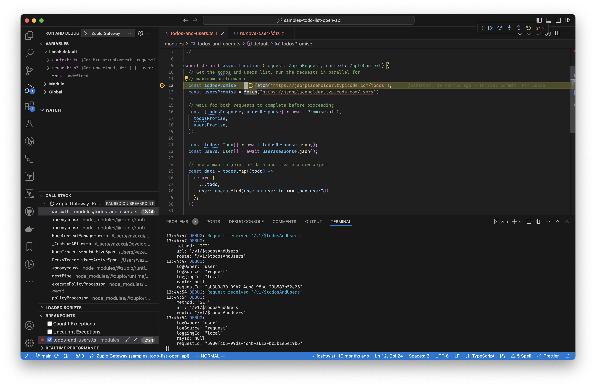

You can debug your local gateway through VS Code using its TypeScript debugger.
Features such as breakpoints, steping through the code, variable inspection, etc
will work.

1. Create a `.vscode/launch.json` file with the following content. If you
   already have an older/existing `.vscode/launch.json` file, you can add the
   section in the curly braces to the configurations array. Take note of the
   port value since that's the value you will specify next.

```json
{
  "configurations": [
    {
      "name": "Zuplo Gateway",
      "type": "node",
      "request": "attach",
      "port": 9229
    }
  ]
}
```

2. Start the gateway in debug mode using the port that you specified above.

```bash
npx @zuplo/cli dev --debug-port 9229
```

3. Switch to the View > Run and Debug in VS Code. You can now attach the
   debugger by selecting "Zuplo Gateway" and clicking the green triangle.



## Limitations

Currently the debugger doesn't automatically re-attach to the local gateway
after you have made changes.

Click on the green triangle to re-attach the debugger in VS Code.
