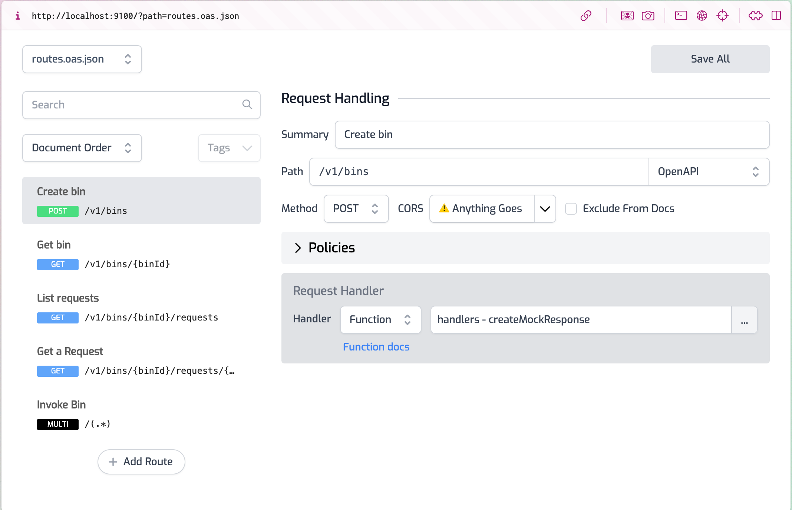
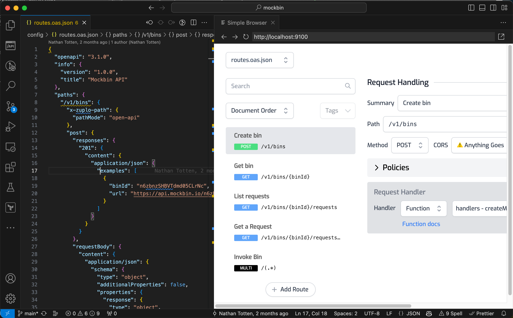

The Routes Designer is a visual tool that allows you to create and edit routes,
as well as add [policies](../policies), for your Zuplo Gateway without having to
manually edit the OpenAPI `routes.oas.json` file manually.

When you run `npm run dev`, the Routes Designer is automatically started on
port 9100. You can access it by visiting http://localhost:9100 in your browser.

```sh
$ npm run dev

Started local development setup
Ctrl+C to exit

🚀 Zuplo Gateway: http://localhost:9000
📘 Route Designer: http://localhost:9100 # <-- Your local route designer
```



If you are using VS Code, you can open it in the Simple Browser extension to see
it side-by-side as follows.


