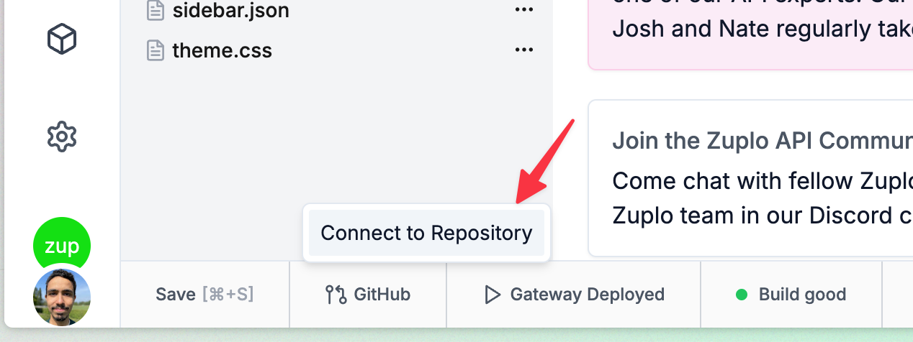

You can configure and run your Zuplo Gateway locally on your machine for
development purposes using your favorite code editor.

## Requirements

- [Node.js](https://nodejs.org/en/download) 20.0.0 or higher
- Linux, Mac OS X, or Windows Subsystem for Linux (WSL)

## Getting Started

### Create a new project from scratch

<Stepper>

1. Create a new project using

   ```bash
   npx create-zuplo-api@latest
   ```

   ```bash title="Expected output: "
   cd <your-new-project-directory>
   npm run dev
   ```

1. Start your local gateway using `npm run dev`.
1. Use the [local Route Designer](./local-development-routes-designer.mdx) to
   create your first route.

</Stepper>

### Import your existing project

If you have been using Zuplo using the _Zuplo Web Portal_, you can import your
project into your local machine.

<Stepper>

1. Connect your project to a Git repository from the _Zuplo Web Portal_.
   
1. Clone your project from your Git provider to your local machine.
1. Install the necessary dependencies:

   ```sh
   npm install
   ```

1. Start your Zuplo Gateway locally;

   ```sh
   npm run dev
   ```

1. Use the [local Route Designer](./local-development-routes-designer.mdx) to
   create your first route.

</Stepper>

## Limitations

While convenient and powerful, not all features of Zuplo are supported while
developing locally. The following features are currently not supported when
running your Zuplo Gateway locally:

- Analytics

## Next steps

- Use the [local Route Designer](./local-development-routes-designer) to create
  your first route.
- Install [packages](../programmable-api/node-modules.mdx) to extend your Zuplo
  Gateway.
- Use the [API keys](./local-development-services.mdx) service locally to secure
  your routes.
- Add [environment variables](./local-development-env-variables.mdx) to your
  project.
