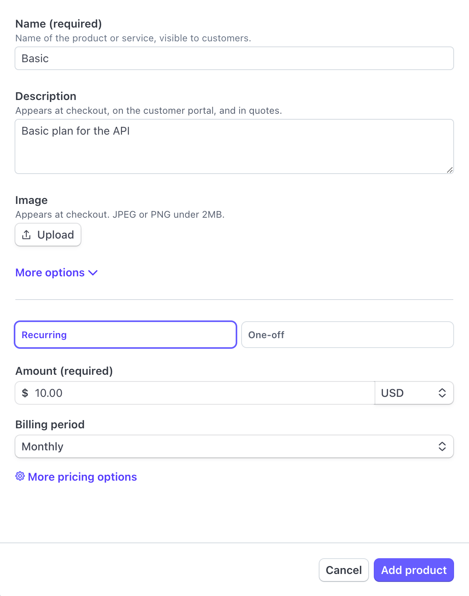
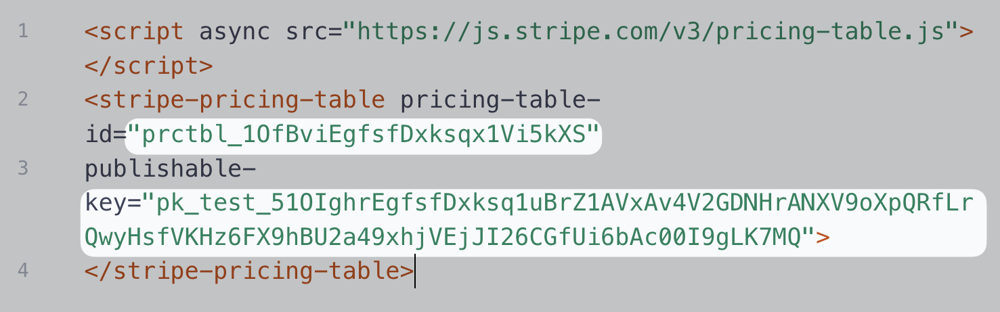
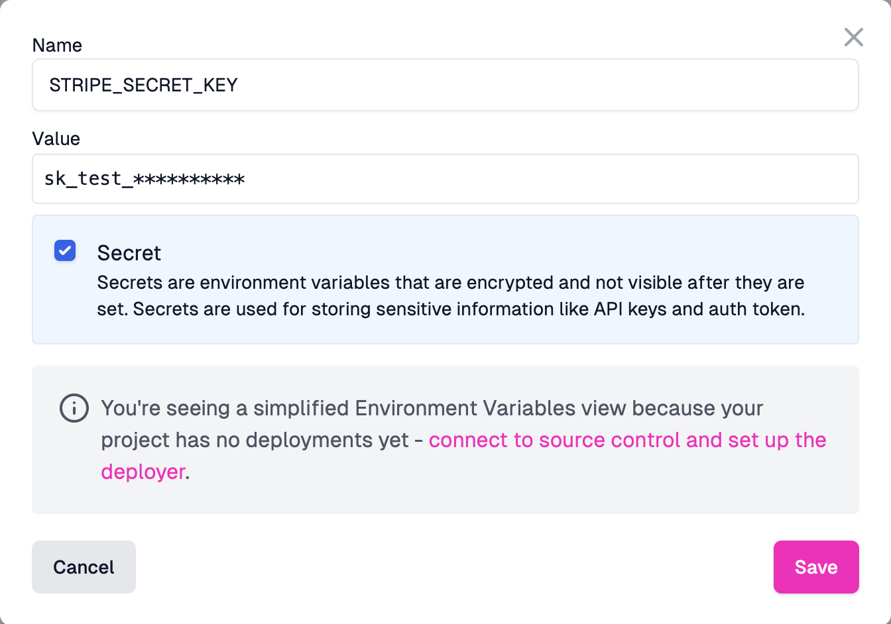

<EnterpriseFeature name="Monetization" />

This guide will walk you through the steps required to set up your Zuplo API's
Developer Portal. This is where your customers will see and subscribe to your
API plans.

If you don't already have a Zuplo API, you can create a new project using the
"ToDo" sample or following step 1 of the
[Getting Started guide](./step-1-setup-basic-gateway.md).

You'll also need a Stripe account. If you don't already have one, you'll need to
[register](https://dashboard.stripe.com/register) for one.

:::tip

You don't need to go through the full set up process in Stripe. You can follow
this tutorial using Stripe's test mode. We recommend using
[Test Mode](https://docs.stripe.com/test-mode) on your Stripe account. This will
allow you to test creating subscriptions with different plans without using real
money.

:::

Once you have a working Zuplo API and a Stripe account, we can move forward!

:::danger

API Monetization is not yet supported in the new Developer Portal. If you are
using API Monetization with the developer portal, you will need to use the
legacy developer portal. You can find the
[documentation for the legacy developer portal here](/docs/legacy/dev-portal/overview).

:::

## 1/ Set Up in Stripe

You need to have a couple things set up in Stripe before enabling Zuplo
monetization.

Your API customers will subscribe to a "Plan" in Zuplo. Plans are associated
with [Stripe Products](https://docs.stripe.com/products-prices/getting-started).
The Stripe Product is what determines the price your customers will pay to use
your API.

The "Plan" in Zuplo is where you will define the limits of each plan. For
example, the "Basic" plan might be limited to 10,000 requests per month while
the "Premium" plan may be limited to 1,000,000 requests per month.

### Creating Stripe Products

When you create your products in Stripe, set each product as **Recurring** on a
**Monthly** billing cycle.

### Creating a Stripe Pricing Table

Once you've created your products, you will need to create a Stripe Pricing
table. Follow
[Stripe's guide for creating a Pricing Table](https://docs.stripe.com/payments/checkout/pricing-table).

## 2/ Set Up in Zuplo Portal

In order for your Zuplo API to connect to Stripe, you'll need to set your Stripe
API Key as an environment variable.

1. In Stripe, navigate to the
   [API keys section](https://dashboard.stripe.com/apikeys) of Stripe's
   developer dashboard. Copy the value of the **Secret Key**.
2. Return to the Zuplo Portal, go to your project and open the **Environment
   Variables** section in the **Settings** tab.
3. Click **Add Variable** and name your new environment variable
   `STRIPE_SECRET_KEY`.
4. Set this variable as a **secret** and paste the Stripe API Key as the value.
   Click **Save**.

### Configure Your Developer Portal

Next, you will enable the monetization pages in your Developer Portal.

1. In your Zuplo project, go to the **Code** tab and select the file
   `dev-portal.json`.
2. Scroll to the **Monetization Settings** section and select the checkbox
   **Enable Monetization**.
3. The values for the fields **Pricing Table ID** and **Publishable Key** can be
   found by opening the pricing table in the Stripe Dashboard
   [Pricing Table](https://dashboard.stripe.com/pricing-tables) section.
4. Copy the value for `pricing-table-id` (it starts with `prctbl_`) and set it
   as the value for **Pricing Table ID** in the form in the Zuplo Portal.
5. Copy the value for `publishable-key` (it starts with `pk_`) and set it as the
   value for **Publishable Key** in the form in the Zuplo Portal.

6. Finally, click the icon next to the **Secret Key** field and select the
   environment variable `STRIPE_SECRET_KEY` you created earlier. This will
   prefill the form with the value `$env(STRIPE_SECRET_KEY)`.
7. Click save to publish your changes.

## 3/ Preview Your Developer Portal

Now that your Developer Portal is configured for monetization you can open it
and view the pricing page. Click the toolbar on the bottom of the Zuplo Portal
to find the URL of your Developer Portal.

Once you open your Developer Portal, you will find a link to the **Pricing**
page on the top right menu section. Open the **Pricing** page in your Developer
Portal to see the pricing table that you have configured as the **Pricing Table
ID** in the previous step.

:::caution

Don't go through the process of subscribing to an API plan yet. In the next step
we will configure the Stripe Webhook that will tell your API that a subscription
was created.

:::

[Next - Step 2](./monetization-webhook-setup.md)
