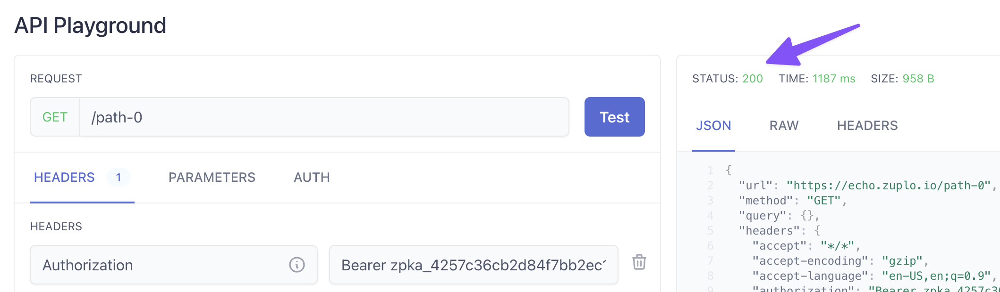

:::warning

The monetization feature is currently in beta and is subject to change.

:::

In the previous steps, you learned how to
[set up Stripe](./monetization-webhook-setup.md) and
[configure your Developer Portal for monetization](./monetization-dev-portal-setup.md).
In this step, you will configure your Zuplo API to ensure that users are allowed
to use your API according to the plan they subscribe to.

We will configure this using Zuplo's
[API Key Authentication Policy](/docs/policies/api-key-inbound) and the
[Monetization Inbound Policy](/docs/policies/monetization-inbound).

## 1/ Add API Key Authentication

To identify customers calling your API, you'll add the
[API Key Authentication Policy](/docs/policies/api-key-inbound). This policy
validates the API Key sent to your API and identifies the user to associate them
with the plan to which they have subscribed.

:::tip

For a full tutorial on the API Key Auth Policy see the
[Getting Started guide](/docs/articles/step-2-add-api-key-auth).

:::

1. Open the **Code** section of the Zuplo Portal and select your
   `routes.oas.json` file.

2. Open the route you want to add monetization to and click **Policies**, then
   click **+ Add Policy**.

3. Type `API Key` in the search and select the **API Key Authentication**
   policy.

4. Leave the default configuration and click **OK**.

Now, all requests to this route will require an API Key to successfully call the
endpoint.

## 2/ Add the Monetization Policy

With the user identified via the API Key Authentication policy, next you will
enforce that they are calling the API within the limits of their plan. The
[Monetization Inbound Policy](/docs/policies/monetization-inbound) is what
enables us to do that.

1. Open the **Policies** section of the same route and click **Add Policy**.

2. Type `Monetization` in the search and select **Monetization**.

The configuration of this policy is where you specify the meters that are
required to call this API. For now, leave the configuration as is, you can
always change it later.

3. Be sure to save your changes.

## 3/ Test the API

With both policies added to the route, you can now call the API with your
subscription's API Key.

1. Return to your Developer Portal and open the **API Reference** section.

2. Find the route you added the policies to in the previous steps.

3. Above the code sample, next to the route, click the **Test** button. This
   will open up the API Playground that you can use to call the API.

:::note

The API Key for your subscription will be pre-populated in the `Authorization`
header.

:::

4. Edit the API Request if needed and click **Test**. You should see a
   successful response. Click **Test** a few more times.

5. Close the API Playground and click the **Subscription** link in the Developer
   Portal header. Notice the Usage section shows that you have consumed some of
   your request quota from your plan.

6. Return to the API Playground and click **Test** until you receive an error
   response telling you that you have exhausted your quota.

:::note

If you set a large number in the **Max Value** of your request quota in the
earlier steps, this is going to take a while.

:::

Congratulations, you are now ready to monetize your API!
