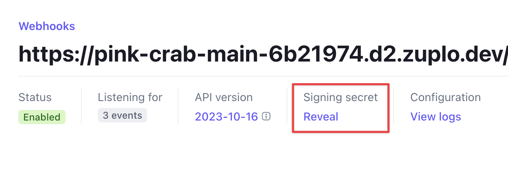
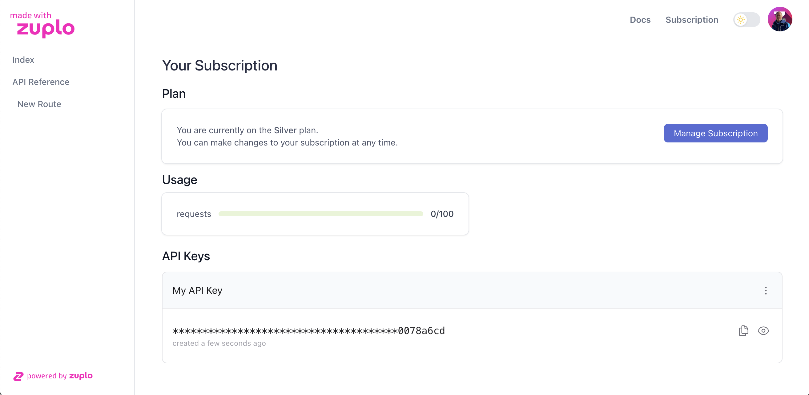

:::warning

The monetization feature is currently in beta and is subject to change.

:::

In the [previous step](./monetization-dev-portal-setup.md), you configured the
Developer Portal to enable your customers to subscribe to your Zuplo API. In
this step, you will configure Stripe and your Zuplo API to handle a customer
subscribing to your API Plans.

## 1/ Configure Plans

Stripe can send subscription events, through Stripe Webhooks, when a customer
subscribes to your API Plans. Your Zuplo API will use those events to connect
the Stripe Subscriptions with the Plans in your Zuplo API. For this to work,
you'll need to create Plans in your Zuplo Metering Service.

1. In the Zuplo Portal, go to your project, select the **Services** tab, and
   click **Configure** on your "Metering Service".


> You'll complete the next steps for each Stripe Product you added to your
> Pricing Table.

2. Click **Create Plan** to create your first Plan. Enter the name of your plan
   (i.e. Basic). The name typically will match the name of your Stripe Product.

3. The value of **External ID** is the ID of the Stripe Product. This value is
   found in the Stripe Dashboard in the
   [Product Catalog](https://dashboard.stripe.com/products). The value will
   start with `prod_`.


4. Next, set a Meter for the plan. To start, create a single meter called
   `Requests`.
5. Set **Max Value** to the number of Requests a user can make against your API
   per month.

:::tip

During the test phase, set the value of the **Max Value** to a low number like
`10`. This will allow you to test the quota later on in this tutorial.

:::

## 2/ Set Up the Zuplo Plugin

The Zuplo
[`StripeMonetizationPlugin`](/docs/articles/stripe-monetization-plugin.md)
enables your Zuplo API to listen to Stripe Webhook subscription events. This
plugin adds an endpoint that is used when configuring the Stripe Webhook.

1. To start, navigate to the **Code** section of your Zuplo project. On the
   `modules` folder click the **+** button and select **Runtime Extension**.

:::note

The **zuplo.runtime.ts** file is where you can
[register global plugins](https://zuplo.com/docs/articles/runtime-extensions#plugin-and-handler-extensions)
and [setup hooks](https://zuplo.com/docs/articles/runtime-extensions#hooks)
within your Zuplo API.

:::

2. Add the `StripeMonetizationPlugin` to your `zuplo.runtime.ts` file as shown
   below.

```ts
import {
  RuntimeExtensions,
  StripeMonetizationPlugin,
  environment,
} from "@zuplo/runtime";

export function runtimeInit(runtime: RuntimeExtensions) {
  // Create the Stripe Plugin
  const stripe = new StripeMonetizationPlugin({
    webhooks: {
      signingSecret: environment.STRIPE_WEBHOOK_SIGNING_SECRET,
    },
    stripeSecretKey: environment.STRIPE_SECRET_KEY,
  });
  // Register the plugin
  runtime.addPlugin(stripe);
}
```

The plugin uses two environment variables. The `STRIPE_SECRET_KEY` is the same
value that was added to the
[Step 1](/docs/articles/monetization-dev-portal-setup.md) of this tutorial. The
`STRIPE_WEBHOOK_SIGNING_SECRET` is a value that you will get after you set up a
new Webhook in Stripe.

## 3/ Set Up the Stripe Webhook

1. In Stripe, navigate to the
   [Webhooks section](https://dashboard.stripe.com/test/webhooks) and click **+
   Add Endpoint** to register a new webhook.

2. Add `<https://your-api-url.dev>/__plugins/stripe/webhooks` in **Endpoint
   URL**. This URL is your Zuplo API's endpoint to process Stripe Webhook
   events.

3. Click the **+ Select events** button and select the following events:

   - `customer.subscription.created`
   - `customer.subscription.updated`
   - `customer.subscription.deleted`

   Click **Add events** when done.

4. Click **Add endpoint** to register your Webhook.

5. With the Webhook created, find the section called **Signing secret** and
   click the **Reveal** link. Copy this value.



6. Return to the Zuplo Portal, open your project, and go to the **Environment
   Variables** section under the **Settings** tab.

7. Create a new Environment Variable. Set it as a **Secret** and name the
   variable `STRIPE_WEBHOOK_SIGNING_SECRET`. Paste the value of the webhook's
   **Signing secret** you copied earlier and click **Save**.

## 4/ Purchase a Subscription

With the Zuplo Plans and the Stripe Webhook configured, you can now test the end
to end subscription experience.

1. Navigate to the **Pricing** page in your Developer Portal.

2. Select a Plan and click **Subscribe**. If you are not already logged into the
   portal, you will be asked to do so first.

3. The Stripe checkout page will open. If you are using test mode, you can enter
   any [test payment method](https://docs.stripe.com/testing) you like.

:::tip

In test mode, use Stripe test credit card number **4242 4242 4242 4242**. Set
any future date as the expiration and any three digits as the CVC.

:::

4. Once you have completed the checkout, you will be redirected to your
   Developer Portal. After a few seconds, you should see your subscription page
   with your API Key.



5. Return to your Zuplo project and open the **Logs** tab. Notice the logs that
   show information about the incoming webhook.

:::tip

If you are having trouble diagnosing issues with your Webhooks, the logs are a
good place to see what is going on. You can also open the
[**Webhooks**](https://dashboard.stripe.com/webhooks) page in Stripe and see the
history of webhook events sent and their responses.

:::

You've successfully subscribed to one of the Plans in your API. You're one step
away from monetizing your API. In the next step, you will add policies to your
API, enforce quotas and ensure that users are only allowed to use your API
according to the plan they subscribe to.

[Next - Step 3](./monetization-policy-setup.md)
