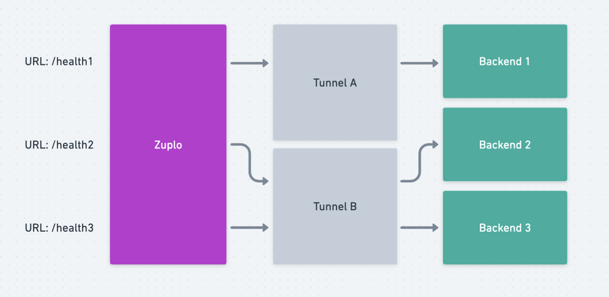

Reliability and performance of your gateway are paramount. Zuplo's commitment to
operational excellence aims to provide seamless, uninterrupted service.
Nevertheless, the complex and customizable nature of gateways necessitates a
vigilant approach to monitoring by users. Proactive, end-to-end monitoring
becomes not just a recommendation but a requisite for maintaining the integrity
of your mission-critical gateway.

Zuplo makes every effort to actively monitor our core services and deliver 100%
up-time for your gateway. However, there are many ways in which you can cause
issues with your gateway, for example:

### Common Sources of Disruptions

Several factors can compromise the functionality of your gateway, including but
not limited to:

- Misconfigured environment variables: Simple errors like a misspelled URL or
  incorrect shared secret can take your gateway down.
- Coding Errors: The flexibility of Zuplo allows for extensive customization
  and, like any software, has the potential to cause disruption if bad code is
  deployed.

This means we strongly recommend that you have active end-to-end monitoring of
each network configuration of your gateway. In fact, for some Enterprise
Agreements we mandate this to offer a higher SLA.

## Pro-active monitoring

We recommend doing this by having a health check endpoint for each network
configuration. For example, if you have 3 backends and 2 tunnels we would
recommend having 3 health-check endpoints on Zuplo with each going through the
same combination of network hops that your gateway routes will need to leverage.

Some customers choose to go further, and have their backend health-check only
return 'OK' if it also verifies other critical dependencies, like a database
connection or dependent service, are also operational.

Most customers use a monitoring service, here are a few examples:

- [Checkly](https://checklyhq.com)
- [API Context](https://apicontext.com)
- [Datadog](https://www.datadoghq.com/dg/apm/synthetics/api-test)

In addition, we recommend using our [Enterprise Log Plugins](./logging.mdx) to
send log events to partners like Datadog and set up volume based alerts from any
unusually increased error rates from your custom code or dependent services.
