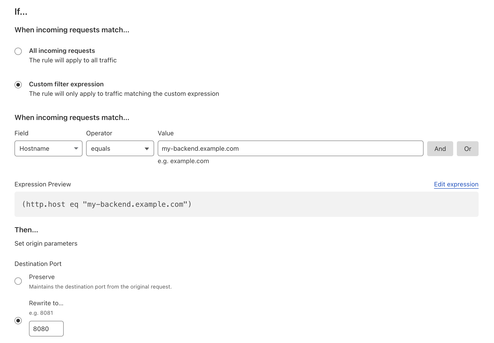

Zuplo's edge networking infrastructure is currently limited to handling making
requests on standard network ports (e.g. 80, 443). This means that if you have
an API that is running on a non-standard port (e.g. 8080, 8443) you will need to
configure your API to run on a standard port or use one of the below methods to
proxy requests to your API.

## Using a Reverse Proxy

The most common way to handle this is to use a reverse proxy in front of your
API Gateway. This reverse proxy can be configured to listen on a standard port
and forward requests to your API running on a non-standard port.

Nginx is a popular choice for reverse proxying and can be configured to listen
on a standard port and forward requests to your API running on a non-standard
port.

Here is an example Nginx configuration that listens on port 443 and forwards
requests to an API running on port 8443:

```nginx
server {
    listen 443 ssl;
    server_name my-api.example.com;

    ssl_certificate /etc/nginx/ssl/my-api.example.com.crt;
    ssl_certificate_key /etc/nginx/ssl/my-api.example.com.key;

    location / {
        proxy_pass http://localhost:8443;
        proxy_set_header Host $host;
        proxy_set_header X-Real-IP $remote_addr;
        proxy_set_header X-Forwarded-For $proxy_add_x_forwarded_for;
        proxy_set_header X-Forwarded-Proto $scheme;
    }
}
```

## Using a Load Balancer

If you are running your API in a cloud environment, you can use a load balancer
to handle the port translation for you. Most cloud providers offer load
balancers that can listen on a standard port and forward requests to your API
running on a non-standard port.

For example, AWS Elastic Load Balancer (ELB) can be configured to listen on port
443 and forward requests to your API running on port 8443.

## Using Cloudflare Origin Rules

Cloudflare offers a feature called Origin Rules that allows you to rewrite the
request URL before it is sent to your origin server. You can use Origin Rules to
rewrite the request URL to include the non-standard port.

If your domain is proxied through Cloudflare, you can configure an Origin Rule
to rewrite the request URL to include the non-standard port. For example, you
can rewrite `https://my-api.example.com` to `https://my-api.example.com:8443`.

For detailed instructions on how to configure Origin Rules, refer to the
[Cloudflare documentation](https://developers.cloudflare.com/rules/origin-rules/features/#destination-port).


