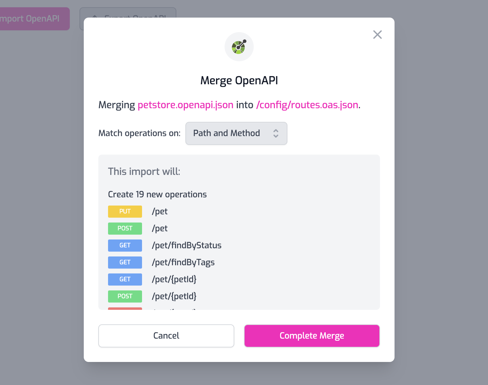

Zuplo natively supports the OpenAPI 3.1 (and is compatible with 3.0)
specification standard as the core way to configure the gateway.

When you create a new project you will see a `routes.oas.json` file. This is
your default OpenAPI routing file (oas = 'open api specification').


You can use the Route Designer to build your routes, which will be creating an
OpenAPI document in the background for you (check it out in the **JSON View**).

You can also **import an OpenAPI** document by clicking the **Open API** tab.


This will merge your imported file with any routes you already have in your
.oas.json file. By default, operations will be merged by path & method - but you
can choose to merge on `operationId` instead if you prefer.

## OpenAPI Workflow

Having a source of truth when embracing design-first and OpenAPI is critical.
Zuplo offers the best workflow for OpenAPI friendly businesses because its
support for OpenAPI is native.

You can start your OpenAPI document in Zuplo and export that to other sources,
or you can generate your OpenAPI elsewhere (by hand, using
[stoplight.io](https://stoplight.io), etc) and sync your changes into Zuplo
using our import feature.

The import feature will merge changes from an external source-of-truth OpenAPI
document and will keep your Zuplo settings intact, while overwriting everything
else from your imported OpenAPI docs. This creates a great workflow, whatever
toolset you use.



What's more, you can now have more confidence that your OpenAPI represents the
truth of your API implementation - because it now drives the configuration of
your gateway.

## Zuplo extensions

Zuplo extends the OpenAPI spec using **vendor extensions**. You will see two
vendor extensions:

### x-zuplo-path

`x-zuplo-path` is used to specify the type of
[path matching mode](./routing.mdx) you want to use; **open-api** is the default
and uses the standard OpenAPI slugs for tokens (e.g. `/pizza/{size}`). You can
change the pathMode to `url-pattern` to use the web standards
[URLPattern](https://developer.mozilla.org/en-US/docs/Web/API/URLPattern)
approach to path matching which is much more powerful and supports regular
expressions.

This extension is defined below the **path** property:

```json
"paths": {
    "/path-0": {
        "x-zuplo-path": {
            "pathMode": "url-pattern"
        },
    }
}
```

### x-zuplo-route

`x-zuplo-route` is where all of your route settings are configured, including
[policies](/docs/policies), [handlers](/docs/handlers/openapi.mdx),
[CORS](../programmable-api/custom-cors-policy.mdx) and more.

This extension is defined inside the operation, below the method:

```json
"get": {
    "summary": "New Route",
    "description": "Lorem ipsum dolor sit amet, **consectetur adipiscing** elit, sed do `eiusmod tempor` incididunt ut labore et dolore magna aliqua.",
    "x-zuplo-route": {
        "corsPolicy": "none",
        "handler": {
            "export": "urlForwardHandler",
            "module": "$import(@zuplo/runtime)",
            "options": {
                "baseUrl": "https://echo.zuplo.io"
            }
        },
        "policies": {
            "inbound": []
        }
    },
    "operationId": "e73d0713-b894-494d-8796-2c50b8634d47"
}
```

## Other Supported Extensions

Zuplo also supports other popular extensions in order to better integrate with
your existing tooling.

### x-internal

```json
"get": {
    "summary": "Internal Route",
    "x-internal": true,
    "x-zuplo-route": {
        //...
    },
}
```

You can set this property to `true` in order to hide a route from the Developer
Portal. If you are using the [OpenAPI Spec Handler](../handlers/openapi.mdx),
internal routes won't be present in the generated OpenAPI file.

## Multiple File Support

You can have multiple `.oas.json` files if you wish to break up your route
definitions. Note that routes will be executed in document order, based on the
`.oas.json` files being sorted alphabetically. For more details see
[routing](./routing.mdx).
