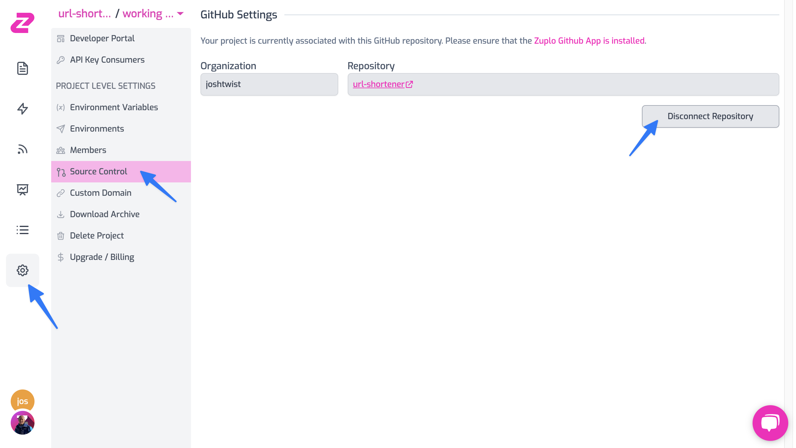

Projects cannot be moved between accounts or renamed in Zuplo but there is an
easy workaround using Source Control.

If the project you want to move or rename is not already connected to source
control then
[follow our GitHub integration guide](/docs/articles/source-control). This will
copy the contents of your project to a GitHub repo.

If your project is already connected to Source Control (or you just connected it
above) the next step is to push any changes you want to be included in when you
move to a different project.

If you're confident all your code is stored safely in the repo you can now
disconnect the project from Source Control.

Next create a new project in the correct account if moving accounts or with the
correct name. Choose the `Advanced` option on the new project dialog.

You should see a list of Orgs and Repos - pick the source repo you wanted to
move and click Create Project from Repository.

Your new project will now be connected to this repo and ready to go.

NOTE - assets and data that is not 'code' and stored in the repo will not be
moved. Things that will not be moved when renaming a project include:

- API Key consumers
- Environment variable values
- Permissions / Project Members
- Custom Domains (contact us to move these for you)
