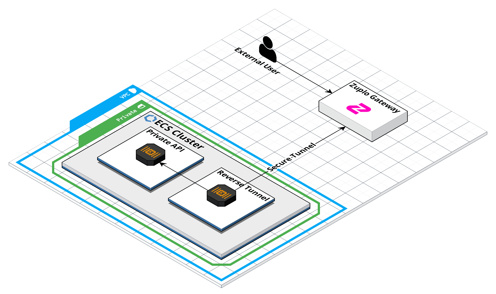

For customers running on bare metal, on-premises, or other non-cloud providers
tunnels provides a way to secure your backend without mTLS or IAM.

The way this system works is by deploying a small service inside your network or
VPC that makes a secure outbound connection to Zuplo's infrastructure. Your
Zuplo API Gateway can then use this tunnel to securely route traffic to your
private API. The benefits of a secure tunnel are:

1. Because the tunnel makes an outbound connection, there is no need for your
   API to be exposed on the internet at all.
2. All traffic between Zuplo and your API is fully encrypted.
3. You eliminate the need to configure complex ingress, firewall, or other types
   of policies to route traffic into your API. Simply install the tunnel and
   Zuplo takes care of the rest.

## How does the Tunnel Work?

The Zuplo tunnel can run on virtually any infrastructure. The most common way
users install the tunnel is as a Docker container, but we can provide you a
build in virtually any format (for example an Azure VM, etc.). The tunnel itself
is a lightweight service that when started makes an outbound connection to the
Zuplo network and then through to your Zuplo Gateway.

When the tunnel service connects to the Zuplo network, traffic from your gateway
can be routed to internal services running in your network or VPC. For example,
if your API is running on the internal DNS address `external-api.local`, the
tunnel will route traffic from the Zuplo API Gateway to your internal service
based only on the code and policies you have set up in your Zuplo Gateway.

The example below illustrates how the Zuplo tunnel would be configured in an AWS
ECS Cluster. Notice that there is no public IP address or ingress traffic in
this configuration. This is a completely private VPC. The tunnel makes an
outbound connection to the Zuplo Gateway and then uses internal DNS to route
requests to the Private API.

## Is this Secure?

Zuplo builds on top of many different tools to ensure that your gateway and API
stay secure. Each tunnel uses a secret key that allows it to securely connect to
Zuplo's network. Under the hood, Zuplo relies on Cloudflare's network for
establishing secure and reliable tunnel connections. Each tunnel is configured
with unique access policies that allow only the Zuplo Gateway that you have
authorized to make connections over that tunnel. Every incoming request is
terminated using Cloudflare's network which provides sophisticated DDoS, bot,
and threat protections. Next, the request is routed through your Zuplo Gateway
which can be configured with all policies and code you require to control access
to your API. By default, no requests will be routed from your gateway to your
API until you configure routes, URL rewrites, and policies in your Gateway.

All traffic is terminated at the edge with SSL certificates and encrypted
through the entire route to your API. All requests that your gateway makes to
Zuplo's internal services like API Key Management or Rate Limiting are also
transported over secure and encrypted tunnels.

Every request is logged and you can configure Zuplo's logs to push to the log
service of your choice.

## How will tunnels perform?

Most customers are fine running two instances of the tunnel service for
redundancy in the event one pod/service fails. Each tunnel is able to handle
millions of requests per minute. For customers that require additional scale,
simply increase the number of tunnel instances you are running or configure auto
scaling on your deployment. It's unlikely that the tunnel will become the
bottleneck in your traffic before other factors, but if you do run into any
issues [contact support](mailto:support@zuplo.com) and we will work out a
solution that meets your scale requirements.

## How should I Configure the Tunnel?

You should run your tunnel with an IAM role or other network policies that only
allow the tunnel to make requests to the network services that you want your
Gateway to access. This can be done in a variety of ways depending on your
setup. IAM roles, network segregation, and internal service meshes are common
means of controlling which services the tunnel can access.

For details on how to configure a tunnel on your network see
[the setup guide](tunnel-setup.mdx).
