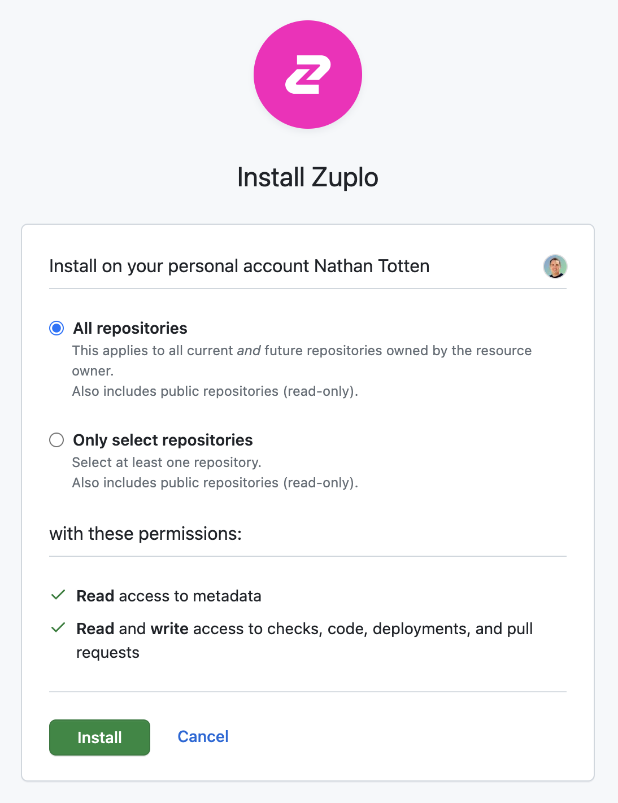
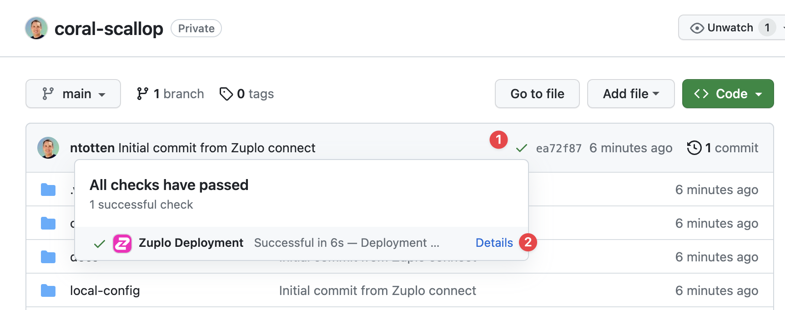
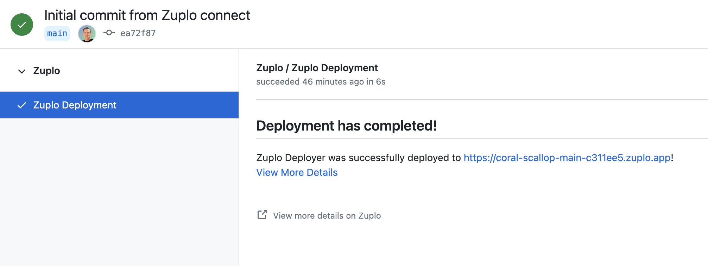

Connect your Zuplo project to GitHub for source control and automatic
deployments. Every push to your repository deploys automatically — no CI/CD
configuration required.

To begin, go to your project in the Zuplo portal and open to the **Settings**
tab, then select **Source Control**. If your project isn't already connected to
GitHub click the **Connect to GitHub** button and follow the auth flow. You'll
need to grant permissions for any GitHub organizations you want to work with.

Next, a dialog will open asking you to authorize Zuplo. Click the **Authorize
Zuplo** button.

<Framed size="sm">

</Framed>

<Callout type="tip" title="GitHub Permissions" >

The permission "Act on your behalf" sounds a bit scary - however, this is a
standard GitHub permission and by default Zuplo can't actually do anything with
this. In order to perform actions on your behalf you must grant Zuplo access to
a specific repository (shown in the next steps.).

You can
[read more about this permission on GitHub's docs](https://docs.github.com/en/apps/using-github-apps/authorizing-github-apps#about-github-apps-acting-on-your-behalf).

</Callout>

After you have connected the GitHub app, it needs to be granted permission to
edit a repository. If this is your first time connecting Zuplo, you will be
immediately asked to select a GitHub Org to install Zuplo. Select the org you
want to use.

<Framed size="sm">

</Framed>

Next, you will be asked to select the repositories that you want Zuplo to
access. The easiest thing is to just select **All Repositories**, but if you
want fine-grain control, you can select a specific repository.

<Framed size="sm">

</Framed>

<Callout type="caution" title="Existing Installation" >

The next step is only if you already have Zuplo installed in a GitHub org and
need to add another organization.

</Callout>

If you weren't prompted to select a GitHub org, it's likely that you are already
a member of an account that has authorized Zuplo. To add Zuplo to a new
organization click **Add GitHub Account** in the org picker list.

## 2/ Connect GitHub to your Project

With your GitHub App configured, you can now return to the Zuplo portal. In the
**Source Control** settings you should now see a list of GitHub repositories.
Create a new repository by clicking the **Create new repository** button. You
will be prompted that this will open GitHub. Click to continue.

In the GitHub UI, you can rename your repository if you want. Click the **Create
repository** button at the bottom of the page and return to the Zuplo Portal.

The portal will reload and you will see your new repository listed. Click
**Connect** to connect Zuplo to that repository.

After the connection succeeds you will see a link to your GitHub repository.

Click the link to return to GitHub. You should see a green check next to the
commit hash (1). When you hover your mouse over that you'll see the Zuplo
deployment was successful. Click **Details** (2) to open the deployment info.

On the deployment page, you will see **Deployment has Completed!!** and below
that's the link to your new environment.

## Connecting Existing Repositories

If you have an existing GitHub repository that contains a Zuplo project, you can
connect to that repository when you create a new project. Select **Import
existing project** then select your GitHub organization and repository.

## What's Included

With GitHub connected, you get:

- **Automatic deployments** — Every push deploys to Zuplo automatically
- **Branch environments** — Each branch gets its own isolated environment
- **Deployment status** — See deploy results as GitHub checks on commits and PRs
- **Portal sync** — Push and pull changes between the Zuplo portal and GitHub

## Next Steps

- **[Testing Deployments](./github-deployment-testing.mdx)** — Run tests
  automatically after each deploy
- **[Custom GitHub Actions](./custom-ci-cd-github.mdx)** — Advanced workflows
  with approval gates and multi-stage deployments
- **[Branch-Based Deployments](./branch-based-deployments.mdx)** — How branches
  map to environments
