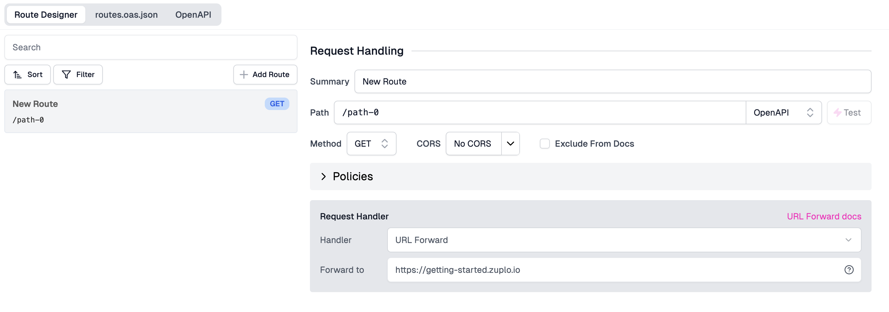
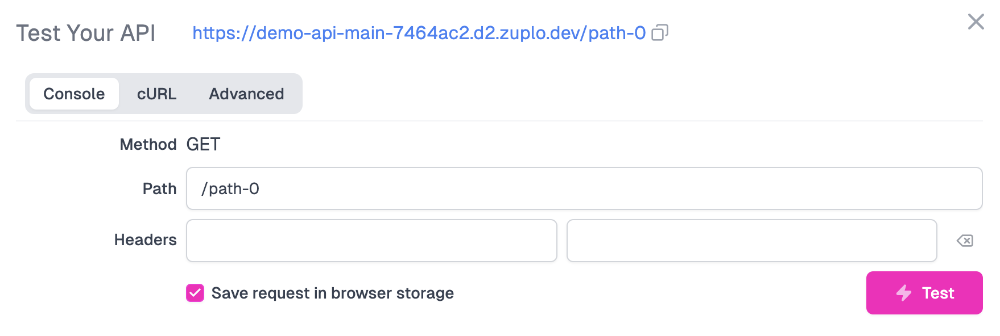
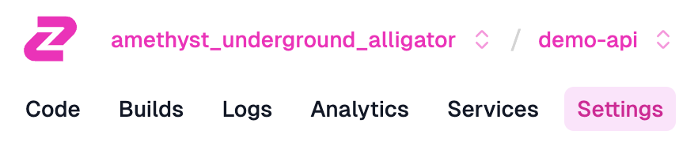

In this tutorial we'll setup a simple gateway. We'll use a demo API at
[getting-started.zuplo.io](https://getting-started.zuplo.io).

To get started, sign in to [portal.zuplo.com](https://portal.zuplo.com) and
create a free account. Create a new **empty** project. Then...

:::tip{title="Local Development"}

Zuplo also supports building and running your API locally. To learn more
[see the documentation](./local-development.md).

:::

## 1/ Add a Route

Inside your new project, choose the `routes.oas.json` file and click **Add
Route**.


Your API's first route will appear, with many configurable fields. Here's a
quick overview of them:

- **Summary**: A summary of what the route does, which will be used in Step 4
  for documenting your API
- **Method** and **Path**: The associated method and path for your endpoint.
  This is what other services will use to call your API.
- **CORS**: The [CORS](https://developer.mozilla.org/en-US/docs/Web/HTTP/CORS)
  configuration for your path.
- **Request Handler**: This is the piece of functionality that will be invoked
  when a request comes through to your endpoint. By default, we are using the
  [URL Forward Handler](../handlers/url-forward.md) which proxies requests to
  the "Forward to" URL. In this case, https://getting-started.zuplo.io



Save your new route (you can click the three-dot menu next to `routes.oas.json`
and then click Save, or press CMD+S).

You can quickly test this route by clicking the **Test** button next to the
**Path** field. You can use the built in test tool or click the URL to open in a
new tab.



You should receive a 200 OK that says something similar to

```txt
"Congratulations - You've successfully proxied my API endpoint. Want to know a
secret? Try changing your Route's path to /policies-test/secret and test your
route again after saving. The secret will be in the response."
```

A secret? Let's try and find out what this API is hiding!

## 2/ Editing your Route

Exit the test console and change your route's Path from `/path-0` to
`/policies-test/secret`. Make sure to save your changes. Your calls will now be
forwarded to `https://getting-started.zuplo.io/policies-test/secret`


Check out the new response when you fire a request at your route via the test
console.

```txt
"You're now proxying my /policies-test/secret endpoint! My secret is that my
endpoints don't have rate limiting 😳. Keep following the tutorial to learn how
to add the rate limiting policy."
```

Looks like it's clear what we need to do next.

**NEXT** Try
[Step 2 - Add Rate Limiting to your API](./step-2-add-rate-limiting.md).

## BONUS - Put the base URL in an Environment Variable

When working with Zuplo, you'll eventually want each
[environment](/docs/articles/environments) to use a different backend (e.g. QA,
staging, preview, production etc).

Change the **URL Forward** value to read the base URL from the
[Environment Variables](/docs/articles/environment-variables) system by setting
the value to `${env.BASE_URL}`. We will set the value for `BASE_URL` next.


Navigate to your project's **Settings** tab via the navigation bar. Next, click
**Environment Variables** under Project Settings.



Add an Environment Variable called `BASE_URL`. Leave the "Secret" checkbox
unchecked. This is typically not a secret, so there's no need to hide this from
your colleagues.


Save the environment variable, head back to the **Code** tab, click
`routes.oas.json`, and test your route again. You should get back the same
response from Step 2.

**NEXT** Try
[Step 2 - Add Rate Limiting to your API](./step-2-add-rate-limiting.md).
