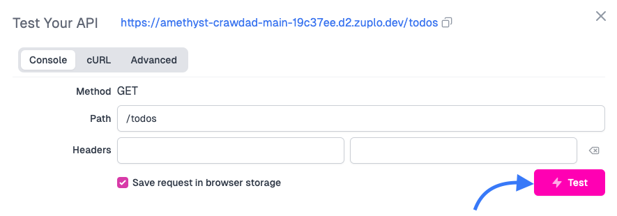
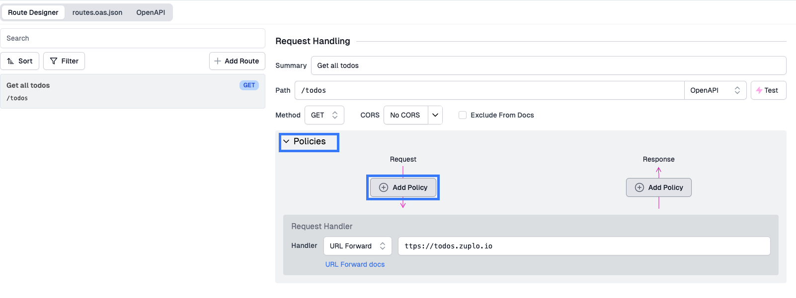
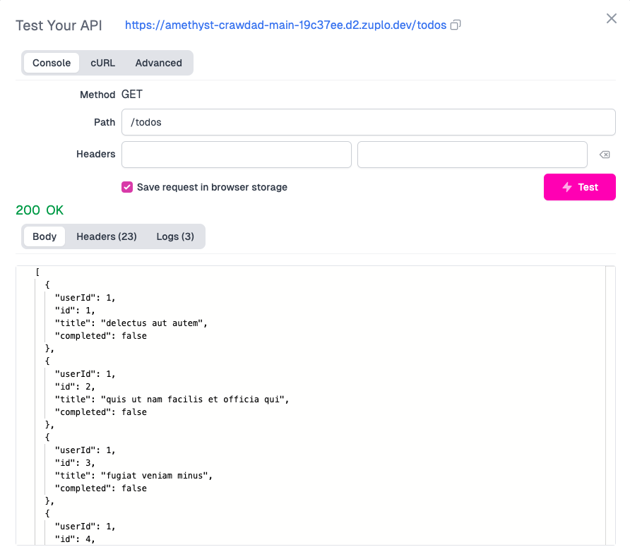

In this tutorial we'll setup a simple gateway. We'll use a demo API at
[todos.zuplo.io](https://todos.zuplo.io/todos) that acts as a todolist API.

This demo API is protected by an API key (sometimes called a shared secret) that
must be provided in an `api-key` header. Good news - given this is a demo API -
the key is provided in the unauthenticated error message.

To get started, sign in to [portal.zuplo.com](https://portal.zuplo.com) and
create a free account. Create a new **empty** project. Then...

:::tip Local Development

Zuplo also supports building and running your API locally. To learn more
[see the documentation](./local-development.md).

:::

## 1/ Add a route

Inside your new project, choose the `routes.oas.json` file and click **Add
Route**.


Using the Route Designer, let's configure our first route to handle the
`GET /todos` route.

- Summary: `Get all todos`
- Method: `GET`
- Path: `/todos`
- [URL Forward](/docs/handlers/url-forward): `https://todos.zuplo.io`


Save your changes (you can click the disk icon next to `routes.oas.json` or
press CMD+S).

You can quickly test this route by clicking the **Test** button next to the
**Path** field. You can use the built in test tool or click the URL to open in a
new tab.



You should receive a 401 Unauthorized that says something similar to

```txt
{
  "status": 401,
  "title": "Unauthorized",
  "detail": "No key or invalid key provided",
  "type": "https://httpproblems.com/http-status/401",
  "instance": "/todos",
  "hint": "This is a demo API that requires authentication. You must add a header 'api-key' with a value '4f0aeaf7-d17f-4b2b-9b71-5177bd194759'"
  ...
}
```

This is expected because you have not provided the required `api-key` header.
Copy the required `api-key` value from that error message to your clipboard
(e.g. `4f0aeaf7-d17f-4b2b-9b71-5177bd194759`).

## 2/ Set the secret header

Open the policies section in your route and click **Add Policy** to the request
pipeline.



Find the **Add or Set Request Header**


Configure the policy JSON to set header name to `api-key` and the value to
`$env(API_KEY)`. This tells the policy to read the value from our secure vault
used for [Environment Variables](/docs/articles/environment-variables.md).


Save your changes to `routes.oas.json`.

Head over to the Environment Variables screen in settings and click **Add new
variable**.


Set the name to `API_KEY` and select **is Secret** (the demo API key is not
really secret but if you use an API key to access your backend, that _is_ an
important secret).


## 3/ Test your API

Go back to your route in the Route Designer and click the **Test** button next
to the **Path** field. Click the **Test** button in the dialog that opens.



Congratulations, your gateway is working 👏👏👏

## 4/ BONUS - put the base URL in an environment variable

When working with Zuplo, you'll eventually want each
[environment](/docs/articles/environments) to use a different backend (e.g. QA,
staging, preview, production etc).

Change the **URL Forward** value to read the base URL from the
[Environment Variables](/docs/articles/environment-variables) system by setting
the value to `${env.BASE_URL}`.


Add another Environment Variable called BASE_URL. This is typically not a
secret, there's no need to hide this from your colleagues.


Save all your changes and test your route again.

**NEXT** Try
[step 2 - add API key authentication to your API](./step-2-add-api-key-auth.md).
