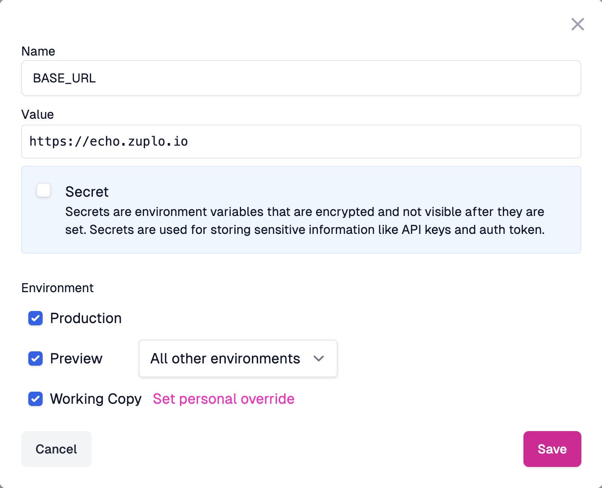

In this tutorial we'll setup a simple gateway. We'll use a simple origin API at
[getting-started.zuplo.io](https://getting-started.zuplo.io).

Note - Zuplo also supports building and running your API locally. To learn more
[see the documentation](./local-development.md).

<Stepper>

1. **Sign-in**

   Sign in to [portal.zuplo.com](https://portal.zuplo.com) and create a free
   account. Create a new **empty** project. Then...

1. Add your first **Route**

   Inside your new project, select the **Code** tab (1), choose the
   `routes.oas.json` file (2) and click **Add Route** (3)

   

   Your API's first route will appear, with many options. First we'll configure
   the route to match specific incoming requests to the gateway:
   - **Summary**: Enter a summary, e.g. `Example Endpoint`.
   - **Method**: Leave as `GET`.
   - **Path**: Enter `path-1`.

   Then we'll specify how the route will invoke the backend origin API, using a
   forward handler:
   - **Request Handler**: We'll use the
     [URL Forward Handler](../handlers/url-forward.md) which proxies requests by
     "Forwarding to" the same path on specified URL. In this case, enter
     `https://getting-started.zuplo.io`

   

   **Save your changes** - click **Save** at the bottom left, or press **CMD+S**

1. **Test** your route.

   You can quickly test this route by clicking the **Test** button next to the
   **Path** field. You can use the built in test tool or click the URL to open
   in a new tab.

   

   You should receive a 200 OK that says something similar to

   ```txt
   "Congratulations - You've successfully proxied my API endpoint. Want to know a
   secret? Try changing your Route's path to /policies-test/secret and test your
   route again after saving. The secret will be in the response."
   ```

   A secret? Let's try and find out what this API is hiding!

1. Put the base URL in an **Environment Variable**

   When working with Zuplo, you'll eventually want each
   [environment](/docs/articles/environments) to use a different backend (e.g.
   QA, staging, preview, production etc).

   Change the **URL Forward** value to read the base URL from the
   [Environment Variables](/docs/articles/environment-variables) system by
   setting the value to `${env.BASE_URL}`. We will set the value for `BASE_URL`
   next.

   

   Navigate to your project's **Settings** tab (1) via the navigation bar. Next,
   click **Environment Variables** (2) under Project Settings.

   

   Add an Environment Variable (3) called `BASE_URL`. Leave the "Secret"
   checkbox unchecked. This is typically not a secret, so there's no need to
   hide this from your colleagues.

   <Framed margin={4}>

   
   </Framed>

   Save the environment variable, head back to the **Code** tab, click
   `routes.oas.json`, and test your route again. You should get back the same
   response from Step 2.

</Stepper>

**NEXT** Try
[Step 2 - Add Rate Limiting to your API](./step-2-add-rate-limiting.md).
