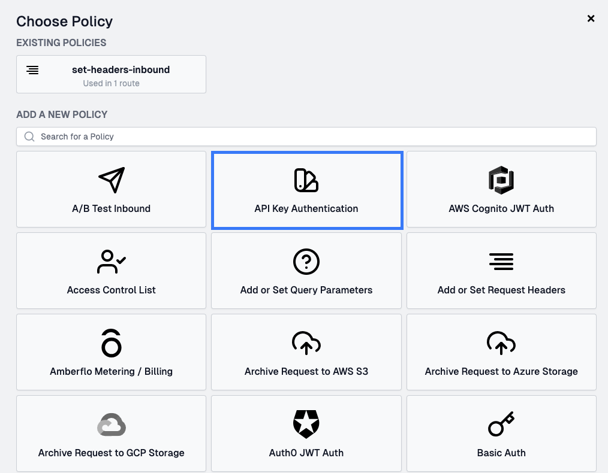
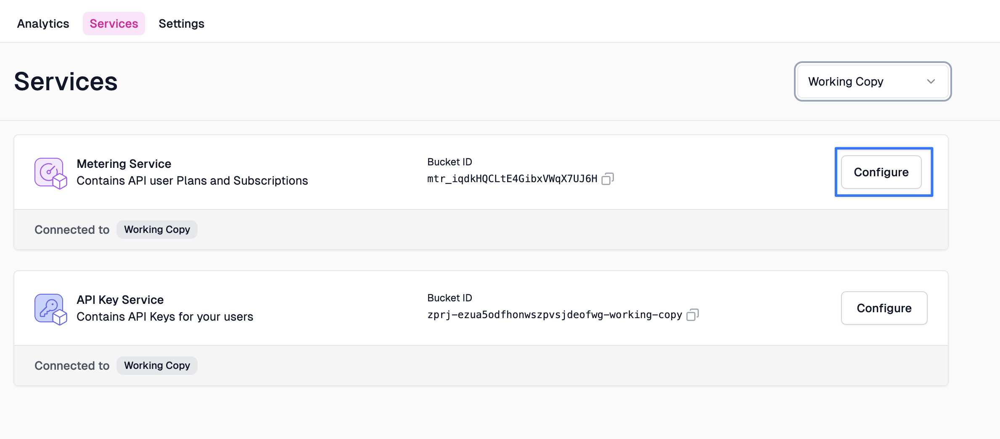
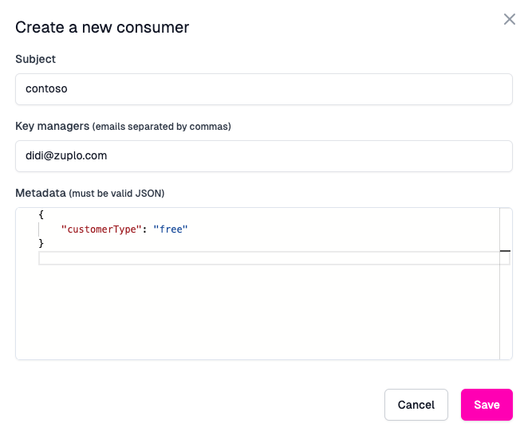
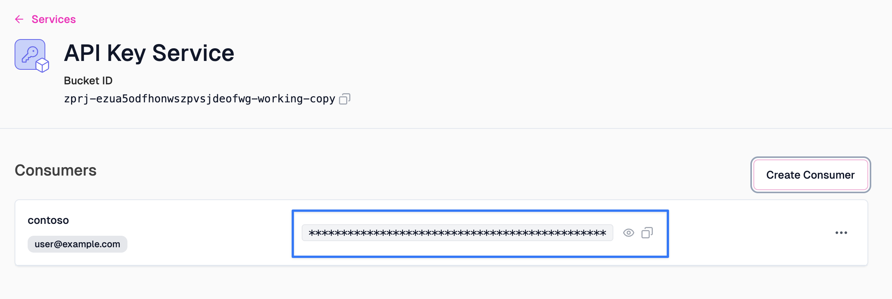
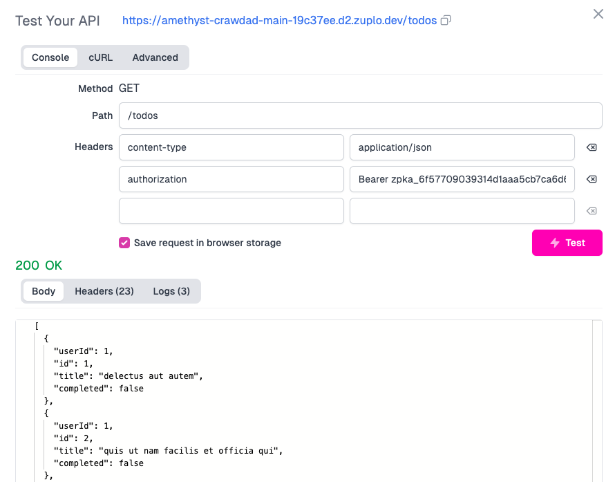

In this guide we'll add API Key authentication to a route. You can do this for
any Zuplo project but will need a route, consider completing
[step 1](./step-1-setup-basic-gateway.md) first.

API Key authentication is one of our most popular policies as implementing this
authentication method is considered one of the easiest to use by developers but
hard for API developers to get right. We also support JWT tokens and other
authentication methods.

## 1/ Add the API Key authentication policy

Navigate to your route in the **Route Designer** and open the **Policies**
section.


Add the API key authentication policy and click OK to accept the default policy
JSON.



:::tip

The API key authentication policy should usually be one of the first policies in
your request pipeline, drag it to the top if you have multiple policies.

:::


If you test your route, you should get a 401 Unauthorized response

```json
{
  "status": 401,
  "title": "Unauthorized",
  "type": "https://httpproblems.com/http-status/401"
}
```

## 2/ Set up an API Key

In order to call your API, you need to configure an API consumer. Go to
Services, then click "Configure" on the "API Key Service".



Then click **Create Consumer**.


Create a name for your identity - this will be the subject (or sub) that
identifies the user when calling Zuplo. Add your own e-mail address to the **Key
managers** field and add some JSON metadata - this is freeform (but must be
valid JSON). This metadata will be made available to the runtime when a key is
used to authenticate.



## 3/ Copy Your API Key

After your API Key consumer is created, click the button to copy your new API
Key.



## 4/ Test out your new key

Since we need to send the key in a header, it's hard to use the browser for this
test. We'll use our built in test client in Zuplo but you could also use Postman
for this part.

Next to the path of your route in Route Designer click the **Test** button. Set
the **path** to `/todos` and hit **Test**.


You should get a 401 Unauthorized response. Add an new `authorization` header
with the value `Bearer YOUR_API_KEY` and insert the API Key you got from the
developer portal.

You should now get a 200 OK.



:::note

We also offer an API for our API key service that allows you to programmatically
create consumers and even create your own developer portal or integrate key
management into your existing dashboard. See
[this document for details](./api-key-api.md).

:::

**NEXT** Try
[step 3 - add Rate Limiting to your API](./step-3-add-rate-limiting.md).
