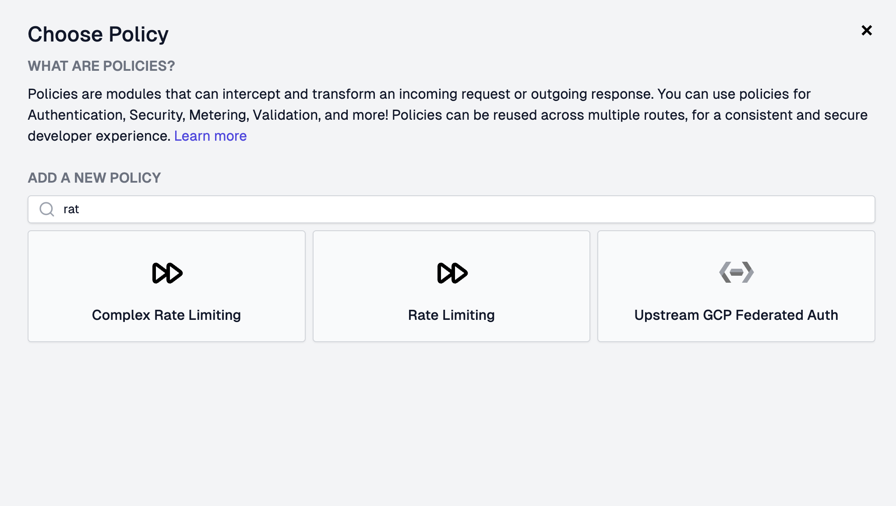

<QuickstartPicker
  mode="local"
  alternateLink="/articles/step-2-add-rate-limiting"
/>

In this guide we'll add simple Rate Limiting to a route. If you don't have one
ready, complete [Step 1](./step-1-setup-basic-gateway.mdx) first.

Rate Limiting is one of our most popular **policies** - you should never ship an
API without rate limiting because your customers or internal developers **will**
accidentally DoS your API; usually with a rogue `useEffect` call in React code.

:::info{title="What's a Policy?"}

[Policies](./policies.mdx) are modules that can intercept and transform an
incoming request or outgoing response. Zuplo offers a wide range of policies
built-in (including rate limiting) to save you time. You can check out
[the full list](./policies.mdx).

:::

Zuplo offers a programmable approach to rate limiting that allows you to vary
how rate limiting is applied for each customer, or request.s

In this example, we'll add a simple IP based rate limiter, but you should look
into dynamic rate limiting to see the full power of the world's best rate
limiter.

<Stepper>

1.  Link your Local Project

    When developing locally with Zuplo, you can "link" your local project to
    your Zuplo project using the `zuplo link` command. This allows you to test
    your changes in a real environment.

    When you run the command you will be prompted to select your Zuplo account,
    project, and environment. You can pick any environment.

    ```bash
    npx zuplo link
    ```

    After your project is linked, environment variables and other configuration
    from your Zuplo project will be available in your local development
    environment.

1.  Start your Project

    You can start your project using the following command:

    ```bash
    npx zuplo dev
    ```

    After your project is started, you can open the local route designer at
    http://localhost:9100.

1.  Add the rate-limiting Policy

    Open the local **Route Designer** by navigating to http://localhost:9100/.
    Select your route and click **Add Policy** on the incoming Request policies
    section.

    <BrowserScreenshot url="http://localhost:9100/?path=routes.oas.json">

    

    </BrowserScreenshot>

    Search for the Rate Limiting policy (not the "Complex" one) and click it.

    <ModalScreenshot>

    

    </ModalScreenshot>

    By default, the policy will rate limit based on the caller's IP address (as
    indicated by the `rateLimitBy` field). It will allow 2 requests
    (`requestsAllowed`) every 1 minute (`timeWindowMinutes`). You can explore
    the rest of the policy's documentation and configuration in the right panel.

    

    To apply the policy, click **Create Policy**. Then, save your changes to
    redeploy.

1.  Testing your Policy

    Now try firing some requests against your API. You should receive a **429
    Too many requests** on your 3rd request. You can use any API test tool you
    prefer, such as Postman, HTTPie, or curl.

    ```bash
    curl http://localhost:9000/path-0
    ```

    After you make the request 3 times you will see a response similar to:

    ```json
    {
      "type": "https://httpproblems.com/http-status/429",
      "title": "Too Many Requests",
      "status": 429,
      "instance": "/path-0",
      "trace": {
        "timestamp": "2025-08-26T21:50:40.220Z",
        "requestId": "4c62d425-2cb0-4a6c-9ac0-8d04a5f10c57",
        "buildId": "f49c4070-7c0a-441b-a5fd-4e35b5fe41b7"
      }
    }
    ```

    Your rate limiting policy is now intercepting excess requests, protecting
    your API.

</Stepper>

**NEXT** Try
[Step 3 - Add API Key Authentication](./step-3-add-api-key-auth-local.mdx).
