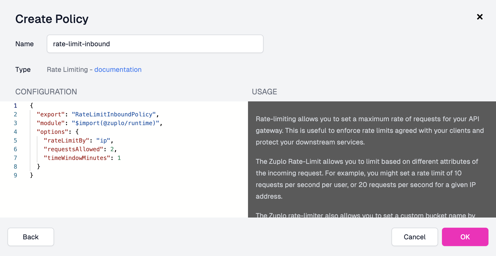

<QuickstartPicker
  mode="portal"
  alternateLink="/articles/step-2-add-rate-limiting-local"
/>

In this guide we'll add simple Rate Limiting to a route. If you don't have one
ready, complete [Step 1](./step-1-setup-basic-gateway.mdx) first.

Rate Limiting is one of our most popular **policies** - you should never ship an
API without rate limiting because your customers or internal developers **will**
accidentally DoS your API; usually with a rogue `useEffect` call in React code.

:::info{title="What's a Policy?"}

[Policies](./policies.mdx) are modules that can intercept and transform an
incoming request or outgoing response. Zuplo offers a wide range of policies
built-in (including rate limiting) to save you time. You can check out
[the full list](../policies.mdx).

:::

Zuplo offers a programmable approach to rate limiting that allows you to vary
how rate limiting is applied for each customer, or requests.

In this example, we'll add a simple IP based rate limiter, but you should look
into dynamic rate limiting to see the full power of the world's best rate
limiter.

<Stepper>

1. Add the rate-limiting Policy

   Navigate to your route in the **Route Designer** (**Code** >
   `routes.oas.json`), click the **Policies** dropdown, then click **Add
   Policy** on the request pipeline.

   <ModalScreenshot>

   

   </ModalScreenshot>

   Search for the rate limiting policy (not the "Complex" one) and click it.

   <ModalScreenshot>

   

   </ModalScreenshot>

   By default, the policy will rate limit based on the caller's IP address (as
   indicated by the `rateLimitBy` field). It will allow 2 requests
   (`requestsAllowed`) every 1 minute (`timeWindowMinutes`). You can explore the
   rest of the policy's documentation and configuration in the right panel.

   

   To apply the policy, click **OK**. Then, save your changes to redeploy.

1. Testing your Policy

   Now try firing some requests against your API. You should receive a **429 Too
   many requests** on your 3rd request.

   <ModalScreenshot>

   

   </ModalScreenshot>

   Your rate limiting policy is now intercepting excess requests, protecting the
   `getting-started` API.

</Stepper>

**NEXT** Try [Step 3 - Add API Key Authentication](./step-3-add-api-key-auth).
