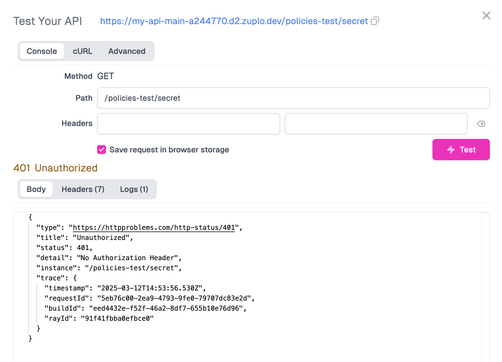
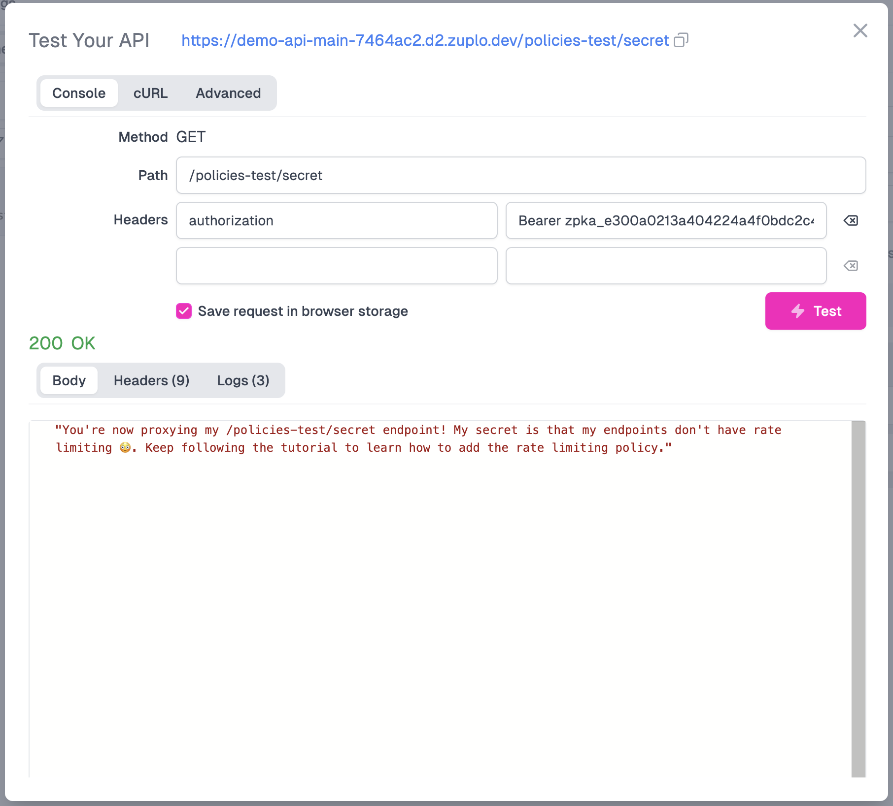

<QuickstartPicker
  mode="local"
  alternateLink="/articles/step-3-add-api-key-auth"
/>

In this guide we'll add API Key authentication to a route. You can do this for
any Zuplo project but will need a route, consider completing
[Step 1](./step-1-setup-basic-gateway.mdx) first.

API Key authentication is one of our most popular **policies** as implementing
this authentication method is considered one of the easiest to use by developers
but hard for API developers to get right. We also support JWT tokens and most
other authentication methods.

:::info{title="What's a Policy?"}

[Policies](./policies.md) are modules that can intercept and transform an
incoming request or outgoing response. Zuplo offers a wide range of policies
built-in (including api key authentication) to save you time. You can check out
[the full list](./policies.md).

:::

Let's get started.

<Stepper>

1. Add the API Key Authentication Policy

   Navigate to your route in the **Route Designer** (**Code** >
   `routes.oas.json`) and open the **Policies** section. Then click **Add
   Policy**.

   

   Search for the API key authentication policy, click on it, and then click OK
   to accept the default policy JSON.

   <ModalScreenshot>

   

   </ModalScreenshot>

   :::tip

   The API key authentication policy should usually be one of the first policies
   executed. If you came here from [Step 2](./step-2-add-rate-limiting.mdx) then
   you will want to drag it above the rate limiting policy.

   :::

   

   If you test your route, you should get a 401 Unauthorized response

   ```json
   {
     "status": 401,
     "title": "Unauthorized",
     "type": "https://httpproblems.com/http-status/401"
   }
   ```

2. Set up an API Key

   In order to call your API, you need to configure an API consumer. Go to
   **Services**, then click **Configure** on the "API Key Service".

   

   Then click **Create Consumer**.

   

   Let's break down the configuration needed.
   - Subject: Also known as `sub`. This is a unique identifier of the API
     consumer. This is commonly the name of the user or organization consuming
     your API
   - Key managers: The email addresses of those who will be managing this API
     key.
   - Metadata: JSON metadata that will be made available to the runtime when a
     key is used to authenticate. Common properties include the consumer's
     subscription plan, organization, etc.

   Go ahead and fill in `test-consumer` for the Subject. Add your own email as a
   Key manager, and leave the metadata empty for now. Click **Save consumer**
   once you're done.

   <ModalScreenshot>

   

   </ModalScreenshot>

3. Copy your API Key

   After your API Key consumer is created, copy your new API Key by clicking the
   copy button (next to the eye icon).

   

4. Test out your API Key

   Navigate back to the **Route Designer**, and select your route. Next to the
   path of your route, click the **Test** button and fire off a request.

   <ModalScreenshot>

   

   </ModalScreenshot>

   You should get a 401 Unauthorized response - as we'ven't supplied the API key
   yet. Add an new `authorization` header with the value `Bearer <YOUR_API_KEY>`
   and insert the API Key you got from the developer portal.

   You should now get a 200 OK.

   <ModalScreenshot>

   

   </ModalScreenshot>

   :::note

   We also offer an API for our API key service that allows you to
   programmatically create consumers and even create your own developer portal
   or integrate key management into your existing dashboard. See
   [this document for details](./api-key-api.md).

   :::

5. View your API Documentation

   Whenever you deploy a new endpoint on Zuplo, it will automatically be added
   to your
   [autogenerated developer documentation portal](../dev-portal/introduction.md).

   To access your API's developer portal, click the **Gateway deployed** button
   in your toolbar and click the link under Developer Portal.
   

   When you use certain policies like API keys, Zuplo will document properties
   like headers associated with that policy. As you can see on the right, the
   API key policy's `Authorization` header has been documented for you.

   

   Additionally, a new Authentication section has been added to your developer
   portal. Users of your API can sign in, view & manage their API keys, test
   your endpoints, track API usage, and much more! You can learn more about that
   in
   [our developer portal auth docs](/docs/dev-portal/zudoku/configuration/authentication).

</Stepper>

**NEXT** Try
[Step 4 - Connect Source Control and Deploy to the Edge](./step-4-deploying-to-the-edge.mdx).
